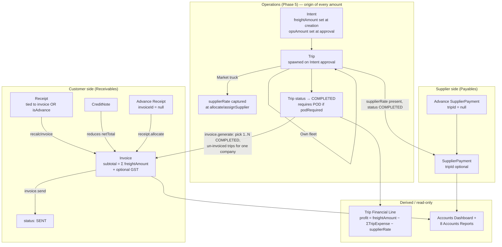

# MJ Transport ERP — Flow of Accounts Analysis

> Analysis of the Accounts module as actually implemented in `backend/src` and `frontend/src/pages/accounts`, based on `prisma/schema.prisma`, the Accounts services/repositories, and the accounts report/dashboard code. The top-level `README.md` is stale — it still describes Accounts as an unbuilt placeholder; the module is in fact fully implemented (Phase 6 of the build).

## 1. Design Philosophy

The schema's own comment (`prisma/schema.prisma`, above the `PHASE 6 — ACCOUNTS` block) states the scope precisely:

> This is deliberately **not** general-purpose accounting software — only the transportation billing/settlement cycle: completed trips → customer invoice → receipts, and completed supplier trips → supplier payments. Trip P&L (income/expenses/supplier charges/profit) is **not** a stored table — it's computed on demand from `Trip` + `TripExpense` + `supplierRate`, which are already the single source of truth from Phase 5 (Operations).

So there is no chart of accounts, no journal/ledger, no double-entry posting. It is two parallel cash-flow tracks (money coming in from customers, money going out to suppliers) plus a derived profitability view, all keyed off the `Trip` record produced by the Operations module.

## 2. The Two Money Tracks, at a Glance



## 3. Upstream Trigger: How a Trip Becomes Billable

Nothing in Accounts can be created from thin air — every invoice line and every supplier payment traces back to a `Trip` row that Operations produced:

1. **Intent** created by an Intent Creator — `freightAmount` (what the customer will be billed) is fixed here, either directly or summed from itemized charges (`baseFreightAmount + tollCharges + loadingCharges + otherCharges`) — see `intent.service.ts` `computeFreightAmount()`.
2. **Intent approved** by an Operation Manager — sets `opsAmount`, the ceiling the market-truck hiring cost may not exceed (`intent.service.ts:261` `approve()`). This is a different number from `freightAmount`: one is what's billed out, the other is what may be spent hiring a market vehicle.
3. Approval auto-creates a **Trip** (still unassigned).
4. **Allocation** (`trip.service.ts` `allocate()`):
   - *Own fleet path*: vehicle + driver assigned, no `supplierRate` involved.
   - *Market truck path*: only allowed once no own vehicle is free; `input.tripAmount` becomes `Trip.supplierRate` and is validated `<= Intent.opsAmount`. Allocating a market truck can immediately spin off an **advance `SupplierPayment`** (`input.supplierAdvance`) and/or an **advance `Receipt`** (`input.clientAdvance`) in the same call — this is the earliest point money can move in the system, before the trip has even started.
   - Allocating either way flips the source `Intent.status` to `CONVERTED`.
5. Trip runs through its status machine (`DRAFT → PLANNED → APPROVED → ASSIGNED → STARTED → LOADING → IN_TRANSIT → REACHED_DESTINATION → UNLOADING → COMPLETED`). Along the way, **TripExpense** rows (Fuel/Driver Bata/Toll/Loading/Unloading/Misc) accumulate against the trip — these are what Accounts later nets against revenue.
6. **`COMPLETED`** is a gate, not just a label: `trip.service.ts:600` blocks the transition if `podRequired` is true and no POD document has been uploaded. Only `COMPLETED` trips are eligible for invoicing or supplier payment.

This means Accounts is structurally incapable of billing a trip that hasn't proven delivery (via POD) — the control is enforced upstream in Operations, not duplicated in Accounts.

## 4. Customer Side — Invoice → Receipt Cycle

### 4.1 Invoice generation (`invoice.service.ts` `generate()`)
- Input: a `companyId` and a list of `tripIds`.
- Validates every trip: exists, `status === 'COMPLETED'`, not already invoiced (`Trip.invoiceId` must be null), and belongs to the selected company (via `trip.intent.companyId`).
- `subtotal = Σ trip.freightAmount`; if a `gstMasterId` is supplied, `taxAmount = subtotal × gst.ratePercent / 100`; `totalAmount = subtotal + taxAmount`.
- Creates the `Invoice` with `outstandingAmount = totalAmount`, `status = DRAFT`(→ effectively `GENERATED` on creation — see repository), and links all selected trips via `Trip.invoiceId` (a trip can only ever belong to one invoice — enforced by the pre-check above, not a DB constraint).
- One invoice can bundle several trips for the same company; a trip cannot be split across invoices.

### 4.2 Invoice lifecycle
`DRAFT → GENERATED → SENT → PARTIALLY_PAID / PAID`, with `CANCELLED` reachable from any non-`PAID` state.
- `send()`: only from `GENERATED`.
- `cancel()`: blocked once `paidAmount > 0` (can't cancel an invoice that already has receipts allocated) and blocked once `PAID`/already `CANCELLED`. Cancelling also unlinks the trips (`unlinkTrips`), freeing them to be re-invoiced.
- `remove()`: only allowed once `CANCELLED` (soft delete).
- `update()`: blocked once `PAID` or `CANCELLED` — only `dueDate`/`notes` are editable.

### 4.3 Recalculation engine (`recalcInvoice`, private to `invoice.service.ts`)
This is the core of the receivables ledger and runs after every Receipt create/update/delete/allocate and after every Credit Note:
```
paidAmount        = Σ Receipt.amount for this invoice
creditedAmount     = Σ CreditNote.amount for this invoice
netTotal           = invoice.totalAmount − creditedAmount
outstandingAmount  = max(netTotal − paidAmount, 0)

status:
  outstandingAmount <= 0        → PAID
  else if paidAmount > 0        → PARTIALLY_PAID
  else if was PAID/PARTIALLY_PAID → reverts to GENERATED
```
`Invoice.paidAmount`/`outstandingAmount`/`status` are therefore always derived, never hand-edited — the only two write paths into an invoice's money are receipts and credit notes.

### 4.4 Credit Notes (`addCreditNote`)
- Blocked against `CANCELLED` invoices.
- Capped: `amount <= outstandingAmount + paidAmount` (i.e. cannot exceed the invoice's original total).
- Triggers `recalcInvoice` immediately.

### 4.5 Receipts (`receipt.service.ts`)
Two shapes of the same table:
- **Tied receipt**: `invoiceId` provided → validated same company, invoice not `CANCELLED` → `isAdvance = false` → triggers `invoiceService.recalc()`.
- **Advance receipt**: no `invoiceId` → `isAdvance = true`, sits against the company only, no invoice to recalc yet.
- **`allocate(id, invoiceId)`**: the only way an advance receipt gets tied to an invoice after the fact. Only callable on receipts where `isAdvance === true`; validates the invoice is the same company and not cancelled; flips `isAdvance` off via `receiptRepository.allocate` and triggers `recalcInvoice` on the target invoice.
- `update()`/`remove()` both re-trigger `recalcInvoice` on the affected invoice if one is linked, so editing/deleting a receipt correctly reopens the invoice's outstanding balance.

## 5. Supplier Side — Payment Cycle

`supplier-payment.service.ts` is deliberately simpler than the invoice side — there is no "supplier invoice" document, no status machine, no recalculation cascade. A `SupplierPayment` is a flat ledger entry:
- **Tied payment**: `tripId` provided → trip must belong to the named supplier and must be `COMPLETED` → `isAdvance = false`.
- **Advance payment**: no `tripId` → `isAdvance = true` (this is exactly the path `trip.service.ts allocate()` uses for `supplierAdvance` at market-truck allocation time, before the trip has even started).
- No cap is enforced against `Trip.supplierRate` — nothing stops a payment exceeding the trip's rate, and nothing stops multiple payments against the same trip; "outstanding payable" is computed separately, at read time (§6), rather than stored on the trip or payment.

## 6. Derived Views (Computed On Demand, Never Stored)

### 6.1 Trip Financial Line (`trip-financial.service.ts`)
For any `COMPLETED` trip:
```
income          = Trip.freightAmount
tripExpenses    = Σ TripExpense.amount (undeleted)
supplierCharges = Trip.supplierRate
profit          = income − tripExpenses − supplierCharges
```
Grouped three ways for the Trip Financials page/report: `vehicleWise()`, `supplierWise()`, `customerWise()` (by `intent.companyId`) — each iterates completed trips in an optional date range and sums the same four numbers per group.

Note this deliberately ignores `SupplierPayment`/`Receipt` entirely — P&L is an accrual view off `Trip`+`TripExpense`, while Invoice/Receipt/SupplierPayment track *cash movement* against that accrual. The two are related but not reconciled against each other anywhere in the code.

### 6.2 Accounts Dashboard (`accounts-dashboard.service.ts`)
Single `getSummary()` call, all reads (no writes):
- **Outstanding Receivables** = `Σ Invoice.outstandingAmount` where not cancelled.
- **Outstanding Payables** = for every supplier: `Σ supplierRate` across their `COMPLETED` trips, minus `Σ SupplierPayment.amount` ever recorded for them — computed in-memory via two Maps (`chargeBySupplier`, `paidBySupplier`), not a SQL aggregate. This is the one place the "how much do we owe this supplier" number actually gets computed; it doesn't live on any row.
- **Monthly Revenue** = `Σ Receipt.amount` this calendar month (cash received, not invoiced amount).
- **Monthly Expenses** = `Σ TripExpense.amount` + `Σ SupplierPayment.amount` this month.
- **Profit** (dashboard tile) = `monthlyRevenue − monthlyExpenses` — a cash-basis figure, distinct from the trip-level accrual `profit` in §6.1.
- Top-10 customer outstanding, top-10 supplier outstanding (both sorted desc, filtered `> 0`), and the 10 most recent receipts/payments as activity feeds.

### 6.3 Accounts Reports (`accounts-report.repository.ts`, 8 report definitions)
Registered in `report.registry.ts` and rendered via `AccountsReports.vue`. Each accepts filters (company/supplier/vehicle + date range) and returns paginated rows:

| Report key | Source | What it shows |
|---|---|---|
| `customerOutstandingReport` | `Invoice` | Invoices with `outstandingAmount > 0`, not cancelled |
| `supplierOutstandingReport` | `Trip` + `SupplierPayment` | Same charge-minus-paid logic as the dashboard, per supplier |
| `invoiceReport` | `Invoice` | All invoices, filterable by status/company/search |
| `receiptReport` | `Receipt` | All receipts with linked invoice number |
| `paymentReport` | `SupplierPayment` | All supplier payments with linked trip number |
| `tripProfitabilityReport` | `Trip` + `TripExpense` | Same income/expenses/supplierCharges/profit line as §6.1, per trip |
| `revenueReport` | `Trip` | Freight amount per completed trip |
| `expenseReport` | `TripExpense` | Trip expenses by category |

## 7. Access Control on Accounts Data

Two independent layers, both enforced server-side:

**Permission strings** (seeded in `prisma/seed.ts`, checked by `authorize()` middleware on every route):
`invoice.view/create/edit/delete/cancel`, `creditNote.view/create`, `receipt.view/create/edit/allocate`, `supplierPayment.view/create/edit`, `tripFinancial.view`, `accounts.dashboard`, `accounts.view`.

**Group scoping** (`utils/groupAccess.ts`), applied on top of permissions for company-facing data (invoices, receipts):
- `ACCOUNTS_EXECUTIVE` is a *group-scoped* role — `forcedCompanyScope()` restricts them to invoices/receipts whose `companyId` falls inside the companies of their own `Group` (via `GroupMembership`). A user with this role but no group membership sees nothing (fails closed, returns `[]`).
- `ACCOUNTING_MANAGER`, `ADMIN`, `SUPER_ADMIN`, `OPERATION_MANAGER` are unrestricted — no company filter applied, full visibility.
- `SupplierPayment` has no equivalent scoping — suppliers aren't attached to a Group/Company the way customer-facing Companies are, so `supplier-payment.service.ts` never calls `forcedCompanyScope`.

## 8. Every State-Change Is Audited

Every mutating Accounts action (`generate`, `update`, `send`, `cancel`, `remove`, `addCreditNote` on invoices; `create`, `update`, `allocate`, `remove` on receipts; `create`, `update`, `remove` on supplier payments) writes an `AuditLog` row via `audit.service.ts` — actor, action, entity type/id, and a human-readable description. There is no soft-delete-and-forget path; cancellations, deletions and reallocations all leave a trail.

## 9. Frontend Surface (`frontend/src/pages/accounts/`)

| Page | Backed by | Purpose |
|---|---|---|
| `AccountsHub.vue` | — | Landing/navigation tile for the module |
| `AccountsDashboard.vue` | `GET /api/accounts/dashboard` | Revenue vs collection vs payments chart, profit analysis, customer/supplier outstanding lists, recent receipts/payments feeds |
| `CustomerInvoices.vue` | `invoice.routes.ts` | List + "Generate Invoice" dialog (pick company → eligible completed trips → optional GST → preview subtotal/tax/total) + send/cancel/credit-note actions |
| `CustomerReceipts.vue` | `receipt.routes.ts` | List filterable by Advance/Allocated, create/edit/delete, allocate-to-invoice action |
| `SupplierPayments.vue` | `supplier-payment.routes.ts` | List + create/edit/delete, opting a trip in or leaving it as an advance |
| `TripFinancials.vue` | `trip-financial.routes.ts` | Per-trip income/expense/supplier-charge/profit breakdown |
| `reports/AccountsReports.vue` | `accounts-report.repository.ts` (via `report.routes.ts`) | The 8 tabular reports in §6.3, with export |

## 10. Summary — The Complete Money Trail

```
Intent.freightAmount (customer price, fixed at creation)
Intent.opsAmount     (hiring ceiling, fixed at approval)
        │
        ▼
Trip created (APPROVED) → allocate()
        │                       │
   own fleet              market truck: Trip.supplierRate ≤ opsAmount
        │                       │  (optional instant supplierAdvance / clientAdvance)
        └──────────┬────────────┘
                    ▼
      Trip runs: TripExpense rows accrue
                    │
                    ▼
      Trip.status = COMPLETED  (blocked without POD if required)
        │                                   │
        ▼                                   ▼
  invoice.generate()                supplierPayment.create({tripId})
  (1..N completed trips,                    │
   1 company, sums freightAmount)           ▼
        │                          SupplierPayment ledger row
        ▼                          (no cap, no status machine)
   Invoice (subtotal/tax/total,
   outstandingAmount = total)
        │
        ├── Receipt (tied or advance) ──► recalcInvoice() ──► paidAmount / outstandingAmount / status
        └── CreditNote ──────────────────► recalcInvoice()

Everything above is read back, never re-derived into a ledger, by:
  - Trip Financial lines (income − tripExpenses − supplierRate)
  - Accounts Dashboard (cash-basis monthly revenue/expenses/profit + outstanding receivables/payables)
  - 8 Accounts Reports
```

## 11. Notable Design Choices / Gaps (for anyone extending this module)

- **No general ledger / chart of accounts** — by design (see §1). Adding one would be a significant departure, not an extension.
- **Two different "profit" numbers** coexist: the accrual per-trip profit (§6.1, `freightAmount − expenses − supplierRate`) and the cash-basis dashboard profit (§6.2, `monthly receipts − monthly expenses`). They will not reconcile to the same figure and nothing in the code attempts to reconcile them — worth flagging to whoever reads the dashboard.
- **SupplierPayment has no ceiling check** against `Trip.supplierRate`, unlike the customer side where `Invoice.outstandingAmount` is strictly derived. Overpaying a supplier is possible and silent.
- **A trip can receive multiple supplier payments with no aggregate cap**, and outstanding payable is a live computation (§6.2), not a stored balance — fine at current scale, but an `N+1`-shaped computation (`prisma.trip.findMany` + in-memory grouping) that would need revisiting if trip volume grows large.
- **`VehicleExpense` vs `TripExpense`** are intentionally separate (per schema comment at `VehicleExpense` model): the former is the vehicle's lifetime cost ledger (Fleet module), the latter is trip-scoped P&L (Accounts). Fuel and Maintenance costs are mirrored from Fleet into `VehicleExpense` automatically, but `TripExpense` is entered independently in Operations — the two are not the same numbers and should not be confused when reading reports.
