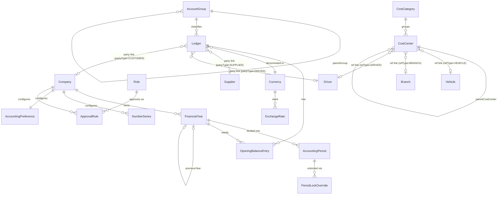

# Phase 1 — Accounting Foundation
### Functional & Technical Design Document — MJ Transport ERP

Status: Design (no code written yet) · Scope: foundation only — no vouchers, no posting, no banking, no receivables/payables, no reports.

---

## 1. Business Overview

Phase 1 builds the vocabulary every later accounting phase will speak. Nothing in this phase moves money — there is no voucher, no posting engine, no bank ledger yet. What this phase delivers is the *scaffolding* that makes double-entry accounting possible at all: a Chart of Accounts to classify every rupee, Ledger Accounts to hold it, Cost Centers to attribute it to a vehicle/branch/trip/driver, Financial Years and Periods to timestamp and eventually lock it, Number Series to identify every document uniquely, and Opening Balances to seed the books on day one.

Every later phase (Voucher Engine, Banking, Receivables/Payables, Payroll, Assets, GST/Reports) posts *into* the structures defined here. If this phase is wrong, every later phase inherits the mistake — so the design favors rigidity where it matters (Dr/Cr nature, group hierarchy, opening balance lock) and configurability where the business genuinely varies (number series formats, cost center taxonomy, approval thresholds).

This phase is additive to the existing schema — it does not touch `Trip`, `Intent`, `TripExpense`, or the Phase-6 `Invoice`/`Receipt`/`SupplierPayment` tables (those are removed in a later step, once Phase 4 can replace them). It reuses existing masters — `Company`, `Group`, `Branch`, `Supplier`, `Driver`, `Vehicle`, `Role`, `User`, `AuditLog` — rather than duplicating them.

---

## 2. Module Breakdown

| # | Module | Purpose | New table? |
|---|---|---|---|
| 1 | Company Financial Settings | Per-company accounting configuration (books-begin date, FY pattern, base currency) | No — extends `Company` + `AccountingPreference` |
| 2 | Financial Years | Defines the accounting year boundary, lock/close/reopen lifecycle | `FinancialYear` |
| 3 | Accounting Periods | Sub-divisions of a Financial Year (month/quarter/custom), individually lockable | `AccountingPeriod` |
| 4 | Chart of Accounts (COA) | The classification tree (Assets/Liabilities/Income/Expenses/Equity → groups) | `AccountGroup` |
| 5 | Account Groups | Nodes of the COA tree | (same table as #4) |
| 6 | Ledger Accounts | The actual accounts money is tracked against | `Ledger` |
| 7 | Cost Centers | Attribution dimension (vehicle/branch/trip/driver/department) | `CostCenter` |
| 8 | Cost Categories | Grouping of cost centers by type | `CostCategory` |
| 9 | Accounting Preferences | Company-wide behavioral switches (mandatory narration, back-dating, etc.) | `AccountingPreference` |
| 10 | Numbering & Document Series | Auto/manual numbering rules per document type | `NumberSeries` |
| 11 | Opening Balances | One-time balance seeding per ledger per FY | `OpeningBalanceEntry` |
| 12 | Currency & Exchange Rate Foundation | Base currency + FX rate table (unused until multi-currency phase) | `Currency`, `ExchangeRate` |
| 13 | Approval Configuration Foundation | Rules describing *who* approves *what*, not the workflow engine itself | `ApprovalRule` |
| 14 | Audit Configuration Foundation | Standard audit columns + reuse of existing `AuditLog` | No new table — convention applied to all of the above |
| 15 | Financial Locks & Period Closing Foundation | Status fields on FY/Period + an override trail | `PeriodLockOverride` |

13 new tables in total. Two "modules" are policy/convention rather than schema — reusing what already exists is deliberate: the codebase already has a working generic `AuditLog` and RBAC system; duplicating them here would create two audit trails and two permission systems to keep in sync.

---

## 3. Complete Setup Workflow

The one-time sequence an Accounts Manager follows to bring a company's books online:

```
1. Company Financial Settings configured (base currency, books-begin date)
        │
2. Financial Year created (e.g. FY 2026-27: 2026-04-01 → 2027-03-31) → status = DRAFT
        │
3. Accounting Periods generated for that FY (12 monthly periods, or quarterly/custom) → status = OPEN
        │
4. Chart of Accounts seeded: 5 root groups (Assets/Liabilities/Income/Expenses/Equity)
   + standard sub-groups (Bank Accounts, Cash, Sundry Debtors, Sundry Creditors, Duties & Taxes, ...)
        │
5. Ledger Accounts created under those groups:
   - System ledgers seeded automatically (Cash, Round Off, GST Payable, GST Input, TDS Payable...)
   - Party ledgers created for existing masters (one Ledger per Company/customer, per Supplier,
     per Driver — linked via partyType + partyId, not duplicated data)
        │
6. Cost Categories + Cost Centers created (Vehicle, Branch, Driver, Trip, Department categories;
   one cost center per Branch/Vehicle auto-suggested from existing masters)
        │
7. Number Series configured for every future document type (Journal, Receipt, Payment, Sales,
   Purchase, Debit/Credit Note, Opening Balance)
        │
8. Opening Balances entered — once — for every ledger that carries a balance on the books-begin date
        │
9. Financial Year activated (DRAFT → ACTIVE) — this locks the opening balance entries;
   all further balance changes must happen through vouchers (Phase 2+)
        │
10. Accounting Preferences finalized (approval thresholds, mandatory fields, back-date policy)
        │
   → Foundation is now ready for the Voucher Engine (Phase 2) to post against it.
```

Step 9 is the hinge of the whole design: activating a Financial Year is a one-way door for opening balances. Before activation, opening balances are freely editable (you're still doing setup). After activation, the only way to change a ledger's balance — including correcting an opening balance mistake — is a Journal Voucher, once Phase 2 exists. This is what "balances are never stored manually" means in practice, starting from day one.

---

## 4. Entity Relationship Diagram



The `Ledger → Supplier/Driver/Company` and `CostCenter → Vehicle/Branch/Driver` links are **polymorphic app-level references** (`partyType` + `partyId`, `refType` + `refId`), not physical foreign keys — a single ledger row cannot have three different real FK columns for three different possible party tables. Referential integrity for these is enforced in the service layer (validate `partyId` exists in the table named by `partyType` before save), and documented here as the one deliberate deviation from strict FK-everywhere.

---

## 5. Database Design

Conventions carried over from the existing schema (`Vehicle`, `Driver`, `Supplier`, etc.): `id` = UUID PK, `code` unique per company, `isActive` boolean, soft delete via `deletedAt`, `createdById`/`updatedById` FKs to `User`, `createdAt`/`updatedAt` timestamps, `@@map` to snake_case table name.

### 5.1 `FinancialYear`

| Column | Type | Notes |
|---|---|---|
| id | uuid PK | |
| companyId | uuid FK → Company | multi-company ready |
| code | varchar(20) | e.g. `FY2026-27` |
| name | varchar(50) | display label |
| startDate | date | |
| endDate | date | |
| booksBeginDate | date | usually = startDate; differs only for the very first FY a company goes live on this system |
| previousFinancialYearId | uuid FK → FinancialYear (self, nullable) | chains years for carry-forward |
| status | enum: DRAFT / ACTIVE / CLOSED / LOCKED | see §6 |
| isCurrent | boolean | exactly one ACTIVE year per company should be current |
| closedAt / closedById | timestamp / FK User (nullable) | |
| lockedAt / lockedById | timestamp / FK User (nullable) | |
| version | int, default 0 | optimistic concurrency |
| createdById / updatedById / createdAt / updatedAt / deletedAt | — | standard audit block |

Constraints: unique `(companyId, code)`. App-level validation rejects overlapping `[startDate, endDate]` ranges per company (a true DB-level range-exclusion constraint via Postgres `EXCLUDE ... USING gist` is noted as a future hardening step, not required for Phase 1).

### 5.2 `AccountingPeriod`

| Column | Type | Notes |
|---|---|---|
| id | uuid PK | |
| financialYearId | uuid FK → FinancialYear | |
| companyId | uuid FK → Company | denormalized for direct indexing/reporting |
| name | varchar(30) | e.g. `Apr-2026` |
| periodType | enum: MONTHLY / QUARTERLY / YEARLY / CUSTOM | |
| sequenceNo | int | order within the FY (1..12 for monthly) |
| startDate / endDate | date | |
| status | enum: OPEN / CLOSED / LOCKED / FROZEN | see §6 |
| closedAt / closedById | timestamp / FK User (nullable) | |
| createdById / updatedById / createdAt / updatedAt / deletedAt | — | |

Constraints: unique `(financialYearId, sequenceNo)`. Index `(companyId, startDate, endDate)` for "which period does this date fall in" lookups.

### 5.3 `AccountGroup` (Chart of Accounts nodes)

| Column | Type | Notes |
|---|---|---|
| id | uuid PK | |
| companyId | uuid FK → Company | |
| code | varchar(20) | |
| name | varchar(100) | |
| parentGroupId | uuid FK → AccountGroup (self, nullable) | null = root |
| classification | enum: ASSET / LIABILITY / INCOME / EXPENSE / EQUITY | must equal parent's classification — a group can never mix classifications across its own subtree |
| path | varchar(500) | materialized path, e.g. `/assetsId/currentAssetsId/` for fast subtree queries |
| level | int | depth from root |
| isSystemGroup | boolean | seeded groups (Bank Accounts, Cash-in-Hand, Sundry Debtors, Sundry Creditors, Duties & Taxes...) — protected from delete/rename |
| isActive | boolean | |
| createdById / updatedById / createdAt / updatedAt / deletedAt | — | |

Constraints: unique `(companyId, code)`. Self-referential FK with `onDelete: Restrict` (a group with children cannot be hard-deleted). Circular hierarchy is prevented at the application layer by walking `parentGroupId` ancestors before save and rejecting if the new parent is a descendant of the group being moved.

### 5.4 `Ledger`

| Column | Type | Notes |
|---|---|---|
| id | uuid PK | |
| companyId | uuid FK → Company | |
| code | varchar(20) | per Number Series |
| name | varchar(150) | |
| accountGroupId | uuid FK → AccountGroup | **required — a ledger cannot exist without a group** |
| classification | enum (same 5 values) | denormalized copy from `accountGroupId.classification`, set once at creation, immutable |
| normalBalance | enum: DEBIT / CREDIT | expected balance side, derived from classification (Asset/Expense → Debit, Liability/Income/Equity → Credit); used to flag unusual-direction balances, not to block them |
| currencyId | uuid FK → Currency | defaults to company base currency |
| openingBalance | decimal(18,2) | mirrors the current FY's `OpeningBalanceEntry.amount` for fast reads — see §6 note on derived caches |
| openingBalanceType | enum: DEBIT / CREDIT | |
| partyType | enum: NONE / CUSTOMER / SUPPLIER / DRIVER / EMPLOYEE / BANK / VEHICLE / OTHER | tags which real-world master this ledger represents |
| partyId | uuid, nullable | polymorphic — validated in-service against the table named by `partyType` |
| gstNumber, panNumber, tanNumber | varchar, nullable | |
| bankName, bankAccountNumber, bankIfsc, bankBranch | varchar, nullable | populated when `partyType = BANK` (full bank-account ledger arrives in Phase 3; this phase only reserves the fields) |
| contactPerson, phone, email, address | varchar/text, nullable | |
| creditPeriodDays | int, nullable | |
| creditLimit | decimal(18,2), nullable | |
| isSystemLedger | boolean | seeded ledgers (Cash, Round Off, GST Payable...) — protected |
| isEditable | boolean | false for system ledgers' core fields (group, classification) |
| isActive | boolean | |
| createdById / updatedById / createdAt / updatedAt / deletedAt | — | |

Constraints: unique `(companyId, code)`, unique `(companyId, lower(name))`. Index on `accountGroupId`, index on `(partyType, partyId)`. `onDelete: Restrict` from `AccountGroup`. A ledger cannot be hard-deleted once it has any GL postings — that check has no teeth yet in Phase 1 (no postings exist), but the guard clause is written now so it's already in place when Phase 2 lands.

### 5.5 `CostCategory`

| Column | Type | Notes |
|---|---|---|
| id | uuid PK | |
| companyId | uuid FK → Company | |
| code, name, description | varchar/text | e.g. Vehicle, Branch, Department, Project, Trip, Driver |
| isSystemCategory | boolean | |
| isActive | boolean | |
| createdById / updatedById / createdAt / updatedAt / deletedAt | — | |

### 5.6 `CostCenter`

| Column | Type | Notes |
|---|---|---|
| id | uuid PK | |
| companyId | uuid FK → Company | |
| costCategoryId | uuid FK → CostCategory | |
| code, name | varchar | e.g. `Vehicle TN38AB1234`, `Coimbatore Branch` |
| parentCostCenterId | uuid FK → CostCenter (self, nullable) | supports nesting (Branch → Vehicle under that branch) |
| path, level | varchar / int | materialized path, same pattern as `AccountGroup` |
| refType | enum: NONE / VEHICLE / DRIVER / BRANCH / TRIP / SUPPLIER / OTHER | auto-links to an existing operational master |
| refId | uuid, nullable | polymorphic, validated against the table named by `refType` |
| isSystemCostCenter | boolean | |
| isActive | boolean | |
| createdById / updatedById / createdAt / updatedAt / deletedAt | — | |

Constraints: unique `(companyId, code)`. Recommendation: a database trigger or scheduled job auto-creates a `CostCenter(refType=VEHICLE)` whenever a new `Vehicle` is created, and similarly for `Branch` — so Operations users never have to remember to create the accounting-side cost center by hand.

### 5.7 `AccountingPreference` (one row per company)

| Column | Type | Notes |
|---|---|---|
| id | uuid PK | |
| companyId | uuid FK → Company, unique | one config row per company |
| baseCurrencyId | uuid FK → Currency | |
| decimalPrecision | int, default 2 | |
| negativeCashAllowed | boolean, default false | |
| backDateEntryAllowed | boolean, default true | |
| backDateAllowedDays | int, default 7 | how far back a voucher date may be, once Phase 2 exists |
| voucherApprovalRequired | boolean, default true | applies to manual vouchers; system-generated postings bypass (see §11) |
| numberingMode | enum: AUTO / MANUAL, default AUTO | company-wide default; overridable per `NumberSeries` |
| costCenterMandatory | boolean, default false | |
| narrationMandatory | boolean, default false | |
| attachmentMandatory | boolean, default false | |
| allowDuplicateReference | boolean, default false | |
| financialLockDays | int, default 0 | grace days after a period closes before it hard-locks |
| updatedById / updatedAt | — | single-row config, still audited |

### 5.8 `NumberSeries`

| Column | Type | Notes |
|---|---|---|
| id | uuid PK | |
| companyId | uuid FK → Company | |
| documentType | enum: LEDGER / COST_CENTER / JOURNAL_VOUCHER / RECEIPT_VOUCHER / PAYMENT_VOUCHER / SALES_VOUCHER / PURCHASE_VOUCHER / DEBIT_NOTE / CREDIT_NOTE / CONTRA_VOUCHER / OPENING_BALANCE_VOUCHER | extensible enum — later phases add values, never remove |
| financialYearId | uuid FK → FinancialYear, nullable | set when `resetFrequency = FINANCIAL_YEAR` |
| prefix, suffix | varchar(10), nullable | |
| nextNumber | int, default 1 | incremented atomically on issue |
| padWidth | int, default 5 | `00001` style |
| resetFrequency | enum: NEVER / FINANCIAL_YEAR / MONTHLY | |
| lastResetPeriod | varchar(20), nullable | marker (`2026-04` or `FY2026-27`) so the reset job knows whether it already fired |
| isActive | boolean | |
| version | int, default 0 | optimistic concurrency — see §11 concurrency note |
| createdById / updatedById / createdAt / updatedAt | — | |

Constraints: unique `(companyId, documentType, financialYearId)`. Number issuance must happen inside a DB transaction with a row lock (`SELECT ... FOR UPDATE`) on the series row, not read-then-write from application memory — otherwise concurrent voucher creation produces duplicate numbers.

### 5.9 `OpeningBalanceEntry`

| Column | Type | Notes |
|---|---|---|
| id | uuid PK | |
| financialYearId | uuid FK → FinancialYear | |
| ledgerId | uuid FK → Ledger | |
| amount | decimal(18,2) | always positive; direction carried by `balanceType` |
| balanceType | enum: DEBIT / CREDIT | |
| narration | text, nullable | |
| isCarryForward | boolean, default false | true when generated by the year-end close process (Phase 7); false when manually keyed at first-time setup |
| isLocked | boolean, default false | flips true the moment the parent `FinancialYear` activates |
| enteredById / enteredAt | FK User / timestamp | |
| lockedById / lockedAt | FK User / timestamp, nullable | |

Constraints: unique `(financialYearId, ledgerId)` — one opening balance per ledger per year. Update/delete blocked once `isLocked = true` or once the parent `FinancialYear.status != DRAFT`.

### 5.10 `Currency`

| Column | Type | Notes |
|---|---|---|
| id | uuid PK | |
| code | varchar(3), unique | ISO 4217, e.g. `INR` |
| name, symbol | varchar | |
| decimalPrecision | int, default 2 | |
| isBaseCurrency | boolean | exactly one true system-wide for now (single base currency; per-company base currency is a documented future extension) |
| isActive | boolean | |

### 5.11 `ExchangeRate`

| Column | Type | Notes |
|---|---|---|
| id | uuid PK | |
| currencyId | uuid FK → Currency | |
| rateDate | date | |
| rateToBase | decimal(18,6) | |
| source | enum: MANUAL / API | |
| createdById / createdAt | — | |

Constraints: unique `(currencyId, rateDate)`. Unused by any transaction in Phase 1 — exists purely so `Ledger.currencyId` is already forward-compatible.

### 5.12 `ApprovalRule`

| Column | Type | Notes |
|---|---|---|
| id | uuid PK | |
| companyId | uuid FK → Company | |
| module | enum: LEDGER_CREATION / COST_CENTER_CREATION / VOUCHER | scope this rule applies to |
| voucherType | varchar, nullable | populated only when `module = VOUCHER`, matches a future `NumberSeries.documentType` |
| minAmount, maxAmount | decimal(18,2), nullable | the amount band this rule covers |
| approverRoleId | uuid FK → Role | reuses the existing `Role` table |
| sequenceOrder | int | level 1, 2, 3... for multi-level approval |
| autoApproveBelow | boolean | if true, this band needs no human approval |
| isActive | boolean | |
| createdById / updatedById / createdAt / updatedAt | — | |

This table stores *configuration only*. No `ApprovalRequest`/instance table exists yet — that belongs to whichever phase first needs a real approval queue (Voucher Engine, Phase 2).

### 5.13 `PeriodLockOverride`

| Column | Type | Notes |
|---|---|---|
| id | uuid PK | |
| accountingPeriodId | uuid FK → AccountingPeriod | |
| overriddenById | uuid FK → User | must hold an override-capable role |
| reason | text | mandatory — no silent overrides |
| overriddenAt | timestamp | |
| revertedAt | timestamp, nullable | when the period was re-locked after the override |

Every bypass of a closed/locked period leaves a permanent, queryable trail — this table exists precisely so "who unlocked March and why" is always answerable.

---

## 6. Business Rules

**Why Account Groups exist.** A ledger's classification (Asset/Liability/Income/Expense/Equity) determines which financial statement it appears on and which side (Dr/Cr) increases it. Grouping lets the Trial Balance, P&L, and Balance Sheet be generated by *summing groups*, not by hardcoding which of thousands of ledgers belongs where — add a ledger under "Direct Expenses" and it automatically rolls up into the P&L's expense section with zero report-code changes.

**Why ledgers cannot exist without a group.** An orphan ledger has no classification, meaning it cannot appear on any financial statement and its Dr/Cr nature is undefined — every downstream posting, report and closing entry silently breaks. The FK is `NOT NULL` by design, not an oversight.

**How Financial Years work.** A Financial Year is a container with a lifecycle: `DRAFT` (being set up — opening balances editable) → `ACTIVE` (live, vouchers post against its periods once Phase 2 exists) → `CLOSED` (accounting finished, closing entries generated, still viewable) → `LOCKED` (immutable, only a role-based override can touch it, and only through `PeriodLockOverride`). Exactly one FY should be `ACTIVE`/current per company at a time; `previousFinancialYearId` chains years together so a year-end close process (Phase 7) knows where to carry closing balances forward as next year's opening balances.

**Why Periods are locked independently of the Financial Year.** A company typically wants to close March's books the moment March's reconciliation is done, without waiting for the whole FY to end in the following March. Period-level status (`OPEN → CLOSED → LOCKED → FROZEN`) lets last month close for postings while the current month stays open — `FROZEN` is a step beyond `LOCKED` reserved for periods that have been through statutory filing and must never reopen even via override.

**Why Opening Balances are restricted to one-time entry.** Opening balances represent "where the books stood on day one" — they are not transactions and have no counterparty voucher. If they stayed editable indefinitely, anyone could silently rewrite history with no audit trail beyond a generic `updatedAt`. Locking them the moment the Financial Year activates, and routing every subsequent correction through a Journal Voucher (Phase 2), guarantees every balance change after go-live has a traceable debit and credit.

**How Cost Centers are used.** Cost Centers are an *attribution* dimension orthogonal to the Chart of Accounts — the same "Fuel Expense" ledger might be split across "Vehicle TN38AB1234," "Vehicle TN38AB5678," and "Coimbatore Branch" cost centers. This is what eventually produces Trip Profit / Vehicle Profit / Branch Profit reports (Phase 7): the ledger tells you *what kind* of money moved, the cost center tells you *where it belongs*.

**How Document Numbering works.** Every document type (ledger code, cost center code, and later every voucher type) gets its own `NumberSeries` row per company, optionally re-scoped per Financial Year. Numbers are issued atomically and monotonically — never reused, even if the originating document is later cancelled — so gaps in a sequence are auditable evidence of a cancellation, not evidence of a missing record.

---

## 7. Validation Rules

| Rule | Where enforced | Behavior |
|---|---|---|
| Duplicate ledger name (case-insensitive) within a company | `Ledger` service, unique index | Reject with "A ledger named '<name>' already exists" |
| Duplicate ledger code within a company | `Ledger` service, unique index | Reject |
| Duplicate Financial Year code, or overlapping date range, per company | `FinancialYear` service | Reject; list the conflicting FY |
| Invalid / inactive parent group | `AccountGroup` service | Reject if `parentGroupId` is inactive, soft-deleted, or would create a classification mismatch |
| Circular group hierarchy | `AccountGroup` service | Walk ancestors of the proposed parent; reject if the group being saved appears in that chain |
| Ledger opening balance without an ACTIVE→DRAFT-state Financial Year, or after lock | `OpeningBalanceEntry` service | Reject once `FinancialYear.status != DRAFT` or entry `isLocked` |
| Invalid opening balance (negative amount, or non-cash ledger of Asset/Expense classification opened on Credit side without override) | `OpeningBalanceEntry` service | Warn (not hard-block, since e.g. a contra-asset can legitimately open Credit) — logged as a flagged entry for review |
| Duplicate cost center code within a company | `CostCenter` service, unique index | Reject |
| Circular cost center hierarchy | `CostCenter` service | Same ancestor-walk pattern as account groups |
| Inactive parent (group or cost center) | Both services | Reject creating a child under an inactive/deleted parent |
| Deletion of a group/ledger/cost center with children or (later) postings | All three services | Block hard delete; only deactivation (`isActive=false`) permitted |
| Deletion of a system-flagged row (`isSystemGroup`/`isSystemLedger`/`isSystemCostCenter`) | All three services | Always blocked, regardless of children |
| Number series exhausted padding width (e.g. `nextNumber` > 99999 with `padWidth=5`) | `NumberSeries` service | Reject issuance, surface an actionable error to reconfigure the series before it silently misformats |
| Party link (`partyType`/`partyId`, `refType`/`refId`) pointing to a non-existent or inactive record | `Ledger`/`CostCenter` service | Reject at save time with the specific missing entity named |

---

## 8. API Design

REST, versioned under `/api/accounting/*`, following the existing Express + Zod validation + service/repository pattern already used elsewhere in the codebase.

| Module | Endpoints | Notes |
|---|---|---|
| Financial Year | `GET/POST /financial-years`, `GET/PATCH /financial-years/:id`, `POST /financial-years/:id/activate`, `POST /financial-years/:id/close`, `POST /financial-years/:id/reopen`, `POST /financial-years/:id/lock` | State-transition endpoints are separate from the generic `PATCH` so each carries its own permission and validation |
| Accounting Period | `GET /accounting-periods`, `POST /financial-years/:id/generate-periods`, `PATCH /accounting-periods/:id`, `POST /accounting-periods/:id/close`, `POST /accounting-periods/:id/lock`, `POST /accounting-periods/:id/override-unlock` | `generate-periods` bulk-creates 12/4/1 periods from the FY's type in one call |
| Account Group | `GET/POST /account-groups`, `GET/PATCH/DELETE /account-groups/:id`, `GET /account-groups/tree` | `/tree` returns the nested hierarchy for the COA screen |
| Ledger | `GET/POST /ledgers`, `GET/PATCH/DELETE /ledgers/:id`, `GET /ledgers/:id/opening-balance`, `POST /ledgers/bulk-import` | Filterable by group, classification, partyType, active status |
| Cost Category | `GET/POST /cost-categories`, `GET/PATCH/DELETE /cost-categories/:id` | |
| Cost Center | `GET/POST /cost-centers`, `GET/PATCH/DELETE /cost-centers/:id`, `GET /cost-centers/tree` | |
| Accounting Preference | `GET /accounting-preferences`, `PATCH /accounting-preferences` | Singleton per company — no `:id`, resolved from the caller's company context |
| Number Series | `GET/POST /number-series`, `GET/PATCH /number-series/:id`, `POST /number-series/:id/preview-next` | `preview-next` shows the next formatted number without consuming it |
| Opening Balance | `GET /opening-balances?financialYearId=`, `POST /opening-balances`, `PATCH/DELETE /opening-balances/:id`, `POST /opening-balances/bulk-import` | Blocked once FY leaves `DRAFT` |
| Currency | `GET/POST /currencies`, `GET/PATCH /currencies/:id` | |
| Exchange Rate | `GET/POST /exchange-rates` | Present but unused by any posting logic this phase |
| Approval Rule | `GET/POST /approval-rules`, `GET/PATCH/DELETE /approval-rules/:id` | |
| Period Lock Override | `GET /period-lock-overrides`, `POST /accounting-periods/:id/override-unlock` (listed under Period) | Read endpoint exists for audit review; no direct create outside the override action |

Every write endpoint follows the existing pattern: Zod schema validation → permission check (`authorize()` middleware) → service layer business rules → repository persistence → `AuditLog` entry.

---

## 9. UI/UX Design

| Screen | Layout | Key interactions |
|---|---|---|
| Financial Years | List + status chips (Draft/Active/Closed/Locked) | Create wizard (dates → books-begin date → confirm); Activate/Close/Lock as guarded action buttons with confirmation dialogs |
| Accounting Periods | Calendar-strip view per FY, 12 tiles for monthly | Click a tile to close/lock; locked tiles show a padlock icon and the overriding user on hover |
| Chart of Accounts | Two-pane: left tree (groups), right grid (ledgers in selected group) | Drag-and-drop re-parenting (blocked with inline error if it would cross classifications or create a cycle); expand/collapse tree; search-as-you-type across both panes |
| Ledger Master | Tabbed form: General / Party Details (GST, PAN, TAN, bank, contact) / Credit Terms / System Flags | Party fields conditionally shown based on `partyType`; "link to existing master" typeahead when `partyType` is set (search existing Supplier/Driver/Company records instead of retyping) |
| Cost Centers | Same two-pane tree+grid pattern as COA, mirrored for consistency | "Auto-linked" badge shown on cost centers created automatically from Vehicle/Branch masters |
| Accounting Preferences | Single settings page, grouped into cards (Numbering, Approval, Locking, Mandatory Fields) | Toggle switches with inline explanation text; no grid/list, this is a singleton form |
| Number Series | Grid, one row per document type | Inline edit of prefix/suffix/padWidth/reset frequency; "Preview" column shows the next number live as fields change |
| Opening Balances | Grid grouped by classification, with a running Dr/Cr total footer | Import from Excel (`exceljs`, already a backend dependency) for bulk entry at go-live; hard validation banner if Dr ≠ Cr total before allowing "Confirm & Lock" |
| Approval Rules | Grid, filterable by module | Simple form: module → amount band → approver role → sequence |

Common to all grids: search, column filters, sort, pagination, export (reusing the existing `exceljs`/`pdfkit` dependencies already in `package.json`), and bulk activate/deactivate. Status and lock state are always shown as a colored chip, never plain text, so a locked period or inactive ledger is visible at a glance in list view — not just on the detail screen.

---

## 10. Security & Permissions

New permission strings, following the existing `resource.action` convention seeded in `prisma/seed.ts`:

`financialYear.view/create/edit/activate/close/reopen/lock`, `accountingPeriod.view/edit/close/lock/override`, `accountGroup.view/create/edit/delete`, `ledger.view/create/edit/delete`, `costCategory.view/create/edit/delete`, `costCenter.view/create/edit/delete`, `accountingPreference.view/edit`, `numberSeries.view/create/edit`, `openingBalance.view/create/edit`, `currency.view/create/edit`, `approvalRule.view/create/edit/delete`.

| Role | Typical access |
|---|---|
| Super Admin | Full access, including `override` actions and locked-year edits |
| Admin | Full access except period/year override (reserved for Super Admin + Accounts Manager) |
| Accounts Manager | Full CRUD on COA, ledgers, cost centers, opening balances, number series, preferences; can close/lock periods; override requires a logged reason |
| Accounts Executive | View + create/edit ledgers and cost centers (no delete); view-only on Financial Years/Periods/Preferences; no override |
| Auditor | View-only, everywhere, including `PeriodLockOverride` history and full `AuditLog` — this role exists specifically to read the trail, not produce it |
| Viewer | Read-only on non-sensitive masters (COA, cost centers); no visibility into opening balances or preferences |

`ACCOUNTS_EXECUTIVE`'s existing group-scoping (`forcedCompanyScope`, already implemented for the old Invoice/Receipt module) carries forward unchanged: an executive tied to a Group only sees ledgers/cost centers belonging to companies within their Group.

---

## 11. Future Integration Points

| Consumer phase | What it depends on from Phase 1 |
|---|---|
| Phase 2 — Voucher Engine | Every voucher line references a `Ledger` (required) and optionally a `CostCenter`; voucher numbering pulls from `NumberSeries`; voucher date is validated against the relevant `AccountingPeriod.status`; approval routes through `ApprovalRule` |
| Phase 3 — Banking & Cash | Adds the concrete `BankAccount` entity, each one backed by a `Ledger` with `partyType = BANK`; contra/payment/receipt vouchers move between these and `Cash` system ledgers already seeded here |
| Phase 4 — Receivables/Payables | Every `Company` (customer) and `Supplier` gets its `Ledger` (already created in this phase's setup workflow); invoice/receipt/payment vouchers post against those ledgers and against Cost Centers tagged to the originating Trip |
| Phase 5 — Driver Accounts, Payroll | Requires an `Employee` master (currently absent from the codebase — flagged as an open dependency, not part of this phase) and `Ledger`/`CostCenter` rows per Driver/Employee, following the same `partyType`/`refType` pattern already built here |
| Phase 6 — Vehicle Assets, Loans | Vehicle Loan and EMI ledgers slot under `Liabilities > Loans` (seeded group); each `Vehicle` cost center (already created in this phase) receives depreciation/EMI postings |
| Phase 7 — GST/TDS/Reports | Trial Balance/P&L/Balance Sheet are pure aggregations over `Ledger` grouped by `AccountGroup.classification`; period closing consumes `FinancialYear`/`AccountingPeriod` status and produces next year's `OpeningBalanceEntry` rows via `isCarryForward=true` |
| Phase 8 — Integration/Automation/Security | Reuses `AuditLog`, `Role`/`Permission`, and the `PeriodLockOverride` trail defined here; no new foundation needed |

---

## 12. Risks & Recommendations

- **Employee/Payroll master gap.** No `Employee` model exists in the current schema at all. Phase 5 cannot create Employee ledgers without it. Recommend deciding now whether Employee master data is built as part of Phase 5 or delivered earlier from Operations — this phase's `partyType` enum already reserves `EMPLOYEE` so no rework is needed here either way.
- **NumberSeries concurrency.** Under load (multiple vouchers created simultaneously, once Phase 2 lands), naive read-increment-write on `nextNumber` produces duplicate numbers. Recommend the row-lock/atomic-increment pattern noted in §5.8 be treated as a hard requirement, not an optimization, before Phase 2 starts issuing voucher numbers.
- **Single global base currency.** `Currency.isBaseCurrency` is modeled as one flag system-wide rather than per-company. Fine for a single-country transport business today; if MJ Transport ever operates a foreign subsidiary, this needs revisiting — flagged now so it isn't a silent assumption later.
- **Materialized path maintenance.** `AccountGroup.path` and `CostCenter.path` speed up subtree queries but must be rewritten for every descendant when a node is re-parented. Recommend this rewrite happen inside the same transaction as the move, with an integration test that specifically covers "move a group with 3+ levels of existing children."
- **Opening balance Dr=Cr integrity.** Nothing in the schema enforces that the sum of all `OpeningBalanceEntry` rows for a Financial Year balances to zero (total Dr = total Cr) — it's a UI-level check (§9) today. Recommend also enforcing it server-side as a hard gate on the FY `activate()` transition, not just a warning banner, since this is the one balance-integrity check that has no voucher/posting-engine safety net behind it later.
- **Bank master is currently just a name/IFSC lookup.** The existing `Bank` model (used by Fleet/Vehicle expense entry today) has no account number or balance. Phase 3 will need to decide whether it's extended in place or wrapped by a new `BankAccount` entity — flagged now so Phase 1's `Ledger.bankAccountNumber`/`bankIfsc` fields aren't duplicating a table that's about to be redesigned underneath them.

## 13. Best Practices Applied

- **Reuse over duplication** — RBAC, audit logging, and Company/Branch/Supplier/Driver/Vehicle masters are consumed, not rebuilt, keeping one source of truth per concern.
- **Denormalize only what's immutable and read-hot** — `Ledger.classification` and `CostCenter`/`AccountGroup.path` are the only denormalized fields, and each is either set-once-never-changes or maintained transactionally on the rare write that touches it.
- **Polymorphic links stay at the edges** — `partyType`/`partyId` and `refType`/`refId` are the only non-FK relationships in the schema; every other relationship is a real foreign key with an explicit `onDelete` policy.
- **Nothing is a true "delete" once it can be referenced** — groups, ledgers, cost centers, financial years and periods are soft-deleted/deactivated, never hard-deleted, once they could plausibly be pointed to by history.
- **Every lock has a paper trail** — `PeriodLockOverride` exists so no bypass of a closed period is ever silent.
- **Money fields are `decimal`, never `float`** — consistent with the existing `Trip`/`TripExpense`/`VehicleExpense` schema convention already in place.

---

## 14. Implementation Sequence Within Phase 1

1. `Currency` (base currency must exist before anything references it)
2. `FinancialYear` → `AccountingPeriod` (generated from the FY)
3. `AccountGroup` (5 root classifications + standard sub-groups seeded)
4. `Ledger` (system ledgers seeded, then party ledgers generated from existing Company/Supplier/Driver masters)
5. `CostCategory` → `CostCenter` (categories first, then auto-linked centers from Vehicle/Branch masters)
6. `AccountingPreference` (one row per company, sensible defaults)
7. `NumberSeries` (all document types pre-configured, even though only Ledger/CostCenter codes are consumed this phase)
8. `OpeningBalanceEntry` (only after every ledger above exists)
9. `ApprovalRule` (configuration only — no consumer yet, but Role table dependency is already satisfied)
10. `PeriodLockOverride` (schema only — first real row won't appear until a period is actually closed and later overridden)
11. Financial Year activation flow wired last, since it depends on every module above being populated and validated (specifically the Dr=Cr opening balance gate from §12)

This ordering matches dependency direction exactly — nothing here is built before something it depends on exists.

---

*End of Phase 1 design document. No implementation code has been written. Awaiting confirmation before proceeding to Phase 2 (Voucher Engine) or to code implementation of this phase.*
