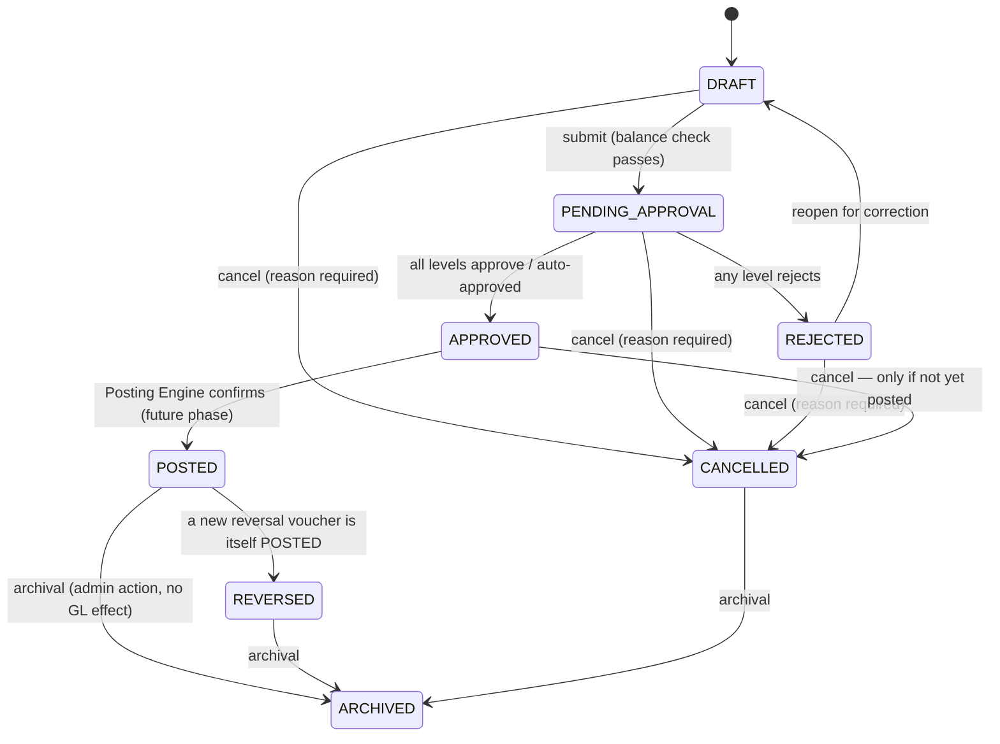
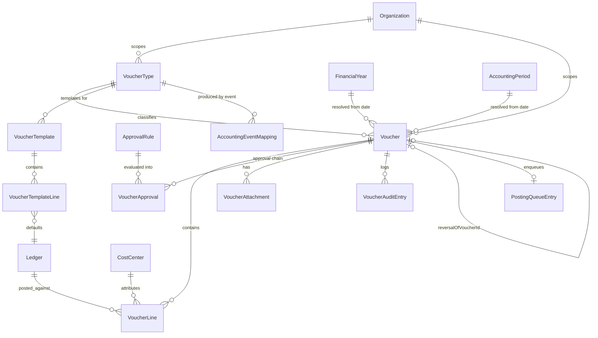

# Phase 2 — Voucher Engine
### Functional & Technical Design Document — MJ Transport ERP

Status: Design (no code written yet) · Scope: the Voucher Engine only — no Posting Engine, no Banking, Receivables/Payables, Payroll, Loans, or GST logic.

---

## 1. Business Overview

Phase 1 built the vocabulary (Chart of Accounts, Ledgers, Financial Years, Cost Centers, Number Series, Opening Balances). Nothing has moved money yet — there is still no way for any event in the ERP to change what a ledger's balance *is*. Phase 2 builds the one and only door through which money is allowed to move: the Voucher.

The rule carried over from Phase 1's mandate is now made concrete: **every module that will ever touch money — Trip, Payroll, Inventory, Vehicle, Banking, Loans, GST — creates a Voucher. None of them ever writes to a ledger directly.** This phase does not build those modules; it builds the structure they will all eventually speak through, plus the one mapping table (`AccountingEventMapping`) that will later tell each module *which* voucher type its events produce.

A Voucher in this system is deliberately not yet allowed to change a balance either — that is the Posting Engine's job, explicitly out of scope here (§16 "Posting Queue Foundation" only). What this phase delivers is everything upstream of that: voucher types, entry, line items, the double-entry balance guarantee, the approval workflow, attachments, templates, reversal, cancellation, and the queue a future Posting Engine will drain.

**Grounded in what Phase 1 actually built**, not built in the abstract:
- Voucher numbering issues through the `NumberSeries`/`numberSeriesService.issueNext()` machinery already built and left ready for exactly this purpose ("*exported here so the posting engine has a ready, already-safe-under-concurrency implementation to call rather than reinventing one later*" — Phase 1 code comment).
- Voucher approval routes through the `ApprovalRule` table already built in Phase 1 (`module = VOUCHER`, `voucherType`, `minAmount`/`maxAmount`, `approverRoleId`, `sequenceOrder`, `autoApproveBelow`) — nothing new to design there, only the engine that evaluates it.
- Voucher line attribution reuses `CostCenter` exactly as built — a line does **not** get nine separate dimension columns (cost category, branch, department, vehicle, trip, driver...); it gets one `costCenterId`, because Phase 1 already modeled Vehicle/Driver/Supplier/Trip/Branch/Department as Cost Centers under seeded Cost Categories. Duplicating that as flat columns on every voucher line would be the exact "don't store a shortcut sideways" mistake the whole Phase 1 architecture exists to prevent.
- Voucher preferences reuse `AccountingPreference` verbatim: `voucherApprovalRequired`, `costCenterMandatory`, `narrationMandatory`, `attachmentMandatory`, `allowDuplicateReference`, `backDateEntryAllowed`/`backDateAllowedDays`, `numberingMode` all already exist and are simply *read* by the Voucher Engine, not redefined.
- Voucher dates validate against the real `FinancialYear`/`AccountingPeriod` status machine Phase 1 built, including the existing `PeriodLockOverride` trail for anything posted into a period that had to be force-reopened.

---

## 2. Voucher Architecture

```
Business Module (Trip / Payroll / Inventory / Vehicle / Banking / Loan / GST)
        │  (future phases — not built here)
        ▼
AccountingEventMapping  ──── tells the module which VoucherType to create
        │
        ▼
Voucher Engine  (THIS PHASE)
        │
        ├── VoucherType            — configurable voucher definitions
        ├── Voucher (header)       — one per transaction
        ├── VoucherLine (detail)   — unlimited debit/credit lines, must balance
        ├── VoucherApproval        — approval-level decisions, evaluated against Phase 1's ApprovalRule
        ├── VoucherAttachment      — supporting documents
        ├── VoucherAuditEntry      — structured before/after audit trail
        ├── VoucherTemplate        — reusable line-structure presets
        │
        ▼
PostingQueue  (FOUNDATION ONLY — enqueue, no processor)
        │
        ▼
Posting Engine (FUTURE PHASE — drains the queue, writes the General Ledger)
```

The Voucher Engine's job ends at **Approved + Enqueued**. It never updates a ledger balance — that remains true even inside this phase, on purpose, so the "no module bypasses the posting engine" rule has no exception anywhere, including here.

---

## 3. Voucher Lifecycle



Key rule embedded in this diagram: **`POSTED` has exactly two ways out — `REVERSED` (via a brand-new voucher) and `ARCHIVED` (a filing action with zero accounting effect). There is no path back to `DRAFT`, no `edit`, no `delete` from `POSTED`.** Everything the brief calls "Amendment" (§ Amendment Rules) is really "how do you correct a posted voucher without ever taking that path" — answered in §7.

`approvalStatus` is tracked as a field distinct from `status` (per the brief), but is fully determined by it — never independently settable:

| `status` | `approvalStatus` |
|---|---|
| DRAFT | NOT_REQUIRED |
| PENDING_APPROVAL | PENDING |
| APPROVED | APPROVED |
| REJECTED | REJECTED |
| POSTED / REVERSED / CANCELLED / ARCHIVED | *(frozen at whatever it was on entering the state)* |

---

## 4. Module Breakdown

| # | Module | New table? |
|---|---|---|
| 1 | Voucher Types | `VoucherType` |
| 2 | Voucher Master | `Voucher` |
| 3 | Voucher Numbering | No new table — extends Phase 1 `NumberSeriesDocumentType` enum + reuses `numberSeriesService.issueNext()` |
| 4 | Voucher Entry | `Voucher` + `VoucherLine` (same as #2/#5) |
| 5 | Voucher Line Items | `VoucherLine` |
| 6 | Voucher Status Workflow | No new table — `Voucher.status`/`approvalStatus` enums (§3) |
| 7 | Voucher Approval Workflow | `VoucherApproval` (consumes Phase 1 `ApprovalRule` — no change to that table) |
| 8 | Voucher Validation Engine | No new table — service-layer rule set (§8) |
| 9 | Voucher Reference Management | No new table — fields on `Voucher`/`VoucherLine` + `VoucherAuditEntry` for history |
| 10 | Voucher Attachments | `VoucherAttachment` |
| 11 | Voucher Audit Trail | `VoucherAuditEntry` (alongside Phase 1's generic `AuditLog`, not replacing it) |
| 12 | Voucher Templates | `VoucherTemplate`, `VoucherTemplateLine` |
| 13 | Voucher Reversal | No new table — `Voucher.reversalOfVoucherId` self-relation |
| 14 | Voucher Cancellation | No new table — `Voucher.cancelledById`/`cancelledAt`/`cancellationReason` |
| 15 | Voucher Amendment Rules | No new table — service-layer rule, gated by `VoucherType.editableAfterApproval` |
| 16 | Posting Queue Foundation | `PostingQueueEntry` |
| 17 | Accounting Event Mapping Foundation | `AccountingEventMapping` |

8 new tables in total (`VoucherType`, `Voucher`, `VoucherLine`, `VoucherApproval`, `VoucherAttachment`, `VoucherAuditEntry`, `VoucherTemplate` + `VoucherTemplateLine`, `PostingQueueEntry`, `AccountingEventMapping` — 9 counting the template's line table). Nine modules of the seventeen requested need no new schema at all — they're workflow rules layered on the tables above, or direct reuse of Phase 1 structures.

---

## 5. Database Design

Same conventions as Phase 1: UUID PKs, `organizationId` scoping where the row is a standalone master, soft delete via `deletedAt` where hard delete would ever be wrong, `createdById`/`updatedById` plain columns (no FK, matching the existing codebase convention), `@@map` to snake_case.

### 5.1 `VoucherType`

| Column | Type | Notes |
|---|---|---|
| organizationId | uuid FK → Organization | |
| code | varchar | e.g. `PAYMENT`, `RECEIPT`, `JOURNAL`, `CONTRA`, `SALES`, `PURCHASE`, `DEBIT_NOTE`, `CREDIT_NOTE`, `EXPENSE`, `SALARY`, `OPENING`, `ADJUSTMENT`, `LOAN`, `INTEREST`, `DEPRECIATION`, `ASSET_PURCHASE`, `ASSET_SALE`, or a custom code |
| name | varchar | |
| prefix | varchar, nullable | display convenience; the real numbering config lives in Phase 1's `NumberSeries` row for the matching `documentType` |
| numberSeriesDocumentType | enum (extended `NumberSeriesDocumentType`) | which Phase 1 `NumberSeries` row issues this type's numbers |
| numberingMode | enum: AUTO / MANUAL | overrides `AccountingPreference.numberingMode` per type if set |
| approvalRequired | boolean | if false, every voucher of this type auto-approves on submit |
| postingRequired | boolean | if false, approved vouchers of this type never enter the Posting Queue (rare — reserved for non-GL memo vouchers) |
| editableAfterApproval | boolean, default false | gates whether an `APPROVED`-but-not-yet-`POSTED` voucher may still be edited |
| allowAttachments | boolean | |
| allowCostCenter | boolean | |
| allowReference | boolean | |
| allowNarration | boolean | |
| defaultDebitLedgerId | uuid FK → Ledger, nullable | pre-fills the first line on entry (e.g. Payment Voucher defaults debit to the paid-to party's control ledger group) |
| defaultCreditLedgerId | uuid FK → Ledger, nullable | |
| isSystemType | boolean | seeded types (Payment/Receipt/Journal/Contra/Sales/Purchase/Debit Note/Credit Note/Opening) protected from delete |
| isActive | boolean | |
| deletedAt, createdById, updatedById, createdAt, updatedAt | — | |

Constraints: unique `(organizationId, code)`.

### 5.2 `Voucher`

| Column | Type | Notes |
|---|---|---|
| organizationId | uuid FK → Organization | |
| voucherNumber | varchar | issued via `numberSeriesService.issueNext()` against the type's `NumberSeries` row |
| voucherDate | date | must fall inside an `OPEN` `AccountingPeriod` of an `ACTIVE` `FinancialYear` |
| voucherTypeId | uuid FK → VoucherType | |
| financialYearId | uuid FK → FinancialYear | resolved from `voucherDate`, not user-entered |
| accountingPeriodId | uuid FK → AccountingPeriod | resolved from `voucherDate` via the same `accountingPeriodRepository.findByDate()` built in Phase 1 |
| referenceNumber, referenceDate | varchar/date, nullable | header-level primary reference |
| referenceType | enum: AGAINST_INVOICE / ADVANCE / ON_ACCOUNT / NEW_REFERENCE / ADJUSTMENT / OTHER | |
| narration | text, nullable | mandatory if `AccountingPreference.narrationMandatory` or `VoucherType.allowNarration` requires it |
| status | enum (§3) | DRAFT / PENDING_APPROVAL / APPROVED / REJECTED / POSTED / CANCELLED / REVERSED / ARCHIVED |
| approvalStatus | enum: NOT_REQUIRED / PENDING / APPROVED / REJECTED | derived, see §3 table |
| totalDebit, totalCredit | decimal(18,2) | denormalized cache of the line sums — always equal, maintained transactionally with every line write, never hand-edited |
| createdById | uuid | |
| approvedById, approvedAt | uuid/timestamp, nullable | final approving user (last level) |
| rejectedById, rejectedAt, rejectionReason | uuid/timestamp/text, nullable | |
| cancelledById, cancelledAt, cancellationReason | uuid/timestamp/text, nullable | |
| reversalOfVoucherId | uuid FK → Voucher (self), nullable, unique | set only on a reversal voucher, pointing at what it reverses |
| postingStatus | enum: NOT_QUEUED / QUEUED / PROCESSING / POSTED / FAILED | denormalized cache of the matching `PostingQueueEntry.status`, for fast list rendering without a join |
| postingDate | timestamp, nullable | when the (future) Posting Engine actually posted it |
| sourceModule | enum: MANUAL / TRIP / PAYROLL / INVENTORY / VEHICLE / BANKING / LOAN / GST | `MANUAL` for anything entered directly in this phase — every other value is reserved for a module that doesn't exist yet |
| sourceDocumentType, sourceDocumentId | varchar/uuid, nullable | polymorphic pointer back to the originating business record once a source module exists (e.g. `Trip`/`<trip id>`) |
| version | int, default 0 | optimistic concurrency — approval actions and edits both mutate this row, and two concurrent approval clicks must not both "win" |
| deletedAt, createdAt, updatedAt | — | soft delete exists structurally but is never used by any normal flow — see §7 (cancellation, not deletion, is the only way a voucher stops mattering) |

Constraints: unique `(organizationId, voucherNumber)`. Index `(voucherTypeId)`, `(financialYearId)`, `(accountingPeriodId)`, `(status)`, `(postingStatus)`, `(sourceModule, sourceDocumentType, sourceDocumentId)` (answers "has this Trip already generated a voucher?" in O(1) once Trip integration exists).

### 5.3 `VoucherLine`

| Column | Type | Notes |
|---|---|---|
| voucherId | uuid FK → Voucher, cascade delete | lines never outlive their voucher |
| lineNo | int | display order |
| ledgerId | uuid FK → Ledger | must be `isActive`; classification is read at posting time, never copied here |
| debitAmount, creditAmount | decimal(18,2), default 0 | exactly one is > 0 per line — enforced in the service layer (a DB `CHECK` is noted as a hardening option in §12) |
| currencyId | uuid FK → Currency, nullable | defaults to the ledger's own currency |
| exchangeRate | decimal(18,6), default 1 | unused until multi-currency vouchers exist; present so the column doesn't need adding later |
| costCenterId | uuid FK → CostCenter, nullable | the **single** attribution point — covers vehicle/driver/supplier/trip/branch/department, all of which are already Cost Centers per Phase 1 |
| partyType | enum (Phase 1's `LedgerPartyType`, reused verbatim) | line-level party override — lets one control ledger (e.g. "Sundry Debtors") post against many different customers across lines of the same voucher |
| partyId | uuid, nullable | polymorphic, validated the same way Phase 1's `validateLedgerParty()` already does |
| referenceNumber, referenceType | varchar/enum, nullable | per-line reference, for a Journal voucher whose lines each settle a different bill |
| narration | text, nullable | overrides the header narration for this line only |
| taxLedgerId, taxAmount | uuid/decimal, nullable | reserved placeholder for GST — **not implemented**, just a column that won't need a migration when GST lands |
| metadata | jsonb, nullable | the brief's "Future Dimensions" — a deliberately generic escape hatch rather than guessing at unnamed future columns |
| createdAt, updatedAt | — | |

Constraints: index `(voucherId)`, `(ledgerId)`, `(costCenterId)`, `(partyType, partyId)`.

### 5.4 `VoucherApproval`

| Column | Type | Notes |
|---|---|---|
| voucherId | uuid FK → Voucher, cascade delete | |
| approvalRuleId | uuid FK → Phase 1 `ApprovalRule`, nullable | null only for a manual ad-hoc approval with no matching configured rule |
| levelNo | int | sequence within this voucher's approval chain |
| approverRoleId | varchar (denormalized Role id) | copied from the rule *at evaluation time* — a rule edited later must not retroactively rewrite history |
| actualApproverId | uuid, nullable | the User who actually decided (null while PENDING) |
| decision | enum: PENDING / APPROVED / REJECTED | |
| remarks | text, nullable | |
| decidedAt | timestamp, nullable | |
| createdAt | timestamp | |

Constraints: unique `(voucherId, levelNo)`.

### 5.5 `VoucherAttachment`

| Column | Type | Notes |
|---|---|---|
| voucherId | uuid FK → Voucher, cascade delete | |
| category | enum: INVOICE / BILL_COPY / RECEIPT / CHEQUE_IMAGE / POD / SUPPORTING_DOCUMENT / TRANSPORT_DOCUMENT / SCANNED_COPY / OTHER | |
| fileName, filePath, fileType | varchar | same multer-backed upload convention already used for Supplier documents in Phase 3 of the base system |
| fileSizeBytes | int | |
| uploadedById, uploadedAt | uuid/timestamp | |
| deletedAt | timestamp, nullable | soft delete — a removed attachment stays discoverable in the audit trail |

Constraints: index `(voucherId)`.

### 5.6 `VoucherAuditEntry`

| Column | Type | Notes |
|---|---|---|
| voucherId | uuid FK → Voucher, cascade delete | |
| action | enum: CREATED / UPDATED / FIELD_CHANGED / SUBMITTED / APPROVED / REJECTED / POSTED / CANCELLED / REVERSED | |
| fieldName | varchar, nullable | populated only for `FIELD_CHANGED` rows |
| oldValue, newValue | text, nullable | |
| reason | text, nullable | mandatory for `CANCELLED`, optional elsewhere |
| performedById | uuid | |
| performedAt | timestamp | |

This sits **alongside**, not instead of, Phase 1's generic `AuditLog` — `AuditLog` still gets one summary row per action (for the cross-entity "show me everything this user did" search Administration already has); `VoucherAuditEntry` is the voucher-specific structured old/new trail the brief explicitly asks for, which the generic log's free-text `description` field can't answer queries against (e.g. "show every narration ever changed on this voucher").

### 5.7 `VoucherTemplate` / `VoucherTemplateLine`

| `VoucherTemplate` column | Type | Notes |
|---|---|---|
| organizationId | uuid FK → Organization | |
| code, name | varchar | e.g. Fuel Expense, Salary Payment, Driver Advance, Supplier Payment, Bank Transfer, Office Expense, Loan EMI, Insurance, FastTag Recharge |
| voucherTypeId | uuid FK → VoucherType | |
| description | text, nullable | |
| isSystemTemplate | boolean | |
| isActive | boolean | |

| `VoucherTemplateLine` column | Type | Notes |
|---|---|---|
| templateId | uuid FK → VoucherTemplate, cascade delete | |
| lineNo | int | |
| ledgerId | uuid FK → Ledger | |
| side | enum: DEBIT / CREDIT | which side this line defaults to — the amount is always left blank for the user to fill in at entry time |
| defaultCostCenterId | uuid FK → CostCenter, nullable | |
| defaultNarration | text, nullable | |

Selecting a template at voucher-entry time pre-populates `VoucherLine` rows from `VoucherTemplateLine` with `debitAmount`/`creditAmount` left at 0 — the user only has to type amounts, not rebuild the ledger structure every time.

### 5.8 `PostingQueueEntry`

| Column | Type | Notes |
|---|---|---|
| voucherId | uuid FK → Voucher, unique | one queue row per voucher, updated in place across retries — never duplicated |
| status | enum: PENDING / PROCESSING / SUCCESS / FAILED | |
| attemptCount | int, default 0 | |
| lastAttemptAt, nextRetryAt | timestamp, nullable | |
| errorMessage | varchar, nullable | short summary for list views |
| errorLog | text, nullable | full detail for the (future) Posting Engine's failure diagnostics |
| queuedAt | timestamp | when this phase enqueued it |
| postedAt | timestamp, nullable | set by the future Posting Engine, not by anything built in this phase |
| priority | int, default 0 | reserved for future ordering; unused by anything in this phase since nothing dequeues yet |

This phase implements **only** the enqueue action (Approved + `postingRequired` → insert a `PENDING` row) and the read-side status surfaced back onto `Voucher.postingStatus`. No process ever transitions a row from `PENDING`, `PROCESSING`, or `FAILED` — there is nothing yet that would.

### 5.9 `AccountingEventMapping`

| Column | Type | Notes |
|---|---|---|
| organizationId | uuid FK → Organization | |
| sourceModule | enum: TRIP / PAYROLL / INVENTORY / VEHICLE / BANKING / LOAN / GST | `MANUAL` is deliberately excluded — this table exists for *automated* triggers, not the manual entry screen |
| sourceEventCode | varchar | e.g. `TRIP_COMPLETED`, `SUPPLIER_PAYMENT_MADE`, `DRIVER_ADVANCE_GIVEN`, `SALARY_PROCESSED`, `BANK_TRANSFER`, `LOAN_EMI_DUE` |
| voucherTypeId | uuid FK → VoucherType | which voucher type that event should generate, once the owning module exists |
| description | text, nullable | |
| isActive | boolean | |

Constraints: unique `(organizationId, sourceModule, sourceEventCode)`. **This table is pure configuration.** No listener, trigger, or handler is implemented against it in this phase — there is nothing to listen for yet, since Trip/Payroll/Banking/Loan/GST accounting integration doesn't exist. It exists now so that when each of those modules is built, "which voucher does this event produce" is a lookup, not a code change.

---

## 6. Entity Relationships



---

## 7. Business Rules

**Voucher Lifecycle.** A voucher is created `DRAFT`, is only ever balance-checked-and-locked into `PENDING_APPROVAL`/auto-`APPROVED` on explicit submit, and from `POSTED` has exactly two forward exits: `REVERSED` (a new voucher neutralizes it) and `ARCHIVED` (filing, zero GL effect). There is no edge back into `DRAFT` from anything except `REJECTED` — a rejected voucher was never posted, so reopening it for correction is safe.

**Posting Rules.** Only `APPROVED` vouchers may be enqueued, and only if `VoucherType.postingRequired` is true. Enqueue is the *only* action this phase performs against the ledger-affecting pipeline — it never simulates, previews, or performs an actual posting. `Voucher.postingStatus` mirrors the queue row purely for read convenience.

**Approval Rules.** On submit, the engine reads every active `ApprovalRule` where `module = VOUCHER` and `voucherType` matches (or is null, meaning "any"), whose `[minAmount, maxAmount]` band contains `Voucher.totalDebit`, ordered by `sequenceOrder`. If the lowest matching rule has `autoApproveBelow = true`, the voucher auto-approves with one system-generated `VoucherApproval` row. Otherwise one `PENDING` `VoucherApproval` row is created per distinct `sequenceOrder` found, and levels are actioned strictly in order — level 2 cannot approve before level 1 has. Any single rejection at any level rejects the whole voucher.

**Number Generation.** Every voucher number is issued through Phase 1's `numberSeriesService.issueNext()` against the `NumberSeries` row matching `VoucherType.numberSeriesDocumentType` — the same optimistic-concurrency, no-duplicate-numbers guarantee Phase 1 built for exactly this moment. Numbers are issued once and never reused, even for a cancelled voucher — a gap is evidence of a cancellation, not a bug.

**Reference Management.** A reference is metadata about *why* money moved, not a second ledger — `referenceType = AGAINST_INVOICE`/`ADVANCE`/`ON_ACCOUNT`/`NEW_REFERENCE`/`ADJUSTMENT`/`OTHER` at header level (and optionally overridden per line for split-reference Journal entries). Every change to a reference field is captured as a `FIELD_CHANGED` row in `VoucherAuditEntry` — that log **is** the reference history the brief asks for, not a separate table.

**Reversal Rules.** Reversal always creates a brand-new voucher (opposite debit/credit per line, same lines otherwise), never edits the original. The original's `status` only flips to `REVERSED` once its reversal voucher is itself fully `POSTED` — a reversal that's still sitting in `DRAFT` or pending its own approval must not make the original look neutralized before it actually is. `reversalOfVoucherId` is unique — one reversal per voucher in this phase; a need for partial/multiple reversals is a documented future extension (§15), not built now.

**Cancellation Rules.** Cancellable states are `DRAFT`, `PENDING_APPROVAL`, `REJECTED`, and `APPROVED`-but-not-yet-posted. `POSTED` is never cancellable — only reversible — because cancelling a posted voucher would erase real accounting history instead of correcting it. Every cancellation requires a reason and is a soft state transition (`status = CANCELLED`), never a delete.

**Amendment Rules.** Once `status = POSTED`, no field on the voucher or its lines may change, full stop, regardless of any flag. Before that, `VoucherType.editableAfterApproval` decides whether an `APPROVED` voucher can still be tweaked pre-posting. Every correction to a posted voucher's effect happens through a *new* voucher — Journal, Debit Note, Credit Note, a Reversal, or an Adjustment voucher — never by touching the posted row.

**Validation Rules.** Total Debit must equal Total Credit at every save, not only at approval or posting — a voucher is simply never allowed to exist unbalanced, matching how Tally itself refuses to let an entry screen close unbalanced. This is enforced identically at create, at every line edit, at submit, and (redundantly, as a last-line defense) immediately before enqueue.

---

## 8. Validation Rules

| Rule | Enforced |
|---|---|
| Voucher date falls inside an accounting period | Reject if no `AccountingPeriod` row contains `voucherDate` for the org |
| That period is `OPEN` | Reject if `CLOSED`/`LOCKED`/`FROZEN` — no per-voucher override; only a period-level `PeriodLockOverride` (Phase 1) can reopen it |
| Financial Year is `ACTIVE` | Reject otherwise (mirrors Phase 1's own activation gate) |
| Back-dating within policy | If `AccountingPreference.backDateEntryAllowed = false`, `voucherDate` cannot be earlier than today; if true, no earlier than `backDateAllowedDays` |
| Voucher number unique | Enforced by `NumberSeries` issuance + the table's own unique constraint as a second line of defense |
| Total Debit = Total Credit | Every line write, every status transition — no exceptions |
| At least 2 lines, each with either debit or credit (never both, never neither) | Service-layer check before any save |
| Ledger exists and is active | Every `VoucherLine.ledgerId` |
| Cost Center required | If `AccountingPreference.costCenterMandatory` or `VoucherType.allowCostCenter` requires it |
| Narration required | If `AccountingPreference.narrationMandatory` or `VoucherType.allowNarration` requires it |
| Attachment required | If `AccountingPreference.attachmentMandatory` or `VoucherType.allowAttachments` requires it |
| Currency valid | `VoucherLine.currencyId`, if set, must exist and be active |
| Reference not duplicated | Unless `AccountingPreference.allowDuplicateReference = true` |
| Cannot edit a `POSTED` voucher | Hard block, independent of any role or flag |
| Cannot delete a `POSTED` voucher (or any voucher) | Only `CANCELLED` (soft) or `REVERSED` (new voucher) exist as end states — no delete endpoint at all |
| Cannot reverse an already-`REVERSED` voucher | Reject — `reversalOfVoucherId` uniqueness plus a status check |
| Cannot reverse a voucher that isn't `POSTED` | Reversal only makes sense against real posted history |
| Cannot cancel a `POSTED` voucher | See Cancellation Rules above |
| Approval level acted out of order | Reject — level *N* requires level *N-1* `APPROVED` first |

---

## 9. Approval Workflow

Reuses Phase 1's `ApprovalRule` (`module = VOUCHER`) with zero schema change — this phase only builds the *evaluator*:

1. On submit, collect active rules for the voucher's `voucherType` (falling back to rules with `voucherType = null`, meaning "applies to all voucher types").
2. Filter to rules whose `[minAmount, maxAmount]` band contains `totalDebit`.
3. If any matching rule (lowest `sequenceOrder`) has `autoApproveBelow = true` → auto-approve, single system `VoucherApproval` row, `status = APPROVED` immediately.
4. Otherwise, create one `PENDING` `VoucherApproval` row per distinct `sequenceOrder` present among matching rules, and set `status = PENDING_APPROVAL`.
5. Any user holding the role named by a `PENDING` level's `approverRoleId` may action that level (approve/reject + remarks) — but only once every lower `sequenceOrder` level is `APPROVED`.
6. All levels `APPROVED` → voucher `status = APPROVED`. Any level `REJECTED` → voucher `status = REJECTED` immediately, remaining levels never actioned.

Department-based approval and further workflow expansion (parallel levels, delegate approvers, escalation) are explicitly left as future extensions of the same `ApprovalRule`/`VoucherApproval` pair — the table shape doesn't need to change to add them later (§15).

---

## 10. Posting Queue Design

Deliberately the smallest module in this phase. One row per voucher (`unique voucherId`), one enum (`PENDING`/`PROCESSING`/`SUCCESS`/`FAILED`), an attempt counter, and an error log. The **only** write path implemented now is:

```
Voucher.status → APPROVED  AND  VoucherType.postingRequired = true
        │
        ▼
INSERT PostingQueueEntry { voucherId, status: PENDING, queuedAt: now() }
        │
        ▼
Voucher.postingStatus ← "QUEUED"   (denormalized mirror, read-only convenience)
```

Nothing reads `PENDING` rows and processes them — that consumer is the Posting Engine, a future phase. `PROCESSING`/`SUCCESS`/`FAILED`/retry semantics are modeled now (so the future engine doesn't need a migration) but are never set by anything in this phase.

---

## 11. API Design

REST, under `/api/accounting/vouchers*`, following the existing Express + Zod + service/repository pattern.

| Module | Endpoints |
|---|---|
| Voucher Types | `GET/POST /voucher-types`, `GET/PUT/DELETE /voucher-types/:id` |
| Vouchers | `GET/POST /vouchers`, `GET/PUT /vouchers/:id`, `POST /vouchers/:id/submit`, `POST /vouchers/:id/approve`, `POST /vouchers/:id/reject`, `POST /vouchers/:id/cancel`, `POST /vouchers/:id/reverse`, `POST /vouchers/:id/reopen` (REJECTED→DRAFT), `POST /vouchers/:id/archive`, `GET /vouchers/:id/audit-trail` |
| Voucher Lines | Nested under voucher create/update payload — no standalone line endpoints, since a line never exists without its voucher |
| Approvals | `GET /vouchers/:id/approvals`, `POST /vouchers/:id/approvals/:levelNo/decide` |
| Attachments | `POST/GET/DELETE /vouchers/:id/attachments` |
| Templates | `GET/POST /voucher-templates`, `GET/PUT/DELETE /voucher-templates/:id`, `POST /vouchers/from-template/:templateId` |
| Posting Queue | `GET /posting-queue` (read-only visibility — Auditor/Accounts Manager only; no action endpoints since nothing processes it yet) |
| Event Mapping | `GET/POST /accounting-event-mappings`, `GET/PUT/DELETE /accounting-event-mappings/:id` |

Every write follows the existing pattern: Zod validation → `authorize()` → service-layer business rules (§7/§8) → repository → `AuditLog` + `VoucherAuditEntry`.

---

## 12. UI/UX Design

| Screen | Purpose |
|---|---|
| Voucher Entry | Type-first form: pick `VoucherType` (or a Template) → header fields gated by that type's `allow*` flags → line grid (ledger, cost center, Dr/Cr, party) with a live running Dr/Cr balance banner that turns red when unequal and blocks Save |
| Voucher List | Filterable by type/status/date range/amount; status and approval shown as colored chips, not text |
| Voucher Approval Screen | Queue scoped to "levels I can action right now" (lower levels already approved); bulk-approve for same-type/same-amount-band batches |
| Voucher Details | Header + line grid (read-only once posted) + attachments + full `VoucherAuditEntry` timeline |
| Voucher Timeline | Chronological render of `VoucherAuditEntry` — created → submitted → approved (per level) → posted/reversed |
| Attachment Viewer | Inline preview for images/PDF, download for everything else |
| Filters/Search/Sort | Standard grid toolbar, same pattern as every Phase 1 list page |
| Bulk Approval / Bulk Export | Multi-select on the Approval Screen / List respectively |
| Print Voucher | Standard printable layout per voucher type (matches the existing `pdfkit` usage already in the codebase) |
| Voucher Copy | "Duplicate as new Draft" action — copies lines, blanks the date and number |
| Template Selection | A picker shown at the start of Voucher Entry, optional — skips straight to a blank type-first form if none chosen |

---

## 13. Security & Permissions

New permission strings, `resource.action` convention:

`voucherType.view/create/edit/delete`, `voucher.view/create/edit/submit/cancel/reverse/reopen/archive`, `voucher.approve` (acting on any level), `voucherTemplate.view/create/edit/delete`, `postingQueue.view`, `accountingEventMapping.view/create/edit/delete`.

| Role | Access |
|---|---|
| Super Admin | Everything |
| Admin | Everything except acting as a named approver unless also holding that role |
| Accounts Manager | Full voucher type/template/event-mapping CRUD; create/edit/submit/cancel/reverse any voucher; approve where their role matches a rule |
| Accounts Executive | Create/edit/submit/cancel their own vouchers; view others; no approve, no reverse, no type/template management |
| Approver | Whatever `voucher.view` a voucher's visibility already grants, plus `voucher.approve` — a role-membership concept, not a new user type (matches `ApprovalRule.approverRoleId` pointing at existing `Role` rows) |
| Auditor | View-only everywhere, including `postingQueue.view` and every `VoucherAuditEntry` |
| Viewer | Read-only, no financial amounts hidden (Phase 2 has no field-level redaction) |

---

## 14. Audit Strategy

Two layers, matching Phase 1's own dual-layer pattern: `AuditLog` (generic, cross-entity, one row per action, already built) continues to fire for every voucher mutation. `VoucherAuditEntry` (new, this phase) adds the structured old-value/new-value trail specific to a financial document, because a regulator or internal auditor asking "who changed the narration on voucher JV-00042 and what did it used to say" needs a queryable answer, not a free-text description to grep. Neither layer is optional, and both are append-only — no update, no delete, ever, on either table.

---

## 15. Future Integration Points

| Consumer | Depends on |
|---|---|
| Posting Engine (next phase) | Drains `PostingQueueEntry` where `status = PENDING`; on success writes the (not-yet-built) General Ledger and flips `Voucher.postingStatus`/`status` to `POSTED` |
| Banking Module | Will create `CONTRA`/`PAYMENT`/`RECEIPT` vouchers for transfers and bank-side reconciliation; consumes `AccountingEventMapping` rows with `sourceModule = BANKING` |
| Trip Module | On trip completion, creates a `SALES` voucher; `sourceModule = TRIP`, `sourceDocumentId = Trip.id` |
| Payroll | Creates `SALARY`/`JOURNAL` vouchers per the mapping table |
| Inventory / Vehicle | Creates `EXPENSE`/`ASSET_PURCHASE`/`DEPRECIATION` vouchers |
| Loans | Creates `PAYMENT`/`INTEREST` vouchers for EMIs |
| GST | Will need `taxLedgerId`/`taxAmount` on `VoucherLine` (already reserved) plus new GST-specific validation — no schema change anticipated beyond what's already present |
| Financial Reports | Will read the (future) General Ledger, not vouchers directly — Trial Balance/P&L/Balance Sheet never query `Voucher`/`VoucherLine` once posting exists |
| Partial/multiple reversal | `reversalOfVoucherId`'s current 1:1 uniqueness is a deliberate Phase 2 simplification — a real need for partial reversal is a schema change for whichever future phase needs it, not solved speculatively now |

---

## 16. Risks & Recommendations

- **`NumberSeriesDocumentType` needs eight new enum values** (`EXPENSE_VOUCHER`, `SALARY_VOUCHER`, `ADJUSTMENT_VOUCHER`, `LOAN_VOUCHER`, `INTEREST_VOUCHER`, `DEPRECIATION_VOUCHER`, `ASSET_PURCHASE_VOUCHER`, `ASSET_SALE_VOUCHER`) beyond the eleven Phase 1 already anticipated. This is additive to an enum Phase 1 explicitly designed to be extended ("*later phases add values, never remove*") — not a violation of "don't modify Phase 1 architecture."
- **Debit/credit exclusivity per line** (never both, never neither) is specified here as a service-layer check; a Postgres `CHECK` constraint (`(debitAmount = 0) != (creditAmount = 0)` roughly) is a worthwhile hardening pass once the table exists, cheap insurance against a future bug bypassing the service layer.
- **Sequential-only approval** is the Phase 2 default; if a real approval scenario needs parallel/either-of-N levels, `VoucherApproval.levelNo` uniqueness would need to relax to "levels" becoming "groups" — flagged now so it isn't a surprise later, not solved speculatively today.
- **`totalDebit`/`totalCredit` on `Voucher` are a cache**, recomputed from `VoucherLine` on every write inside the same transaction — never a second source of truth. Same pattern Phase 1 used for `Ledger.openingBalance`.
- **No GL yet means no real balance check against Trial Balance** — the Voucher Engine can guarantee a single voucher balances internally, but cannot (and must not attempt to) verify anything against the wider ledger until the Posting Engine exists. Don't be tempted to have this phase "peek" at derived balances; that's next phase's job and doing it now would blur the boundary the whole architecture depends on.

## 17. Best Practices Applied

- **Reuse over duplication** — `ApprovalRule`, `NumberSeries`, `CostCenter`, `AccountingPreference`, `LedgerPartyType` are consumed exactly as Phase 1 built them; nothing here re-solves an already-solved problem.
- **One attribution column, not nine** — `VoucherLine.costCenterId` replaces the brief's flat list of dimension columns, because Phase 1 already made Cost Centers the multi-dimensional attribution mechanism.
- **Append-only history** — `VoucherAuditEntry`, `AuditLog`, and voucher numbering all guarantee that nothing about what happened is ever overwritten, only added to.
- **Immutability past `POSTED`** is enforced identically regardless of caller — service layer, not just UI — so no future integration (Trip, Payroll, ...) can accidentally mutate posted history either.
- **Money fields stay `decimal`**, matching every prior phase.

---

## 18. Implementation Sequence Within Phase 2

1. `VoucherType` (seed the system types: Payment, Receipt, Journal, Contra, Sales, Purchase, Debit Note, Credit Note, Opening — matching Phase 1's already-seeded `NumberSeries` rows for those exact document types)
2. Extend `NumberSeriesDocumentType` with the eight additional voucher-type values
3. `Voucher` + `VoucherLine` (header/detail, with the balance-validation service built before any status-transition logic touches it)
4. `VoucherApproval` + the approval evaluator (consumes existing `ApprovalRule` — no new config UI needed beyond what Phase 1 already built for managing rules)
5. `VoucherAttachment`
6. `VoucherAuditEntry`, wired into every mutation from step 3 onward retroactively
7. Reversal / Cancellation / Reopen actions (service-layer rules only, no new tables)
8. `VoucherTemplate` + `VoucherTemplateLine`
9. `PostingQueueEntry` + the enqueue-on-approve hook
10. `AccountingEventMapping` (seed the example rows from the brief — Trip Completed → Sales, Supplier Payment → Payment, Driver Advance → Payment, Salary → Journal, Bank Transfer → Contra, Loan EMI → Payment — as inactive/reference rows, since no module yet emits these events)

---

*End of Phase 2 design document. No implementation code has been written. Awaiting confirmation before proceeding to code implementation of this phase, or to Phase 3.*
