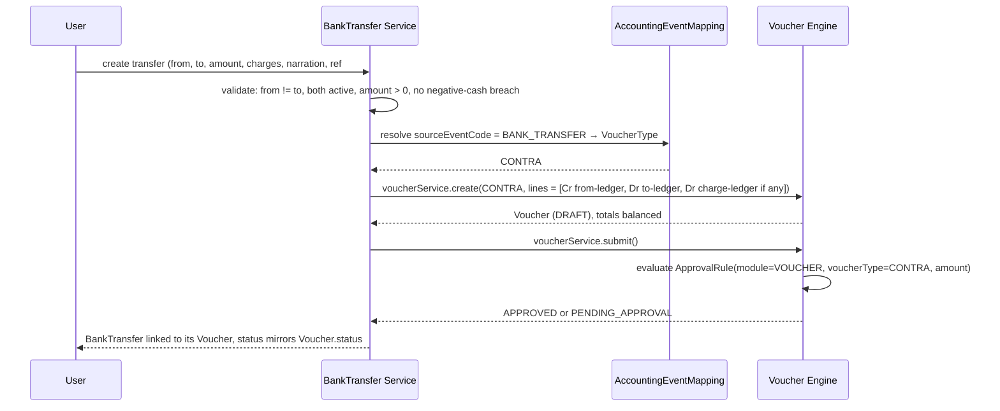
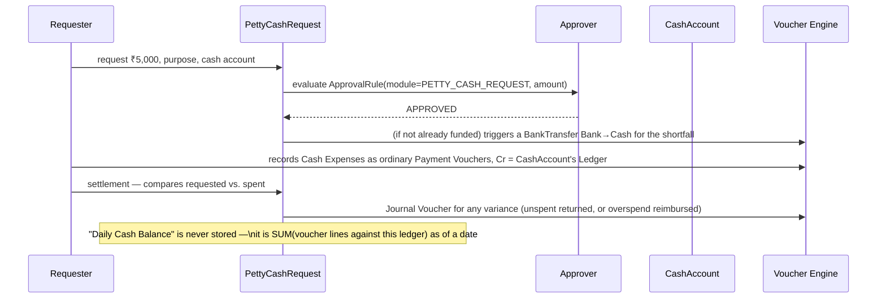
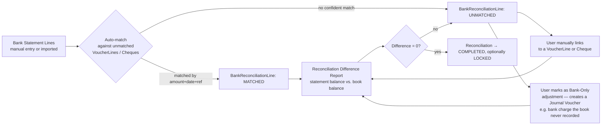
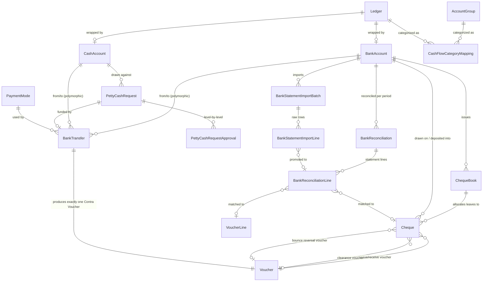
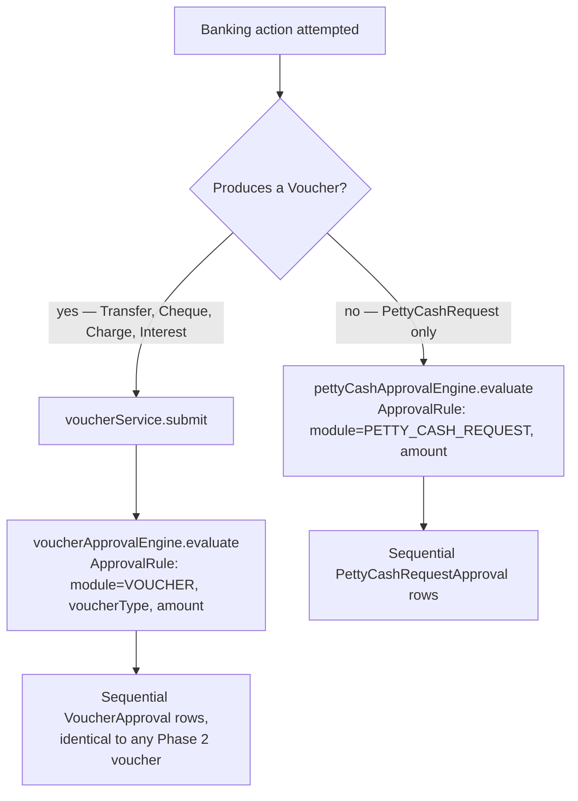

# Phase 3 — Banking & Cash Management
### Functional & Technical Design Document — MJ Transport ERP

Status: Design (no code written yet) · Scope: Bank Master, Cash Accounts, Payment Modes, Bank Transfer, Cheque Management, Bank Reconciliation, Bank Statement Import (foundation), Petty Cash, Bank Charges, Interest, Cash Flow (foundation), Bank Dashboard, Bank Approval Workflow. **No** Receivables, Payables, Driver Accounts, Payroll, Vehicle Loans, GST, or Reports.

---

## 1. Business Overview

Phase 1 built the vocabulary. Phase 2 built the one door money is allowed to move through — the Voucher. Neither phase gave the business a place to actually *manage* its banks and cash: which accounts exist, which cheques are outstanding, whether the bank statement agrees with the books, how much petty cash a driver-advance clerk is trusted to hold today.

Phase 3 is that place. It is not a new door — every transaction this module records still becomes a Voucher and still enters the same Posting Queue Phase 2 built. What Phase 3 adds is the *operational surface* around banking: registers, lifecycles, and reconciliation views that sit in front of the Voucher Engine rather than beside it.

**The one rule that must hold everywhere in this phase, with no exception**: nothing in Banking & Cash Management ever writes to a `Ledger` balance, and nothing in it computes or *stores* a running balance either. A `BankAccount` row has no `currentBalance` column. A `CashAccount` row has no `balance` column. Every "balance" this module ever shows — book balance, cash-in-hand, petty cash balance — is computed on demand by summing `VoucherLine` amounts against that account's `Ledger`, exactly the same way any future General Ledger report will. This is the same discipline Phase 1 enforced against `DriverBalance`/`SupplierBalance`-style shortcuts, applied here to banks and cash for the first time under real transaction volume.

**Grounded in what Phases 1 and 2 actually built:**
- `Ledger` already has `partyType = BANK` and already carries `bankName`/`bankAccountNumber`/`bankIfsc`/`bankBranch` (Phase 1). A bank account in this phase is **not** a duplicate of that data — it is a thin `BankAccount` row that *wraps* an existing (or newly created) `Ledger`, adding only what Phase 1's generic Ledger shape has no room for (SWIFT, MICR, account type, primary/default flags, statement-import state).
- Cash ledgers (Cash in Hand, Petty Cash, Branch Cash…) were already seeded in Phase 1 as ordinary `Ledger` rows under the Current Assets group. `CashAccount` wraps one of those the same way `BankAccount` wraps a `Ledger` with `partyType = BANK`.
- Every banking transaction still becomes a `Voucher` through the existing `voucherService`, still validates against the same `FinancialYear`/`AccountingPeriod` state machine, still balances Dr = Cr through the same `voucherBalance.util.ts`, still runs through the *same* approval engine (`ApprovalRule` + `VoucherApproval`, `module = VOUCHER`) — no second approval engine is built for banking.
- `Voucher.sourceModule = BANKING` and `VoucherReferenceType`/`VoucherSourceModule` already exist in the Phase 2 schema — built, in Phase 2's own words, "so the posting engine has a ready... implementation to call rather than reinventing one later." Phase 3 is the first module to actually set `sourceModule = BANKING`.
- `AccountingEventMapping` already has a seeded (but `isActive: false`) row: `BANKING` / `BANK_TRANSFER` → the `CONTRA` voucher type. Phase 3 is the phase that turns that light on — see §10.

---

## 2. Banking Architecture

```
Bank Transaction (Transfer / Deposit / Withdrawal / Cheque / Charge / Interest)
        │
        ▼
Banking & Cash Service Layer            (THIS PHASE)
        │
        ├── BankAccount / CashAccount   — thin wrappers over Phase 1 Ledger
        ├── PaymentMode                 — how the money moved
        ├── BankTransfer                — Bank⇄Bank / Bank⇄Cash / Cash⇄Cash
        ├── ChequeBook / Cheque         — physical instrument lifecycle
        ├── PettyCashRequest            — pre-disbursement approval
        ├── BankReconciliation          — statement vs. book matching
        │
        ▼
AccountingEventMapping   ──── resolves sourceEventCode → VoucherType (reused from Phase 2, now activated)
        │
        ▼
Voucher Engine (Phase 2, unchanged)     — creates the Voucher, enforces Dr = Cr, runs approval
        │
        ▼
PostingQueue (Phase 2, unchanged — still enqueue-only)
        │
        ▼
Posting Engine (future phase)           — the only thing that will ever touch a Ledger's balance
```

Banking never calls anything below the `AccountingEventMapping` line itself except through `voucherService`. There is no `bankAccount.balance -= amount` anywhere in this design — that sentence should not be constructible in code, and the schema is built so it cannot be.

---

## 3. Cash Management Architecture

Cash is modeled as a parallel, lighter-weight sibling of Banking, not a special case bolted onto it:

```
CashAccount (wraps a Ledger, e.g. "Petty Cash — Branch A")
        │
        ├── funded by a BankTransfer (Bank → Cash) — same Contra Voucher path as any transfer
        ├── PettyCashRequest — "I need ₹5,000 for fuel this week" — approved BEFORE any voucher exists
        ├── Cash Expense — an ordinary Payment Voucher, credit side = the CashAccount's Ledger
        └── Cash Settlement / Closing — reconciles requested vs. spent, tops up or returns the balance
```

A `CashAccount` never receives money directly from "nowhere" — every rupee in a petty cash tin arrived via a `BankTransfer` (Bank → Cash) or a `Voucher` (e.g. an opening balance in Phase 1), and every rupee that leaves it is an ordinary voucher crediting that ledger. This is why Phase 3 needs no `PettyCashAllocation` table of its own — "allocating" petty cash *is* a `BankTransfer`, reused rather than duplicated (the same reuse discipline Phase 2 applied to `CostCenter`).

---

## 4. Module Breakdown

| # | Module (from brief) | New table? |
|---|---|---|
| 1 | Bank Master | `BankAccount` (wraps `Ledger`) |
| 2 | Cash Accounts | `CashAccount` (wraps `Ledger`) |
| 3 | Payment Modes | `PaymentMode` |
| 4 | Bank Account Configuration | No new table — fields on `BankAccount` (§6.1) |
| 5 | Bank Transfer | `BankTransfer` |
| 6 | Cash Deposit | No new table — a `BankTransfer` where `toAccountType = BANK`, `fromAccountType = CASH` (or vice versa for Withdrawal) |
| 7 | Cash Withdrawal | Same as #6, opposite direction |
| 8 | Cheque Management | `ChequeBook`, `Cheque` |
| 9 | Cheque Register | No new table — a filtered read of `Cheque` |
| 10 | Cheque Clearance | No new table — `Cheque.status` transition + a Journal Voucher moving suspense → bank (§10) |
| 11 | Cheque Bounce Handling | No new table — `Cheque.status = BOUNCED` + a reversal Journal Voucher + optional bank-charge Voucher |
| 12 | Electronic Payments | No new table — `PaymentMode` rows (UPI/RTGS/NEFT/IMPS/Card/Wallet/QR) attached to ordinary vouchers |
| 13 | Bank Charges | No new table — a Journal Voucher, `sourceEventCode = BANK_CHARGE` |
| 14 | Interest Transactions | No new table — a Journal Voucher, `sourceEventCode = INTEREST_RECEIVED` / `INTEREST_PAID` |
| 15 | Petty Cash | `PettyCashRequest`, `PettyCashRequestApproval` |
| 16 | Bank Reconciliation | `BankReconciliation`, `BankReconciliationLine` |
| 17 | Bank Statement Import (foundation) | `BankStatementImportBatch`, `BankStatementImportLine` |
| 18 | Cash Flow Foundation | `CashFlowCategoryMapping` |
| 19 | Bank Dashboard | No new table — a read-only aggregation endpoint over the above |
| 20 | Bank Approval Workflow | No new table — reuses Phase 2's `ApprovalRule`/`VoucherApproval` (§11), plus `PettyCashRequestApproval` for the one pre-voucher approval this phase needs |

**12 new tables** (`BankAccount`, `CashAccount`, `PaymentMode`, `BankTransfer`, `ChequeBook`, `Cheque`, `PettyCashRequest`, `PettyCashRequestApproval`, `BankReconciliation`, `BankReconciliationLine`, `BankStatementImportBatch`, `BankStatementImportLine`, `CashFlowCategoryMapping` — 13 counting the mapping table separately). Half of the twenty requested modules need no new schema at all — they are workflow rules or filtered views over the tables above, or direct reuse of Phase 1/2 structures. This is the same ratio Phase 2 found (9 of 17), and for the same reason: most "modules" in an ERP brief are behaviors, not nouns.

---

## 5. Complete Workflows

### 5.1 Bank Transfer (Bank ⇄ Bank, Bank ⇄ Cash, Cash ⇄ Cash)



### 5.2 Cheque Issue → Clearance (outgoing)

```mermaid
stateDiagram-v2
    [*] --> AVAILABLE: cheque leaf allocated from ChequeBook
    AVAILABLE --> ISSUED: Payment Voucher created\n(Dr Party/Expense, Cr "Cheques Issued — Awaiting Clearance")
    ISSUED --> PRESENTED: bank marks presented (manual entry or statement import match)
    PRESENTED --> CLEARED: Journal Voucher\n(Dr "Cheques Issued — Awaiting Clearance", Cr Bank Account)
    PRESENTED --> BOUNCED: reversal Journal Voucher + optional bank-charge Voucher
    ISSUED --> CANCELLED: before presentation, reason required
    ISSUED --> STOP_PAYMENT: bank instructed to stop; reversal Journal Voucher
    AVAILABLE --> EXPIRED: validity window lapsed (RBI: 3 months), no accounting effect
    CLEARED --> [*]
    BOUNCED --> [*]
    CANCELLED --> [*]
    STOP_PAYMENT --> [*]
    EXPIRED --> [*]
```



**Why two vouchers, not one.** Recording the full bank-balance impact the moment a cheque is handed over is the single most common reconciliation defect in cheque-heavy accounting — the book and the bank statement disagree for as long as the cheque is in transit, and every ERP compared in this brief (Tally, SAP B1, Dynamics) solves it the same way: a suspense/clearing ledger. Issuing a cheque books the liability immediately (Dr Party, Cr *Cheques Issued — Awaiting Clearance*) — money is committed the moment the cheque leaves the building — but the *bank account's* ledger is only touched when the cheque actually clears (Dr suspense, Cr Bank). This is what makes §12's reconciliation report clean: "book balance per bank ledger" and "statement balance" converge exactly at clearance, by construction, not by a manual adjustment entry. The same two-stage pattern applies symmetrically to received cheques being deposited (Dr *Cheques Received — Awaiting Clearance* at receipt, Dr Bank / Cr suspense at deposit-clearance).

Each `BankAccount` therefore auto-provisions two suspense `Ledger` rows at creation (system ledgers, `isSystemLedger = true`, not user-deletable): `<Bank Name> — Cheques Issued Awaiting Clearance` and `<Bank Name> — Cheques Received Awaiting Clearance`, both under a dedicated "Bank Suspense" system `AccountGroup` seeded once per organization.

### 5.3 Petty Cash Request → Expense → Settlement



### 5.4 Bank Reconciliation



---

## 6. Database Design

Same conventions as Phases 1–2: UUID PKs, `organizationId` scoping on standalone masters, soft delete via `deletedAt`, `createdById`/`updatedById` plain columns, `@@map` to snake_case, no stored balances anywhere in this section.

### 6.1 `BankAccount`

| Column | Type | Notes |
|---|---|---|
| organizationId | uuid FK → Organization | |
| ledgerId | uuid FK → Ledger, **unique** | must reference a Ledger with `partyType = BANK`; enforced in service layer |
| accountHolderName | varchar | |
| accountNumber | varchar | denormalized copy of `Ledger.bankAccountNumber` for fast unique-check (see §9) |
| accountType | enum `BankAccountType`: SAVINGS / CURRENT / OD / CC / FIXED_DEPOSIT | |
| ifscCode, micrCode, swiftCode | varchar, nullable | |
| branchName | varchar | |
| openingBalance | decimal(18,2) | mirrors `Ledger.openingBalance` at the moment this wrapper is created — informational only, not a live figure |
| openingDate | date | |
| chequeAwaitingClearanceLedgerId | uuid FK → Ledger | auto-provisioned system ledger, §5.2 |
| chequeReceivedClearanceLedgerId | uuid FK → Ledger | auto-provisioned system ledger, §5.2 |
| isPrimary | boolean | exactly one primary account per organization, enforced in service layer |
| isDefaultPaymentAccount | boolean | |
| isDefaultReceiptAccount | boolean | |
| statementImportFormat | enum `BankStatementFileFormat`, nullable | which format this bank typically provides (§6.11) |
| isActive | boolean | |
| deletedAt, createdById, updatedById, createdAt, updatedAt | — | |

Constraints: unique `(organizationId, accountNumber)`; unique `ledgerId`; partial unique `(organizationId) WHERE isPrimary = true` (one primary account).

### 6.2 `CashAccount`

| Column | Type | Notes |
|---|---|---|
| organizationId | uuid FK → Organization | |
| ledgerId | uuid FK → Ledger, **unique** | any Current-Asset ledger not already wrapped as a `BankAccount` |
| cashAccountType | enum `CashAccountType`: MAIN / PETTY / BRANCH / SITE / EMERGENCY | |
| responsiblePersonId | uuid FK → User | who is accountable for this tin |
| maximumLimit | decimal(18,2), nullable | soft ceiling — a validation warning, not a hard block, on requests exceeding it |
| approvalLimit | decimal(18,2), nullable | above this, `PettyCashRequest` requires approval regardless of `ApprovalRule` bands |
| isActive | boolean | |
| deletedAt, createdById, updatedById, createdAt, updatedAt | — | |

Constraints: unique `(organizationId, ledgerId)`.

### 6.3 `PaymentMode`

| Column | Type | Notes |
|---|---|---|
| organizationId | uuid FK → Organization, nullable | null = system-wide default mode (Cash, Cheque, UPI...) available to every org, matching the `Currency`/`CostCategory` global-reference convention from Phase 1 |
| code | varchar | CASH, CHEQUE, UPI, RTGS, NEFT, IMPS, BANK_TRANSFER, DD, CARD, WALLET, QR, or a custom code |
| name | varchar | |
| type | enum `PaymentModeType` (same value set as `code`'s system rows) | |
| requiresBankAccount | boolean | true for everything except CASH |
| requiresChequeDetails | boolean | true only for CHEQUE and DD |
| chargeApplicable | boolean | |
| defaultChargeLedgerId | uuid FK → Ledger, nullable | e.g. "Bank Charges" expense ledger, auto-filled on a `BANK_CHARGE` voucher for this mode |
| isSystemMode | boolean | seeded rows protected from delete |
| isActive | boolean | |
| deletedAt, createdById, updatedById, createdAt, updatedAt | — | |

Constraints: unique `(organizationId, code)`.

### 6.4 `BankTransfer`

| Column | Type | Notes |
|---|---|---|
| organizationId | uuid FK → Organization | |
| transferNumber | varchar | display-only, generated from a simple per-org sequence — **not** a `NumberSeries` document type, since the accounting document of record is the Contra Voucher's own `voucherNumber` |
| transferDate | date | |
| fromAccountType | enum `FundAccountType`: BANK / CASH | polymorphic pair, same pattern as `CostCenter.refType`/`refId` |
| fromAccountId | uuid | resolves against `BankAccount` or `CashAccount` depending on `fromAccountType` |
| toAccountType | enum `FundAccountType` | |
| toAccountId | uuid | |
| amount | decimal(18,2) | |
| transferCharges | decimal(18,2), default 0 | |
| chargeLedgerId | uuid FK → Ledger, nullable | required if `transferCharges > 0` |
| paymentModeId | uuid FK → PaymentMode | |
| referenceNumber | varchar, nullable | UTR/RRN etc. |
| narration | varchar, nullable | |
| voucherId | uuid FK → Voucher, unique | the Contra Voucher this transfer produced |
| status | derived, not stored | mirrors `voucher.status` — read via join, never duplicated |
| deletedAt, createdById, updatedById, createdAt, updatedAt | — | |

Constraints: `fromAccountType`/`fromAccountId` ≠ `toAccountType`/`toAccountId` (same account), enforced in service layer. Index `(fromAccountType, fromAccountId)`, `(toAccountType, toAccountId)`.

### 6.5 `ChequeBook`

| Column | Type | Notes |
|---|---|---|
| organizationId | uuid FK → Organization | |
| bankAccountId | uuid FK → BankAccount | |
| bookNumber | varchar | bank-assigned identifier |
| startNumber | varchar | cheque numbers are strings — some banks use alphanumeric series |
| endNumber | varchar | |
| totalLeaves | int | |
| issuedLeaves | int, default 0 | recomputed from `Cheque` count, not manually decremented |
| isActive | boolean | a book is deactivated once exhausted or replaced |
| deletedAt, createdById, updatedById, createdAt, updatedAt | — | |

Constraints: unique `(bankAccountId, bookNumber)`.

### 6.6 `Cheque`

| Column | Type | Notes |
|---|---|---|
| organizationId | uuid FK → Organization | |
| bankAccountId | uuid FK → BankAccount | the account this cheque draws on (issued) or is deposited into (received) |
| chequeBookId | uuid FK → ChequeBook, nullable | only for `direction = ISSUED` |
| direction | enum `ChequeDirection`: ISSUED / RECEIVED | |
| chequeNumber | varchar | |
| chequeDate | date | |
| isPostDated | boolean | |
| partyType | enum `LedgerPartyType` (reused from Phase 1, no change) | payee (issued) or payer (received) |
| partyId | uuid, nullable | |
| payeeOrPayerName | varchar | plain-text fallback for one-off, non-ledger parties |
| amount | decimal(18,2) | |
| status | enum `ChequeStatus`: AVAILABLE / ISSUED / RECEIVED / DEPOSITED / PRESENTED / CLEARED / RETURNED / BOUNCED / CANCELLED / STOP_PAYMENT / EXPIRED | |
| voucherId | uuid FK → Voucher, nullable | the Payment/Receipt Voucher created at issue/receive time |
| clearanceVoucherId | uuid FK → Voucher, nullable | the Journal Voucher created at clearance (§5.2) |
| bounceReturnVoucherId | uuid FK → Voucher, nullable | the reversal Journal Voucher on bounce |
| depositedIntoBankAccountId | uuid FK → BankAccount, nullable | for `RECEIVED` cheques, which of our accounts it was paid into |
| depositDate | date, nullable | |
| clearanceDate | date, nullable | |
| bounceReason | varchar, nullable | |
| bounceChargeVoucherId | uuid FK → Voucher, nullable | separate Journal Voucher for the bank's bounce-handling fee, if any |
| stopPaymentReason | varchar, nullable | |
| cancellationReason | varchar, nullable | |
| deletedAt, createdById, updatedById, createdAt, updatedAt | — | |

Constraints: unique `(bankAccountId, chequeNumber, direction)` — the same physical number can legitimately recur across banks or across issued-vs-received, but never twice for the same bank in the same direction. Index `(status)`, `(partyType, partyId)`, `(chequeDate)`.

### 6.7 `PettyCashRequest`

| Column | Type | Notes |
|---|---|---|
| organizationId | uuid FK → Organization | |
| cashAccountId | uuid FK → CashAccount | |
| requestedById | uuid FK → User | |
| amount | decimal(18,2) | |
| purpose | varchar | |
| status | enum `PettyCashRequestStatus`: PENDING / APPROVED / REJECTED / DISBURSED / CLOSED | |
| approvedAt, approvedById | | |
| rejectedAt, rejectedById, rejectionReason | | |
| disbursementTransferId | uuid FK → BankTransfer, nullable | set once a Bank→Cash transfer funds this request |
| deletedAt, createdById, updatedById, createdAt, updatedAt | — | |

### 6.8 `PettyCashRequestApproval`

Mirrors Phase 2's `VoucherApproval` shape exactly, one row per approval level, so the same mental model (and, later, the same UI component) applies to both:

| Column | Type | Notes |
|---|---|---|
| pettyCashRequestId | uuid FK → PettyCashRequest | |
| levelNo | int | |
| approverRoleId | uuid FK → Role | denormalized at evaluation time, same rationale as `VoucherApproval.approverRoleId` |
| decision | enum `VoucherApprovalDecision` (reused, no change) | |
| decidedById | uuid, nullable | |
| decidedAt | timestamp, nullable | |
| remarks | varchar, nullable | |

Constraints: unique `(pettyCashRequestId, levelNo)`.

### 6.9 `BankReconciliation`

| Column | Type | Notes |
|---|---|---|
| organizationId | uuid FK → Organization | |
| bankAccountId | uuid FK → BankAccount | |
| periodFrom, periodTo | date | |
| statementOpeningBalance | decimal(18,2) | |
| statementClosingBalance | decimal(18,2) | |
| status | enum `BankReconciliationStatus`: IN_PROGRESS / COMPLETED / LOCKED | |
| completedAt, completedById | | |
| lockedAt, lockedById | | reconciled periods lock, same pattern as `AccountingPeriod` |
| deletedAt, createdById, updatedById, createdAt, updatedAt | — | |

Constraints: unique `(bankAccountId, periodFrom, periodTo)`.

### 6.10 `BankReconciliationLine`

| Column | Type | Notes |
|---|---|---|
| bankReconciliationId | uuid FK → BankReconciliation | |
| lineDate | date | bank's date, not book date |
| description | varchar | |
| referenceNumber | varchar, nullable | |
| chequeNumber | varchar, nullable | |
| amount | decimal(18,2) | |
| side | enum `BalanceSide` (reused from Phase 1) | |
| matchedVoucherLineId | uuid FK → VoucherLine, nullable | |
| matchedChequeId | uuid FK → Cheque, nullable | |
| status | enum `ReconciliationLineStatus`: UNMATCHED / MATCHED / IGNORED / ADJUSTED | ADJUSTED = a bank-only item resolved by creating a Journal Voucher (§5.4) |
| adjustmentVoucherId | uuid FK → Voucher, nullable | |
| sourceImportLineId | uuid FK → BankStatementImportLine, nullable | if this line arrived via import rather than manual entry |

Index `(bankReconciliationId, status)`.

### 6.11 `BankStatementImportBatch` (architecture only)

| Column | Type | Notes |
|---|---|---|
| organizationId | uuid FK → Organization | |
| bankAccountId | uuid FK → BankAccount | |
| fileFormat | enum `BankStatementFileFormat`: CSV / EXCEL / PDF / API / FEED | PDF/API/FEED are modeled now, implemented later |
| originalFileName | varchar | |
| storedFileRef | varchar | object-storage key, not the file itself |
| rowCount | int | |
| status | enum: UPLOADED / PARSED / FAILED | |
| errorLog | text, nullable | |
| importedById | uuid | |
| importedAt | timestamp | |

### 6.12 `BankStatementImportLine` (architecture only)

Raw parsed rows, prior to becoming `BankReconciliationLine`s — kept separate so a bad parse never contaminates a reconciliation directly; a line is promoted deliberately.

| Column | Type | Notes |
|---|---|---|
| bankStatementImportBatchId | uuid FK → BankStatementImportBatch | |
| rowNumber | int | |
| rawDate | varchar | unparsed, as the file gave it |
| parsedDate | date, nullable | null if the parser couldn't confidently resolve it |
| rawDescription | varchar | |
| rawAmount | varchar | |
| parsedAmount | decimal(18,2), nullable | |
| parsedSide | enum `BalanceSide`, nullable | |
| promotedToReconciliationLineId | uuid FK → BankReconciliationLine, nullable | |

### 6.13 `CashFlowCategoryMapping` (foundation only)

| Column | Type | Notes |
|---|---|---|
| organizationId | uuid FK → Organization | |
| accountGroupId | uuid FK → AccountGroup, nullable | mutually exclusive with `ledgerId` — map at whichever granularity is cleanest |
| ledgerId | uuid FK → Ledger, nullable | |
| category | enum `CashFlowCategory`: OPERATING / INVESTING / FINANCING | |
| createdById, updatedById, createdAt, updatedAt | — | |

No report reads this table yet — it exists so that when a future Cash Flow Statement phase arrives, the categorization data entry has already happened gradually, not as a one-time migration scramble.

---

## 7. Entity Relationships



---

## 8. Business Rules

**Bank Account Rules**
- A `BankAccount` may only wrap a `Ledger` whose `partyType = BANK`; creating a `BankAccount` for a non-bank ledger is rejected.
- Exactly one `BankAccount` per organization may be `isPrimary = true`; setting a new primary silently un-sets the previous one in the same transaction.
- Deactivating a `BankAccount` is blocked while it has any `Cheque` in a non-terminal status (`ISSUED`/`RECEIVED`/`DEPOSITED`/`PRESENTED`) or any `BankReconciliation` still `IN_PROGRESS`.

**Cash Rules**
- A `CashAccount` may only wrap a `Ledger` under an Asset `AccountGroup`.
- `AccountingPreference.negativeCashAllowed` (Phase 1, unchanged) governs whether a cash-crediting voucher that would take a `CashAccount`'s computed balance negative is blocked or merely warned.
- `CashAccount.maximumLimit`, if set, is a soft warning on `PettyCashRequest` creation, never a hard block — the approval chain, not a limit field, is the actual control.

**Transfer Rules**
- `fromAccount` and `toAccount` (type + id pair) must differ; a transfer to itself is rejected outright, not just discouraged.
- `transferCharges > 0` requires `chargeLedgerId`; the charge amount is a separate `VoucherLine` on the same Contra Voucher, never netted into the transfer amount.
- A transfer's Contra Voucher follows exactly the same `FinancialYear`/`AccountingPeriod` open/closed rules as any other voucher — Banking gets no back-door around a locked period.

**Cheque Rules**
- A `Cheque` cannot be issued from a `ChequeBook` that is `isActive = false` or has no remaining unused leaves in `[startNumber, endNumber]`.
- `status` transitions follow §5.2's state diagram exactly; no controller or service method may set `status` outside that graph (e.g. `CLEARED` is only reachable from `PRESENTED`, never directly from `ISSUED`).
- A post-dated cheque (`isPostDated = true`) cannot move to `PRESENTED` before `chequeDate`.
- Bouncing a cheque is only valid from `PRESENTED`; it always creates a reversal Journal Voucher restoring the original party liability, and optionally a second Journal Voucher for the bank's bounce fee if one was charged.

**Reconciliation Rules**
- A `BankReconciliation` cannot be marked `COMPLETED` while any `BankReconciliationLine` is `UNMATCHED`.
- Once `LOCKED`, a reconciliation's lines are immutable; correcting a locked period requires a new reconciliation period with an adjustment line, mirroring Phase 1's `PeriodLockOverride` philosophy rather than editing history in place.
- The book-side balance a reconciliation compares against is always computed live from `VoucherLine`s against that bank's `Ledger` — never a cached figure.

**Approval Rules**
- Every voucher-producing banking action (`BankTransfer`, cheque issue/receive, bank charge, interest) is approved exactly like any other `Voucher` — `ApprovalRule` rows keyed by `module = VOUCHER` and the relevant `voucherType` (`CONTRA`, `PAYMENT`, `RECEIPT`, `JOURNAL`). No parallel "banking approval" engine exists.
- The one genuinely pre-voucher approval in this phase — `PettyCashRequest` — uses a newly added `ApprovalModule` value, `PETTY_CASH_REQUEST` (additive to the Phase 1 enum, no existing value touched), evaluated by the *same* rule-matching logic the Voucher Approval Engine already implements (band by amount, sequence by role), just applied to a `PettyCashRequestApproval` row instead of a `VoucherApproval` row.

**Payment Mode Rules**
- `requiresBankAccount`/`requiresChequeDetails` are enforced at the point a `BankTransfer` or `Cheque` is created — e.g. a transfer with `paymentMode = CHEQUE` must carry a `Cheque` reference.
- System-seeded modes (`isSystemMode = true`) cannot be deleted, only deactivated.

**Interest & Bank Charge Rules**
- Both are always Journal Vouchers (never Payment/Receipt) since neither has a "the other side is a specific external party" character — they move value strictly between the bank ledger and an income/expense ledger.
- Bank charges pull their default expense ledger from `PaymentMode.defaultChargeLedgerId` when available, editable per entry.

---

## 9. Validation Rules

| # | Rule | Where enforced |
|---|---|---|
| 1 | Duplicate bank account (`accountNumber` already registered for another `Ledger`/`BankAccount` in the org) | Service layer, on create |
| 2 | Duplicate account number across banks (same number, different IFSC — flagged, not blocked; genuinely possible for old accounts) | Service layer, warning |
| 3 | Inactive bank used in a new transaction | Service layer, blocks voucher creation |
| 4 | Transfer to the same account (`fromAccountType`+`fromAccountId` = `toAccountType`+`toAccountId`) | Service layer |
| 5 | Negative cash restriction (per `AccountingPreference.negativeCashAllowed`) | Service layer, computed live against `CashAccount`'s ledger |
| 6 | Cheque already used (leaf already has a non-`AVAILABLE` `Cheque` row) | Service layer, on issue |
| 7 | Cheque number duplicate for the same bank + direction | DB unique constraint + service-layer pre-check for a clean error message |
| 8 | Invalid IFSC (format check, 11 chars, 5th char `0`) | Zod validator |
| 9 | Invalid payment mode for the context (e.g. `requiresChequeDetails` but no cheque supplied) | Service layer |
| 10 | Reconciliation already completed (attempting to reopen a `LOCKED` reconciliation) | Service layer |
| 11 | Closed financial period (transfer/cheque/charge dated into a `CLOSED`/`LOCKED` `AccountingPeriod`) | Reuses Phase 1's period-status check inside `voucherService.create()` — no new logic |
| 12 | Petty cash request exceeds `CashAccount.approvalLimit` without a matching `ApprovalRule` band | Service layer |
| 13 | Statement import row fails to parse a date/amount | Import parser, row marked `FAILED` on the batch, never silently dropped |

---

## 10. Voucher Integration

| Banking Action | `sourceEventCode` | Resolved `VoucherType` (via `AccountingEventMapping`) | Lines |
|---|---|---|---|
| Bank Transfer (any direction) | `BANK_TRANSFER` | CONTRA | Dr *to*, Cr *from*, (+ Dr charge ledger if any) |
| Cheque Issue | `CHEQUE_ISSUE` | PAYMENT | Dr Party/Expense, Cr *Cheques Issued — Awaiting Clearance* |
| Cheque Clearance (issued) | `CHEQUE_CLEARANCE` | JOURNAL | Dr *Cheques Issued — Awaiting Clearance*, Cr Bank Account |
| Cheque Receive | `CHEQUE_RECEIVE` | RECEIPT | Dr *Cheques Received — Awaiting Clearance*, Cr Party |
| Cheque Deposit Clearance (received) | `CHEQUE_CLEARANCE` | JOURNAL | Dr Bank Account, Cr *Cheques Received — Awaiting Clearance* |
| Cheque Bounce (issued) | `CHEQUE_BOUNCE` | JOURNAL | reverses the clearance entry, restores Party liability |
| Bank Charges | `BANK_CHARGE` | JOURNAL | Dr Bank Charges Expense, Cr Bank Account |
| Interest Received | `INTEREST_RECEIVED` | JOURNAL | Dr Bank Account, Cr Interest Income |
| Interest Paid | `INTEREST_PAID` | JOURNAL | Dr Interest Expense, Cr Bank Account |
| Petty Cash Expense | *(none — ordinary entry)* | PAYMENT | Dr Expense (+ CostCenter), Cr Cash Account's Ledger |
| Bank Reconciliation Adjustment | *(none — ordinary entry)* | JOURNAL | whatever the bank-only item requires, entered directly by the reconciler |

**This table is the entire integration contract.** Banking's service layer never hardcodes a `VoucherType` id — it always resolves through `accountingEventMappingService` by `(organizationId, sourceModule = BANKING, sourceEventCode)`, exactly the indirection Phase 2 built and pre-seeded one row of (`BANK_TRANSFER → CONTRA`, currently `isActive: false`). Phase 3's seed work is to (a) flip that row active and (b) add the remaining rows in the table above, all `isActive: true` from the start since Banking — unlike Trip/Payroll/GST — is the module actually being built this phase. If an organization is missing a mapping row for an action it attempts, that action is rejected with a clear "accounting event mapping not configured" error rather than falling back to a guess.

No banking action ever calls a ledger-mutation method directly. Every row in the table above ends at `voucherService.create()` + `.submit()`, identical in shape to a manually keyed voucher — Banking is a *convenience layer that assembles voucher lines correctly*, not a second path to the ledger.

---

## 11. Approval Workflow

Reused, not reinvented:



- **Payment / Transfer / Cheque Approval** = the underlying voucher's approval. Configuring "cheques over ₹50,000 need the Finance Manager" is simply an `ApprovalRule` row with `module = VOUCHER`, `voucherType = PAYMENT`, `minAmount = 50000`.
- **Cash Approval** = the `PettyCashRequest` approval described above — the only case in Phase 3 where approval must happen *before* any voucher exists, because the money hasn't been designated yet.
- **Emergency Override** reuses Phase 1's `PeriodLockOverride` philosophy: an emergency bypass of an approval step is not a silent skip — it is an explicit action by a user holding an override permission, logged with a mandatory reason, visible in the approval history exactly like a rejected-then-reopened voucher.
- **Approval History** is the existing `VoucherApproval`/`VoucherAuditEntry` trail for voucher-backed actions, and the new `PettyCashRequestApproval` rows for requests — no separate "banking approval log" table.

---

## 12. Bank Reconciliation Design

**Manual reconciliation**: the reconciler opens a `BankReconciliation` for a period, keys in statement lines directly as `BankReconciliationLine` rows, and works through the matching flow in §5.4 by hand — searching unmatched `VoucherLine`s / `Cheque`s by amount and date proximity, linking with one click.

**Auto reconciliation**: when lines arrive via `BankStatementImportBatch` (§6.11/6.12), a matching pass runs on promotion — exact match on `(amount, side)` within a configurable date window (default ±3 days) and, where a cheque number is present on the statement row, an exact `Cheque.chequeNumber` match takes priority over amount/date heuristics. Anything not confidently matched is promoted as `UNMATCHED`, never silently marked `MATCHED` on a fuzzy guess.

**Unmatched transactions** surface in a dedicated filtered view — every `BankReconciliationLine` with `status = UNMATCHED` across all in-progress reconciliations for accounts the user can see.

**Difference report**: `statementClosingBalance − statementOpeningBalance` (the period's net per the bank) versus `SUM(VoucherLine amounts against this bank's Ledger, dated within the period)` (the period's net per the books). The two must reach zero difference before `COMPLETED` is allowed (§8).

**Adjustment entries**: any bank-only item (a charge the bank took that was never recorded, interest silently credited) is resolved by creating an ordinary Journal Voucher directly from the unmatched line — the line then carries `status = ADJUSTED` and points at that voucher, so the reconciliation's own audit trail shows *why* a book entry appeared mid-reconciliation instead of through the normal entry screens.

**Reconciliation lock**: `COMPLETED → LOCKED` is a separate, explicit action (not automatic) so a completed-but-not-yet-signed-off reconciliation can still be revisited; once `LOCKED`, its lines are immutable, matching the read-only-after-close posture Phase 1 established for `AccountingPeriod`.

---

## 13. API Design

All routes sit under `/api/accounting/banking/*`, following the exact `authenticate` → `authorize(permission)` → `validate(schema)` → controller → service → repository chain established in Phases 1–2. Representative surface (not exhaustive):

| Method | Path | Purpose | Permission |
|---|---|---|---|
| GET/POST | `/banking/bank-accounts` | list / create | `bankAccount.view` / `.create` |
| PATCH | `/banking/bank-accounts/:id` | update config, set primary/default flags | `bankAccount.edit` |
| GET/POST | `/banking/cash-accounts` | list / create | `cashAccount.view` / `.create` |
| GET/POST | `/banking/payment-modes` | list / create (masterCrudFactory-eligible) | `paymentMode.view` / `.create` |
| GET/POST | `/banking/transfers` | list / create (creates + submits the Contra Voucher) | `bankTransfer.view` / `.create` |
| POST | `/banking/transfers/:id/approve` \| `/reject` | delegates to `voucherService.decideApproval` on the linked voucher | `bankTransfer.approve` |
| GET/POST | `/banking/cheque-books` | list / create | `chequeBook.view` / `.create` |
| GET/POST | `/banking/cheques` | register / issue / receive | `cheque.view` / `.create` |
| POST | `/banking/cheques/:id/deposit` \| `/clear` \| `/bounce` \| `/cancel` \| `/stop-payment` | lifecycle transitions (§5.2) | `cheque.clear` / `.bounce` / `.cancel` |
| POST | `/banking/bank-charges` | records a Journal Voucher for a charge | `bankCharge.create` |
| POST | `/banking/interest` | records a Journal Voucher for interest received/paid | `interest.create` |
| GET/POST | `/banking/petty-cash/requests` | list / create | `pettyCashRequest.view` / `.create` |
| POST | `/banking/petty-cash/requests/:id/approve` \| `/reject` | decision | `pettyCashRequest.approve` |
| GET/POST | `/banking/reconciliations` | list / start a new reconciliation for a bank+period | `bankReconciliation.view` / `.create` |
| POST | `/banking/reconciliations/:id/lines` | add a manual statement line | `bankReconciliation.edit` |
| POST | `/banking/reconciliations/:id/lines/:lineId/match` | link to a VoucherLine or Cheque | `bankReconciliation.edit` |
| POST | `/banking/reconciliations/:id/complete` \| `/lock` | close out | `bankReconciliation.complete` / `.lock` |
| POST | `/banking/statement-imports` (multipart) | upload a CSV/Excel file (foundation — parser stubbed) | `bankStatementImport.create` |
| GET | `/banking/statement-imports/:id/lines` | review parsed rows before promoting | `bankStatementImport.view` |
| GET/POST | `/banking/cash-flow-mappings` | categorize a ledger/group (foundation) | `cashFlowMapping.view` / `.edit` |
| GET | `/banking/dashboard` | aggregated read model, §14 | `bankDashboard.view` |

Every create/update route follows the same request/response envelope (`sendSuccess`) and Zod validator pattern as Phases 1–2; no new response shape is introduced.

---

## 14. UI/UX Design

Screens follow the existing Hub → List → Detail/Form pattern (`XHub.vue`, `MasterToolbar`/`MasterDataTable`/`MasterFormDialog`) already used throughout Accounting:

- **Banking Hub** — new hub page, cards for Bank Accounts, Cash Accounts, Payment Modes, Bank Transfers, Cheque Register, Petty Cash, Bank Reconciliation, Statement Imports, Cash Flow Mapping, Dashboard.
- **Bank List / Bank Account Form** — standard master CRUD, plus a "System Ledgers" read-only panel on the form showing the two auto-provisioned suspense ledgers (§5.2) so users understand what was created without being able to edit it directly.
- **Cash Account Form** — same pattern, with a responsible-person picker and the two soft limits.
- **Bank Transfer** — a single-screen entry: from/to account pickers (each a combined Bank+Cash selector, grouped), amount, charges, payment mode, reference, narration, attachment — mirrors the Voucher entry form's balance banner, but pre-assembled (the user never sees or edits debit/credit lines directly; the screen speaks "from/to", the service speaks Dr/Cr).
- **Cash Deposit / Cash Withdrawal** — the same Bank Transfer form, pre-locked to one side being a `CashAccount`, with the direction implied by the deposit/withdrawal entry point in navigation (so a cashier only ever sees the relevant half of the picker).
- **Cheque Register** — a filterable `AppDataTable` over `Cheque` (bank, direction, status, date range, party) with `StatusChip` coloring per lifecycle state; row actions gated by current status (only `PRESENTED` cheques show Clear/Bounce, only `ISSUED` show Cancel/Stop Payment).
- **Cheque Entry** — issue/receive form; cheque-book leaf auto-suggested next-available for `ISSUED`, free-text for `RECEIVED`.
- **Cheque Clearance** — bulk action from the register: select multiple `PRESENTED` cheques, clear together (each still produces its own Journal Voucher — bulk is a UI convenience, not a batched accounting entry).
- **Bank Reconciliation** — split-pane screen: statement lines on the left (import or manual add), unmatched book-side transactions on the right, drag-or-click to match; running difference banner at the top, colored red until zero.
- **Petty Cash** — request form (amount, purpose, cash account), approver queue (same visual language as `VoucherApprovals.vue`), and a per-cash-account ledger view (computed balance, not stored) with expense/settlement history.
- **Bank Dashboard** — card-grid summary: Available/Book Balance per bank (computed), Today's Receipts/Payments, Pending Cheques count, Cash Balance per `CashAccount`, Pending Approvals, Pending Reconciliations, Recent Transactions feed — all read-only, all computed on request, refresh button rather than a stored cache.
- Search, filters, sorting, export (existing `pdfkit`/`exceljs` utilities reused), print, and bulk actions follow the same shared components used everywhere else in Accounting — no new UI primitives required for this phase.

---

## 15. Security & Permissions

New permission keys, following the existing `<entity>.<action>` convention and granted the same way Phase 2's were (seed-time role grants, checked via `authorize()` middleware and `authStore.hasPermission` on the frontend):

| Role | Grants |
|---|---|
| Super Admin / Admin | Full access to every permission below |
| Accounts Manager | Full Banking access except reconciliation `.lock` (reserved for Admin, matching the Financial-Year-lock precedent) |
| Accounts Executive | `.view`, `.create`, `.edit` on Bank Accounts, Cash Accounts, Transfers, Cheques; no `.approve`, no reconciliation `.complete`/`.lock` |
| Cashier | `.view`/`.create` on Petty Cash requests and expenses, Cash Deposit/Withdrawal for their assigned `CashAccount` only (row-level check: `responsiblePersonId = currentUser`) |
| Approver | `.approve` on the relevant voucher types and on `pettyCashRequest.approve` — granted per `ApprovalRule.approverRoleId`, not a blanket permission |
| Auditor | `.view` everywhere, including reconciliation history and cheque bounce reasons; no write permissions anywhere in this module |
| Viewer | `.view` on non-sensitive lists only (Bank Accounts, Cash Accounts, Dashboard) — no cheque numbers or party details on unmatched-reconciliation lines |

Row-level scoping (Cashier limited to their own `CashAccount`) is enforced in the service layer, the same pattern already used for driver/vehicle scoping in Operations — no new authorization primitive.

---

## 16. Audit Strategy

Two layers, same split Phase 2 established:

1. **Generic `AuditLog`** (Phase 1, unchanged) — fired via `auditService.record()` on every create/update/delete across every new entity in this phase (`BankAccount`, `CashAccount`, `PaymentMode`, `BankTransfer`, `ChequeBook`, `Cheque`, `PettyCashRequest`, `BankReconciliation`, …), exactly like every other module.
2. **Structured trail via the underlying `Voucher`** — for anything that produces a voucher (transfers, cheque clearance, charges, interest), the *financial* history already lives in `VoucherAuditEntry` (Phase 2) — Banking does not duplicate that trail, it links to it (`BankTransfer.voucherId`, `Cheque.voucherId`/`clearanceVoucherId`/`bounceReturnVoucherId`).

Additionally, because cheques and reconciliations are physical/external-facing artifacts prone to dispute (a bounced cheque, a disputed bank charge), every status transition on `Cheque` and every line-match/unmatch on `BankReconciliationLine` is captured in `AuditLog` with the specific before/after status — not just "updated" — so a bounce dispute six months later has a full, queryable timeline without needing to reconstruct it from the linked vouchers alone.

---

## 17. Future Integration Points

| Future Phase | How it will plug into Phase 3 (no code changes anticipated to Phase 3 tables) |
|---|---|
| Receivables | A Customer Receipt will create a `Voucher` whose `sourceModule = BANKING`-adjacent bank/cash leg is just an ordinary `VoucherLine` against a `BankAccount`'s `Ledger` — Receivables reuses Banking's ledgers, never duplicates them. |
| Payables | Same pattern in reverse for Supplier Payments; a payables-driven cheque issue creates a `Cheque` row exactly like a manual one, with `voucherId` pointing at Payables' own voucher. |
| Driver Accounts | Driver advances/settlements are Payment/Receipt Vouchers whose cash leg is a `CashAccount` — no Driver-specific banking table needed. |
| Payroll | Salary disbursement is a Bank Transfer (Bank → each employee, or Bank → a payroll clearing ledger) using this phase's `BankTransfer`/`PaymentMode` machinery unchanged. |
| Vehicle Loans | EMI payments are ordinary bank-debiting Payment Vouchers; `AccountingEventMapping` gains new rows (`sourceModule = LOAN`), no schema change here. |
| GST | GST payments/refunds move through the same `BankAccount` ledgers; GSTR reconciliation will read `VoucherLine`s the same way Bank Reconciliation does — a second consumer of the same pattern, not a fork of it. |
| Reports | A future Cash Flow Statement reads `CashFlowCategoryMapping` (§6.13) plus posted `VoucherLine`s once the Posting Engine exists — the mapping table this phase seeds is exactly the input that report will need, gathered incrementally instead of retrofitted. |

---

## 18. Risks & Recommendations

| Risk | Recommendation |
|---|---|
| Computing "book balance" live from `VoucherLine` sums could get slow once transaction volume is high (thousands of lines per bank per year) | Index `(ledgerId)` on `VoucherLine` already exists (Phase 2); add a covering index `(ledgerId, voucherId)` filtered by voucher status if the Dashboard's live-sum query proves slow in practice — do not preemptively add a cached balance column to solve a performance problem that hasn't been measured yet. |
| Two-stage cheque clearing (§5.2) is more correct but also more complex than a single-voucher model some smaller competitors ship | Explicitly documented (this section) as a deliberate trade-off; the suspense-ledger pattern is what makes reconciliation actually reconcile, and is the same approach SAP B1/Tally use — worth the extra voucher per cheque. |
| `AccountingEventMapping` resolution failing silently if a mapping row is missing or deactivated | Explicitly rejected with a clear setup error (§10) rather than falling back to a hardcoded guess — a missing mapping is a configuration bug that should surface immediately, not one that quietly picks the "probably right" voucher type. |
| Bank statement import (CSV/Excel) parsing is inherently format-fragile across different banks | Foundation-only in this phase by design; `BankStatementImportLine` keeps raw + parsed values side by side so a bad parse is visible and correctable, never silently wrong. |
| Petty cash approval limits and cash-account maximum limits can conflict (a request within `approvalLimit` but the account already near `maximumLimit`) | Both checks run independently and both surface as distinct warnings/blocks — `maximumLimit` is about the tin's ceiling, `approvalLimit` is about who must sign off; conflating them into one field would lose information. |
| Multi-currency bank accounts (a USD account for future international freight) | `Ledger.currencyId` and `ExchangeRate` already exist from Phase 1; `BankAccount` inherits currency from its wrapped `Ledger` rather than storing its own — no design debt here, just not exercised until it's needed. |

---

## 19. Best Practices

- **Wrap, never duplicate.** `BankAccount`/`CashAccount` add only the fields Phase 1's `Ledger` doesn't already have. Anywhere a field could be read off `Ledger` instead of stored again, it is read, not stored.
- **Every balance is a query, never a column.** This is the single most important carry-over from the core ERP mandate, and Phase 3 is the first phase where it is tested against genuinely high transaction volume (dozens of bank/cash entries daily per the brief's own transaction list).
- **Reuse the approval engine; extend its vocabulary, not its machinery.** The one new enum value (`ApprovalModule.PETTY_CASH_REQUEST`) is additive and mirrors an existing evaluation pattern rather than inventing a second one.
- **Suspense ledgers over convenience shortcuts.** Two vouchers for a cheque's lifecycle is more entries, but it is the difference between a reconciliation that actually closes to zero and one that needs a fudge factor every month-end.
- **Foundation tables are honest about being foundations.** `BankStatementImportBatch`/`Line` and `CashFlowCategoryMapping` are modeled with their eventual consumers in mind but implement none of them — the brief's own instruction ("only design architecture," "do not generate reports yet") is respected literally, not just in spirit.
- **No parallel numbering scheme.** Bank transfers get a display-only `transferNumber` for human reference; the actual accounting document number is still the Contra Voucher's `voucherNumber`, issued through Phase 1's `NumberSeries`/`issueNext()` — Banking does not stand up its own numbering infrastructure.

---

## 20. Implementation Sequence within Phase 3

1. **Schema** — additive migration: `BankAccountType`, `CashAccountType`, `PaymentModeType`, `FundAccountType`, `ChequeDirection`, `ChequeStatus`, `BankReconciliationStatus`, `ReconciliationLineStatus`, `BankStatementFileFormat`, `CashFlowCategory`, `PettyCashRequestStatus` enums; `ApprovalModule` gains `PETTY_CASH_REQUEST` (additive); the 13 new tables (§6); back-relations added to `Organization`, `Ledger`, `Voucher`, `ApprovalRule`.
2. **Bank Master + Cash Accounts + Payment Modes** — the three pure-master modules, no transactions yet; seed system `PaymentMode` rows and the per-organization Bank Suspense `AccountGroup`.
3. **Bank Transfer** (+ Cash Deposit/Withdrawal as its two directional special cases) — first module that actually calls `voucherService`, proves the `AccountingEventMapping` activation path end-to-end.
4. **Cheque Management** (Book, Cheque, full lifecycle including clearance and bounce) — the most stateful module, built once the transfer-to-voucher path is proven.
5. **Petty Cash** (Request + Approval) — the one net-new approval surface, built after the voucher-approval reuse pattern is already exercised by steps 3–4.
6. **Bank Charges + Interest** — small, template-like Journal Voucher producers, quick to add once the mapping-driven pattern exists.
7. **Bank Reconciliation** (manual matching first) — depends on Cheque and Transfer both existing, since it matches against both.
8. **Bank Statement Import (foundation)** — built last among the transactional modules since it only feeds the reconciliation matching built in step 7; no parser implementation, upload + raw-row storage only.
9. **Cash Flow Category Mapping (foundation)** — a standalone, low-risk data-entry screen, can be built any time after step 1; sequenced last only because nothing else depends on it.
10. **Bank Dashboard** — last, by necessity — it is a read-only aggregation over every module above.

After completing Phase 3 documentation, implementation stops here and waits for explicit instruction to proceed to code, matching the same two-step (design → "implement it") pattern used for Phases 1 and 2.
