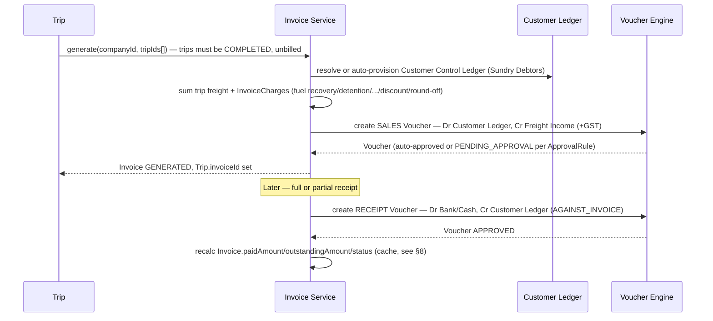
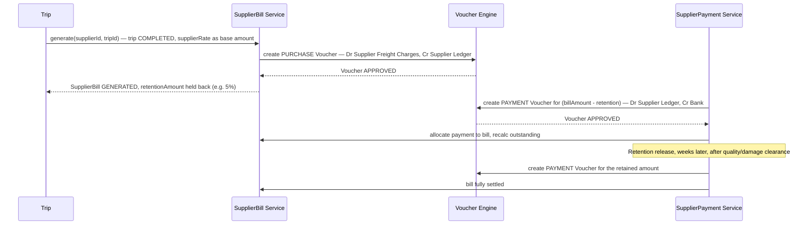
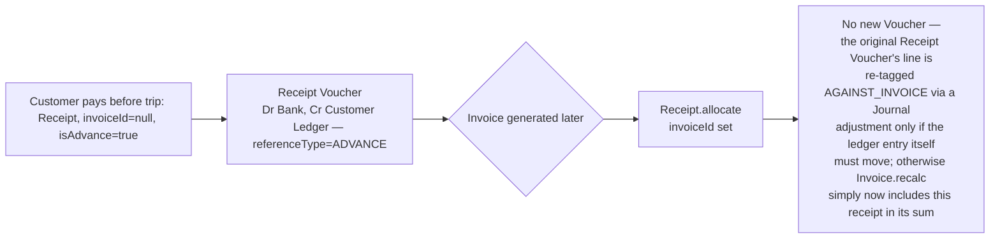
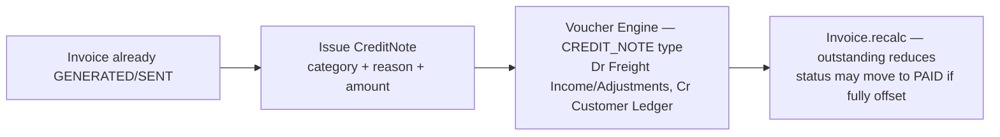
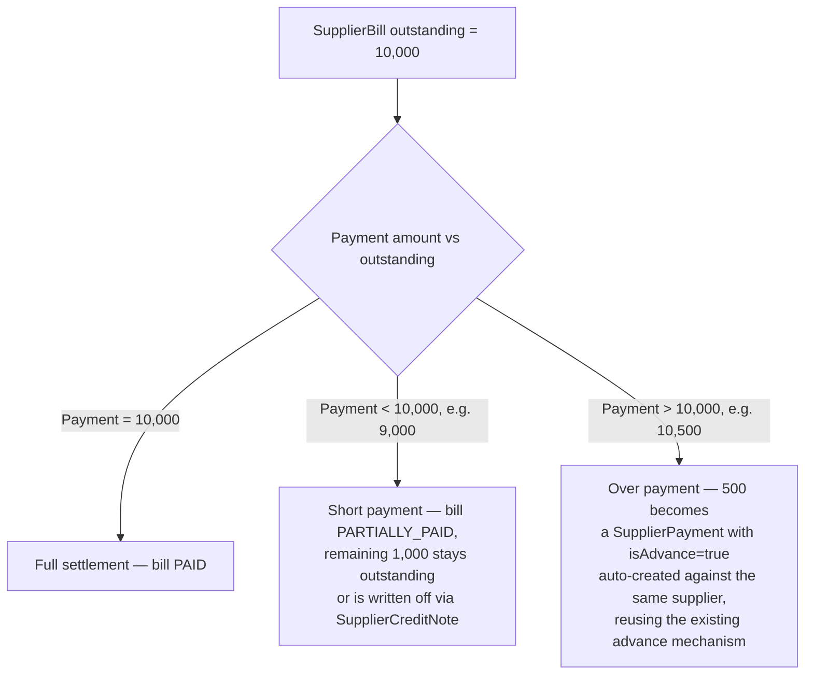
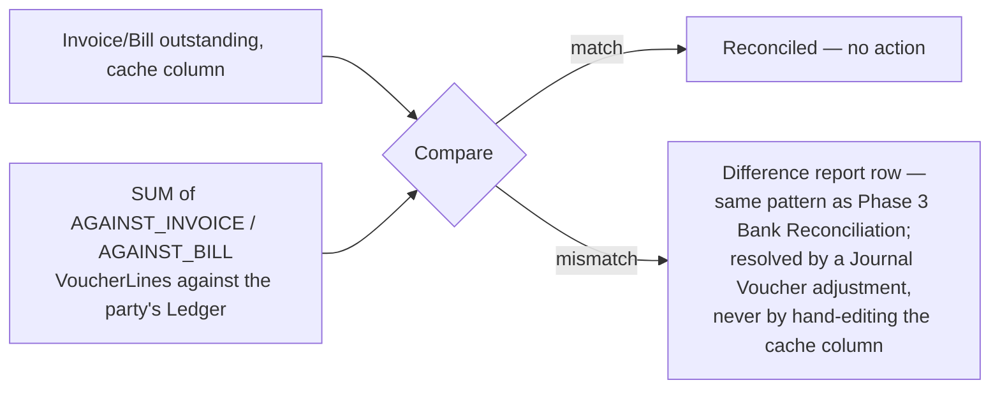
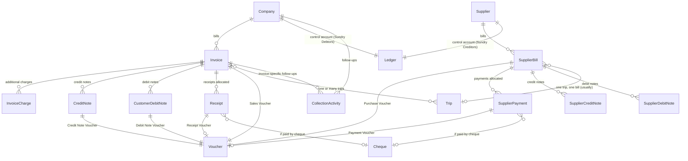
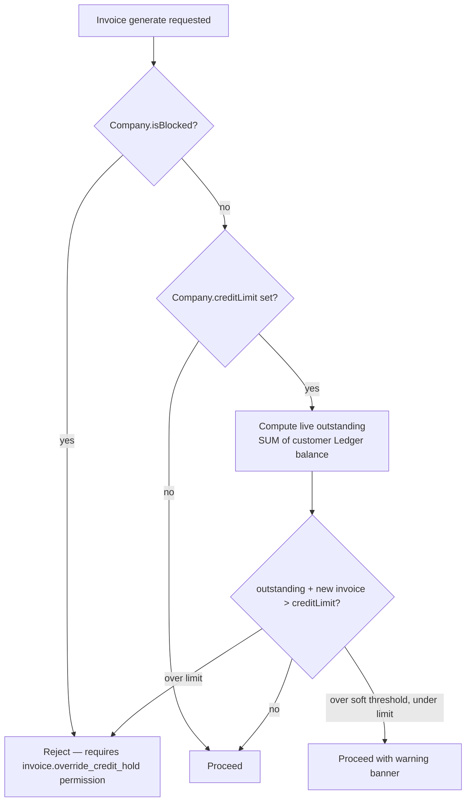

# Phase 4 — Customer Receivables & Supplier Payables
### Functional & Technical Design Document — MJ Transport ERP

Status: Design (no code written yet) · Scope: Customer billing/receivables and Supplier billing/payables — invoicing, advances, receipts, payments, credit/debit notes, outstanding, aging, credit control, collections, vendor settlement, reconciliation. **No** Driver Accounts, Payroll, Vehicle Loans, Assets, Expense Management, GST, or Financial Reports.

---

## 1. Business Overview

Phases 1–3 built the vocabulary (Ledgers), the door money moves through (the Voucher Engine), and the bank/cash operational layer in front of it. None of them touched the one place real money actually starts and ends for a transportation company: what a customer owes for freight, and what MJ Transport owes its market-vehicle suppliers for running it. Phase 4 is that place.

**A critical fact discovered while grounding this design, not assumed**: this system already has an Accounts module — `Invoice`, `CreditNote`, `Receipt`, `SupplierPayment` — built in what the schema itself labels "Phase 6 — Accounts," with a comment stating plainly: *"This is deliberately NOT general-purpose accounting software."* It predates Phase 1 entirely. It has no `organizationId`, no `Voucher`, no `Ledger` reference anywhere. `Invoice.outstandingAmount` is recalculated by a service function that sums raw `Receipt` and `CreditNote` rows directly — the exact ad-hoc-balance pattern every phase since Phase 1 has existed to eliminate. Today, generating an invoice or recording a customer receipt has **zero effect on any Ledger, any Voucher, any GL** — it is bookkeeping in name only, disconnected from everything Phases 1–3 built.

This is not a small gap to patch — it is the central problem Phase 4 exists to solve. **Phase 4's real job is bringing the existing Phase 6 Accounts module into the Voucher Engine, not building a second one beside it.** Concretely:

- `Invoice`, `CreditNote`, `Receipt`, `SupplierPayment` are **reused, not duplicated** — extended additively with the fields that connect them to a real ledger (`voucherId`, `organizationId`, period anchoring, fund-account linkage), the same way Phase 3 extended the pre-existing `PaymentMode` table rather than forking it.
- The **Voucher Types this phase needs already exist and are already sitting unused**: Phase 2 seeded `SALES`, `PURCHASE`, `RECEIPT`, `PAYMENT`, `DEBIT_NOTE`, `CREDIT_NOTE` as system Voucher Types specifically for this moment. Phase 4 activates them; it does not invent them.
- **Approval needs zero new schema.** Every AR/AP transaction becomes a Voucher of one of those six existing types, which already runs through Phase 2's `ApprovalRule`/`VoucherApproval` engine (`module = VOUCHER`, `voucherType = SALES` etc.) — the same reuse story as Phase 3's Bank Transfers and Cheques.
- **`VoucherLine.referenceNumber`/`referenceType`** (with `AGAINST_INVOICE`/`ADVANCE`/`ON_ACCOUNT` already in the `VoucherReferenceType` enum) were built in Phase 2 and never used by anything until now — they are exactly the mechanism Receipt Allocation and Bill Settlement need to tag which invoice/bill a ledger entry belongs to.
- **`LedgerPartyType.CUSTOMER`/`SUPPLIER`** and their polymorphic validation (`validateLedgerParty`) were built in Phase 1 and never exercised — Phase 4 is the first phase to actually create a Ledger per customer/supplier, auto-provisioned the same way Phase 3 auto-provisioned a bank account's suspense ledgers.
- What's genuinely **missing and must be built new**: a Supplier Bill document (today `SupplierPayment` has no corresponding "bill received" record at all — a real gap, not a design choice), Supplier Credit/Debit Notes (don't exist in any form), a Customer Debit Note (only Credit Note exists), Credit Control fields on `Company`, and lightweight Collection tracking.

Grounded in what Phase 3 actually built: fund movement (which bank/cash account received a Receipt or paid a Supplier Payment) reuses Phase 3's `FundAccountType`/`BankAccount`/`CashAccount`/`Cheque` machinery directly — a customer's cheque **is** a Phase 3 `Cheque` row with `direction = RECEIVED`, `partyType = CUSTOMER`. Phase 4 does not model payment instruments a second time.

---

## 2. Accounts Receivable Architecture

```
Trip (Own Vehicle, COMPLETED)  ──or──  Manual entry
        │
        ▼
Invoice  (existing table, extended)
        │  additive: InvoiceCharge lines (fuel recovery/detention/loading/
        │  unloading/discount/round-off), voucherId, organizationId,
        │  financialYearId/accountingPeriodId
        ▼
AccountingEventMapping (RECEIVABLES/INVOICE_GENERATED → SALES)
        ▼
Voucher Engine (Phase 2, unchanged) ── Sales Voucher
        │  Dr Customer Control Ledger (auto-provisioned, Phase 1 SUNDRY_DEBTORS group)
        │  Cr Freight Income (+ Cr GST Payable if applicable)
        ▼
Customer Outstanding = computed live from VoucherLines tagged
        AGAINST_INVOICE against that Ledger — never a second stored balance

Customer Receipt / Advance (existing Receipt table, extended)
        ▼
AccountingEventMapping (RECEIVABLES/RECEIPT_RECORDED → RECEIPT)
        ▼
Voucher Engine ── Receipt Voucher
        Dr Bank/Cash Ledger (Phase 3 BankAccount/CashAccount)
        Cr Customer Control Ledger, referenceType = AGAINST_INVOICE | ADVANCE
```

Credit Notes and Debit Notes follow the identical pattern through the existing `CREDIT_NOTE`/`DEBIT_NOTE` Voucher Types. No AR document ever writes to a Ledger directly; every one of them ends at `voucherService.create()` + `.submit()`, exactly like Phase 3's Banking layer.

---

## 3. Accounts Payable Architecture

```
Trip (Market Vehicle, COMPLETED)  ──or──  Manual entry
        │
        ▼
SupplierBill  (NEW table — the missing AP mirror of Invoice)
        │  Dr Supplier Freight Charges (Direct Expenses), Cr Supplier Control Ledger
        ▼
AccountingEventMapping (PAYABLES/SUPPLIER_BILL_RECORDED → PURCHASE)
        ▼
Voucher Engine ── Purchase Voucher

SupplierPayment (existing table, extended: billId, fund account, retention)
        ▼
AccountingEventMapping (PAYABLES/SUPPLIER_PAYMENT_MADE → PAYMENT)
        ▼
Voucher Engine ── Payment Voucher
        Dr Supplier Control Ledger, Cr Bank/Cash Ledger
```

**Correcting a Phase 2 placeholder, not changing architecture**: Phase 2 pre-seeded an `AccountingEventMapping` row for `SUPPLIER_PAYMENT_MADE` under `sourceModule = BANKING` (`isActive: false`) — a reasonable guess at the time, made before `VoucherSourceModule` had a value for this module. Phase 4 adds `RECEIVABLES`/`PAYABLES` to that enum (additive) and re-points this one row to `sourceModule = PAYABLES`, now active, since Payables is the module that actually owns this event. `DRIVER_ADVANCE_GIVEN` stays exactly as Phase 2 left it — inactive, reserved for the future Driver Accounts phase, untouched here.

---

## 4. Module Breakdown

| # | Module (from brief) | New table? | Reuses |
|---|---|---|---|
| 1 | Customer Billing Foundation | `InvoiceCharge` (new) | `Invoice` (extended) |
| 2 | Sales Invoice Management | — | `Invoice`, `SALES` VoucherType |
| 3 | Customer Advances | — | `Receipt` (`isAdvance = true`, already built) |
| 4 | Customer Receipt Management | — | `Receipt`, `RECEIPT` VoucherType, Phase 3 fund accounts |
| 5 | Customer Credit Notes | — | `CreditNote` (extended: `category`, `voucherId`) |
| 6 | Customer Debit Notes | `CustomerDebitNote` (new) | `DEBIT_NOTE` VoucherType |
| 7 | Customer Adjustments | — | Journal Voucher, manual entry (no new table) |
| 8 | Customer Outstanding | — | Computed from `Invoice` + tagged VoucherLines |
| 9 | Customer Aging | — | Computed service, no stored table |
| 10 | Customer Credit Limit | Additive columns on `Company` | — |
| 11 | Collection Management | `CollectionActivity` (new) | — |
| 12 | Supplier Bill Management | `SupplierBill` (new) | `PURCHASE` VoucherType |
| 13 | Supplier Advances | — | `SupplierPayment` (`isAdvance`, already built) |
| 14 | Supplier Payment Management | — | `SupplierPayment` (extended), `PAYMENT` VoucherType |
| 15 | Supplier Debit Notes | `SupplierDebitNote` (new) | `DEBIT_NOTE` VoucherType |
| 16 | Supplier Credit Notes | `SupplierCreditNote` (new) | `CREDIT_NOTE` VoucherType |
| 17 | Supplier Adjustments | — | Journal Voucher, manual entry |
| 18 | Supplier Outstanding | — | Computed from `SupplierBill` + tagged VoucherLines |
| 19 | Supplier Aging | — | Computed service |
| 20 | Vendor Settlement | — | `SupplierPayment` allocation against `SupplierBill` (+ `retentionAmount` field) |
| 21 | Outstanding Reconciliation | — | Computed difference report (same shape as Phase 3 Bank Reconciliation) |
| 22 | AR/AP Dashboard | — | Read-only aggregation endpoint |
| 23 | Approval Workflow | — | 100% reuse of Phase 2's `ApprovalRule`/`VoucherApproval` |

**5 new tables** (`SupplierBill`, `SupplierCreditNote`, `SupplierDebitNote`, `CustomerDebitNote`, `InvoiceCharge`) plus one small standalone (`CollectionActivity`, non-financial). Eighteen of the twenty-three requested modules need no new table at all. This is the same ratio Phases 2 and 3 found, for the same reason — most of a brief this size is workflow and computation layered on a handful of documents, not new nouns.

---

## 5. Complete Business Workflows

### 5.1 Own-Vehicle Trip → Invoice → Receipt



### 5.2 Market-Vehicle Trip → Supplier Bill → Payment (with retention)



### 5.3 Customer Advance → Later Allocation to Invoice



### 5.4 Credit Note (Customer) — Damage / Rate Correction



### 5.5 Vendor Settlement with Short/Over Payment



### 5.6 Outstanding Reconciliation



---

## 6. Database Design

Same conventions as Phases 1–3: UUID PKs, `organizationId` scoping, soft delete via `deletedAt`, plain `createdById`/`updatedById`, `@@map` to snake_case. Existing Phase 6 tables are extended, never replaced.

### 6.1 `Invoice` (existing — extended)

| Column | Type | Notes |
|---|---|---|
| *(existing columns unchanged)* | | `invoiceNumber`, `companyId`, `gstMasterId`, `subtotal`, `taxAmount`, `totalAmount`, `paidAmount`, `outstandingAmount`, `status`, `dueDate`, `notes` |
| organizationId | uuid FK → Organization | **new** — anchors the invoice in Phase 1's multi-org scaffolding |
| financialYearId / accountingPeriodId | uuid FK | **new** — invoice date must fall in an OPEN period, same rule as vouchers |
| customerLedgerId | uuid FK → Ledger | **new** — the auto-provisioned control Ledger this invoice's Sales Voucher posted against |
| voucherId | uuid FK → Voucher, unique | **new** — the Sales Voucher; `paidAmount`/`outstandingAmount` remain denormalized *caches*, recomputed transactionally whenever a linked Receipt/CreditNote/DebitNote voucher posts — the same "cache, never a second source of truth" rule Phase 2 applied to `Voucher.totalDebit` |
| creditPeriodDays | int, nullable | **new** — snapshot of `Company.creditDays` at invoice time (changing a customer's terms later shouldn't rewrite history) |

### 6.2 `InvoiceCharge` (new)

| Column | Type | Notes |
|---|---|---|
| invoiceId | uuid FK → Invoice | |
| chargeType | enum `InvoiceChargeType`: FUEL_RECOVERY / DETENTION / LOADING / UNLOADING / DISCOUNT / ROUND_OFF / OTHER | |
| description | varchar, nullable | |
| amount | decimal(12,2) | discount/round-off may be negative — sign convention documented in §8 |
| sequence | int | display order |

### 6.3 `CustomerDebitNote` (new — mirrors the existing `CreditNote` shape exactly)

| Column | Type | Notes |
|---|---|---|
| debitNoteNumber | varchar, unique | own `NumberSeries` document type, additive |
| invoiceId | uuid FK → Invoice | |
| category | enum `CustomerDebitNoteCategory`: ADDITIONAL_CHARGES / PENALTY / INTEREST / FUEL_DIFFERENCE / SHORT_COLLECTION / OTHER | |
| amount | decimal(12,2) | |
| reason | varchar | free text, same as `CreditNote.reason` |
| voucherId | uuid FK → Voucher, unique | DEBIT_NOTE type |
| isActive / deletedAt / audit | — | same as `CreditNote` |

### 6.4 `CreditNote` (existing — extended)

| Column | Type | Notes |
|---|---|---|
| *(existing)* | | `creditNoteNumber`, `invoiceId`, `amount`, `reason` |
| category | enum `CustomerCreditNoteCategory`: RATE_DIFFERENCE / SERVICE_CANCELLATION / DAMAGE / SHORT_DELIVERY / DISCOUNT / BILLING_CORRECTION / OTHER | **new** |
| voucherId | uuid FK → Voucher, unique | **new** — CREDIT_NOTE type |

### 6.5 `SupplierBill` (new — the missing AP mirror of `Invoice`)

| Column | Type | Notes |
|---|---|---|
| billNumber | varchar, unique | own `NumberSeries` document type |
| supplierId | uuid FK → Supplier | |
| tripId | uuid FK → Trip, nullable | null for manual/general bills |
| organizationId / financialYearId / accountingPeriodId | uuid FK | |
| supplierLedgerId | uuid FK → Ledger | auto-provisioned control Ledger (Sundry Creditors) |
| billDate / dueDate | date | |
| subtotal / taxAmount / totalAmount | decimal(12,2) | |
| retentionAmount | decimal(12,2), default 0 | withheld amount, released via a later Payment |
| paidAmount / outstandingAmount | decimal(12,2) | denormalized cache, same rule as Invoice |
| status | enum `SupplierBillStatus`: DRAFT / GENERATED / PARTIALLY_PAID / PAID / CANCELLED | mirrors `InvoiceStatus` |
| voucherId | uuid FK → Voucher, unique | PURCHASE type |
| notes / isActive / deletedAt / audit | — | |

### 6.6 `SupplierCreditNote` / `SupplierDebitNote` (new)

Identical shape to `CustomerDebitNote`/`CreditNote`, keyed off `billId` instead of `invoiceId`:

| Column | Type | Notes |
|---|---|---|
| billId | uuid FK → SupplierBill | |
| category | `SupplierCreditNoteCategory` (BILL_CORRECTION / RATE_REVISION / DISCOUNT / ADJUSTMENT / REFUND / OTHER) or `SupplierDebitNoteCategory` (DAMAGE_RECOVERY / PENALTY / SHORT_DELIVERY / QUALITY_ISSUE / FUEL_RECOVERY / COMMISSION_RECOVERY / OTHER) | |
| amount / reason / voucherId / audit | — | same pattern |

### 6.7 `Receipt` (existing — extended)

| Column | Type | Notes |
|---|---|---|
| *(existing)* | | `receiptNumber`, `companyId`, `invoiceId`, `amount`, `paymentModeId`, `isAdvance` |
| organizationId / voucherId | uuid FK | **new** — RECEIPT type Voucher |
| fundAccountType / fundAccountId | enum `FundAccountType` (reused from Phase 3) + uuid | **new** — which BankAccount/CashAccount received it |
| chequeId | uuid FK → Cheque, nullable | **new** — reuses Phase 3's `Cheque` (direction=RECEIVED, partyType=CUSTOMER) rather than re-modeling cheque details |

### 6.8 `SupplierPayment` (existing — extended)

| Column | Type | Notes |
|---|---|---|
| *(existing)* | | `paymentNumber`, `supplierId`, `tripId`, `amount`, `paymentModeId`, `isAdvance` |
| organizationId / voucherId | uuid FK | **new** — PAYMENT type Voucher |
| billId | uuid FK → SupplierBill, nullable | **new** — alongside the existing `tripId`; a bill may receive multiple payments |
| fundAccountType / fundAccountId | enum + uuid | **new**, same reuse as Receipt |
| chequeId | uuid FK → Cheque, nullable | **new** |
| isRetentionRelease | boolean, default false | **new** — marks a payment that releases a previously withheld retention |

### 6.9 `CollectionActivity` (new — non-financial, no Voucher)

| Column | Type | Notes |
|---|---|---|
| companyId | uuid FK → Company | |
| invoiceId | uuid FK → Invoice, nullable | a follow-up may be account-level, not invoice-specific |
| activityType | enum `CollectionActivityType`: CALL / EMAIL / REMINDER / PROMISE_TO_PAY / NOTE | SMS explicitly deferred (brief marks it "Future") |
| notes | varchar | |
| promisedAmount / promisedDate | decimal / date, nullable | only for PROMISE_TO_PAY |
| followUpDate | date, nullable | |
| createdById / createdAt | — | |

### 6.10 Additive columns on `Company` (Credit Control)

| Column | Type | Notes |
|---|---|---|
| creditLimit | decimal(12,2), nullable | null = no limit enforced |
| creditDays | int, nullable | default payment terms |
| isBlocked | boolean, default false | |
| blockedReason / blockedAt / blockedById | — | |

### 6.11 Enum additions (all additive, nothing removed)

- `VoucherSourceModule` += `RECEIVABLES`, `PAYABLES`
- `NumberSeriesDocumentType` += `SUPPLIER_BILL`, `CUSTOMER_DEBIT_NOTE`, `SUPPLIER_CREDIT_NOTE`, `SUPPLIER_DEBIT_NOTE` (Invoice/CreditNote/Receipt/SupplierPayment already number themselves independently of `NumberSeries` today — Phase 4 leaves that as-is rather than forcing a migration of live numbering logic; the new document types get proper `NumberSeries` rows from day one)

---

## 7. Entity Relationships



---

## 8. Business Rules

**Invoice Lifecycle** — `DRAFT → GENERATED → SENT → PARTIALLY_PAID → PAID`, with `CANCELLED` reachable from any pre-`PAID` state (unchanged from the existing `InvoiceStatus` enum). `paidAmount`/`outstandingAmount` are caches recomputed inside the same transaction as every linked Receipt/CreditNote/DebitNote voucher post — never written independently, mirroring `Voucher.totalDebit`'s own rule from Phase 2.

**Bill Lifecycle** — `DRAFT → GENERATED → PARTIALLY_PAID → PAID`, `CANCELLED` from any pre-`PAID` state. Identical cache discipline as Invoice.

**Advance Adjustment** — An advance Receipt/SupplierPayment (`isAdvance = true`, no invoice/bill link) is never deleted or mutated to "become" an allocated one; `allocate()` sets the FK, and the target document's cache recalculates to include it. The advance's own originating Voucher is untouched — its `AGAINST_INVOICE` vs `ADVANCE` `referenceType` tag is set at Voucher-line creation time and does not need to change after allocation, since outstanding is computed by summing all voucher lines tagged for that party within the relevant window, not by the tag alone (see Outstanding Calculation below).

**Outstanding Calculation** — For a specific Invoice: `totalAmount − Σ(CreditNotes) + Σ(CustomerDebitNotes) − Σ(Receipts allocated to it)`. For the *customer as a whole* (the AR/AP Dashboard, aging): `Σ(all customer control Ledger debit lines) − Σ(all customer control Ledger credit lines)` computed live from `VoucherLine`, exactly like Phase 3's bank book-balance computation — never a stored "customer balance" column anywhere.

**Receipt Allocation** — A Receipt is either linked to exactly one Invoice at creation, or created as an advance and allocated later to exactly one Invoice. Splitting one Receipt across multiple invoices is **out of scope for this phase** — the workaround is multiple Receipt rows (already fully supported), each individually allocated; documented as a deliberate simplification in §21.

**Payment Allocation** — Symmetric to Receipt Allocation for `SupplierPayment` → `SupplierBill`. A single bill may receive many payments (`billId` is on `SupplierPayment`, not the reverse) — this directly satisfies the brief's "Multiple Payments Against One Bill" requirement.

**Credit Control** — Enforced at Invoice `generate()`: if `Company.isBlocked`, reject outright (override requires a permission-gated bypass, logged). If `Company.creditLimit` is set, compute the customer's live total outstanding (§ above) plus the new invoice's amount; if it exceeds the limit, warn (soft) below a configurable threshold and block (hard) above it — the exact split is an `AccountingPreference`-style toggle, not hardcoded.

**Settlement Rules** — A bill payment equal to outstanding closes it. Short payment leaves the remainder outstanding (or is written off via a `SupplierCreditNote`, an explicit action, never implicit). Over payment auto-creates an advance `SupplierPayment` for the excess against the same supplier — it is never left as a negative outstanding on the original bill (§ Validations, "Negative Outstanding").

**Reconciliation Rules** — The cache (`Invoice.outstandingAmount`/`SupplierBill.outstandingAmount`) and the ledger-derived total must reconcile to zero at any time under normal operation, since the cache is recomputed transactionally, not asynchronously. Outstanding Reconciliation (§21/§14) exists as a *safety net* for the population of legacy Phase 6 documents that predate this phase's Voucher linkage, and for detecting drift if a future bug ever breaks the transactional recompute — not as a routine monthly chore.

---

## 9. Validation Rules

| # | Rule | Where enforced |
|---|---|---|
| 1 | Duplicate invoice number | DB unique constraint (already exists) |
| 2 | Duplicate supplier bill number | DB unique constraint (new) |
| 3 | Customer active (not `isActive = false`) | Service layer, on invoice generate |
| 4 | Customer not blocked (`isBlocked`) | Service layer, on invoice generate |
| 5 | Supplier active | Service layer, on bill generate |
| 6 | Credit limit exceeded | Service layer, computed live (§8) |
| 7 | Invalid due date (before invoice/bill date) | Zod validator |
| 8 | Advance greater than invoice/bill amount | Service layer — allowed, but flagged; excess remains as advance balance, not rejected outright (a customer may legitimately pre-pay more than one trip's worth) |
| 9 | Payment/receipt greater than outstanding | Service layer — allowed on the payable side (over-payment, §8 Settlement Rules) with an explicit auto-advance action; rejected on the receivable side above a configurable tolerance unless the caller explicitly flags it as an advance |
| 10 | Negative outstanding | Never allowed to persist — over-payments/over-receipts are converted to advances immediately in the same transaction, so the cache never goes below zero |
| 11 | Duplicate receipt reference | Service layer, same-company + same `referenceNumber` + non-cancelled check (mirrors Phase 2 Voucher's own duplicate-reference guard, scoped separately so a receipt and an unrelated voucher never collide) |
| 12 | Duplicate payment reference | Same, scoped to supplier |
| 13 | Closed accounting period | Reuses Phase 1's period-status check inside `voucherService.create()` — no new logic, since every AR/AP document's real date-of-record is its Voucher's `voucherDate` |

---

## 10. Voucher Integration

| AR/AP Action | `sourceEventCode` | Resolved `VoucherType` (existing, now activated) | Lines |
|---|---|---|---|
| Invoice Generated | `INVOICE_GENERATED` | SALES | Dr Customer Ledger, Cr Freight Income (+ Cr GST Payable) |
| Customer Receipt / Advance | `RECEIPT_RECORDED` | RECEIPT | Dr Bank/Cash, Cr Customer Ledger |
| Customer Credit Note | `CREDIT_NOTE_ISSUED` | CREDIT_NOTE | Dr Freight Income/Adjustments, Cr Customer Ledger |
| Customer Debit Note | `DEBIT_NOTE_ISSUED` | DEBIT_NOTE | Dr Customer Ledger, Cr Other/Penalty Income |
| Supplier Bill Recorded | `SUPPLIER_BILL_RECORDED` | PURCHASE | Dr Supplier Freight Charges, Cr Supplier Ledger |
| Supplier Payment (incl. retention release) | `SUPPLIER_PAYMENT_MADE` | PAYMENT | Dr Supplier Ledger, Cr Bank/Cash |
| Supplier Credit Note | `SUPPLIER_CREDIT_NOTE_ISSUED` | CREDIT_NOTE | Dr Supplier Ledger, Cr Supplier Freight Charges |
| Supplier Debit Note | `SUPPLIER_DEBIT_NOTE_ISSUED` | DEBIT_NOTE | Dr Supplier Ledger, Cr Recovery Income |
| Manual Adjustment (either side) | *(none — direct entry)* | JOURNAL | whatever the adjustment requires |

Exactly the same contract Phase 3 established: AR/AP's service layer never hardcodes a `VoucherType` id, always resolving through `accountingEventMappingService` by `(organizationId, sourceModule, sourceEventCode)`. A missing/inactive mapping rejects the action with a setup error, never a guess.

---

## 11. Approval Workflow

There is nothing to design here beyond configuration — this is the section where Phase 4 costs the least, by construction. Every AR/AP transaction is, underneath, a Voucher of type `SALES`/`RECEIPT`/`PURCHASE`/`PAYMENT`/`CREDIT_NOTE`/`DEBIT_NOTE`, and every one of those already runs through Phase 2's `voucherApprovalEngine.evaluate()` against `ApprovalRule` rows keyed by `module = VOUCHER` and that `voucherType`. "Invoices over ₹2,00,000 need the Accounts Manager" is simply an `ApprovalRule` row — nothing new to build. Amount-based and role-based approval, sequential levels, auto-approve-below thresholds: all inherited, unchanged.

The one place this phase adds *judgment*, not schema, is credit-limit override: a blocked-customer or over-limit invoice requires a distinct permission (`invoice.override_credit_hold`) to push through, logged via the same `VoucherAuditEntry`/`AuditLog` pair every other override in this system uses (matching Phase 1's `PeriodLockOverride` philosophy).

---

## 12. Outstanding & Aging Design

Both Customer and Supplier aging are pure read-side computations — **no new stored table**, consistent with the mandate that nothing in this ERP caches a balance it can compute:

```
bucket(invoice) =
  daysOverdue = today - invoice.dueDate
  CURRENT      if daysOverdue <= 0
  1-30         if 1 <= daysOverdue <= 30
  31-60        if 31 <= daysOverdue <= 60
  61-90        if 61 <= daysOverdue <= 90
  91-180       if 91 <= daysOverdue <= 180
  180+         if daysOverdue > 180
```

Grouping dimensions: Customer-wise and Route-wise are directly available today (`Invoice.companyId`, `Trip.routeId` via the invoice's trips). **Branch-wise aging/profitability has a real, disclosed gap**: neither `Intent` nor `Trip` nor `Invoice` carries a branch reference today (the existing `Branch` model is a *customer's* branch/site under `Company`, per Phase 1's own finding — not an MJ Transport operating branch, and nothing links an Intent to one). Phase 4's recommendation (§21) is an additive, nullable `branchId` on `Intent` (propagating transitively to Trip/Invoice through the existing `intentId` relation, no new column needed on Trip/Invoice themselves) — small, additive, deferred to implementation unless the user wants it pulled forward.

Supplier aging mirrors this exactly off `SupplierBill.dueDate`, bucketed the same way, grouped by Supplier and Vehicle (`Trip.vehicleId`, already available).

---

## 13. Credit Control Design



`creditDays` (payment terms) feeds `dueDate = invoiceDate + creditDays` at generation time, snapshotted onto the Invoice (`creditPeriodDays`) so a later change to the customer's terms never rewrites an already-issued invoice's due date.

---

## 14. Settlement & Reconciliation Design

**Vendor Settlement** — `SupplierPayment.billId` allocation, `retentionAmount` withheld at bill creation and released via a dedicated `isRetentionRelease = true` payment against the same bill later. Carry-forward (a short-paid bill's remainder rolling to "next settlement") is simply: the bill stays `PARTIALLY_PAID`, its outstanding remains in the live aging computation — no special carry-forward table needed, since nothing was ever removed from view.

**Outstanding Reconciliation** — Same difference-report shape as Phase 3's Bank Reconciliation (§12 of that design): compare the cached `outstandingAmount` against the ledger-derived figure for a sample of invoices/bills (or all, on demand); a non-zero difference surfaces as a row to investigate, resolved by a Journal Voucher adjustment if the drift is real, or a bug report if it indicates the transactional recompute broke somewhere. This is explicitly a **safety net**, not a routine process — see §8.

---

## 15. API Design

All routes extend the existing `/api/accounts/*` surface (Invoice/Receipt/SupplierPayment already live there) plus new routes for the genuinely new documents, following the identical `authenticate → authorize(permission) → validate(schema) → controller → service → repository` chain:

| Method | Path | Purpose |
|---|---|---|
| GET/POST | `/accounts/invoices` | *(existing)* list / generate — extended to accept `InvoiceCharge` lines |
| POST | `/accounts/invoices/:id/credit-notes` | *(existing, extended with `category`)* |
| POST | `/accounts/invoices/:id/debit-notes` | **new** |
| GET/POST | `/accounts/receipts` | *(existing)* — extended with fund-account/cheque fields |
| POST | `/accounts/receipts/:id/allocate` | *(existing)* |
| GET/POST | `/accounts/supplier-bills` | **new** |
| POST | `/accounts/supplier-bills/:id/credit-notes` | **new** |
| POST | `/accounts/supplier-bills/:id/debit-notes` | **new** |
| GET/POST | `/accounts/supplier-payments` | *(existing)* — extended with `billId`, fund-account/cheque, retention |
| POST | `/accounts/supplier-payments/:id/allocate` | **new** — symmetric to Receipt Allocation |
| GET | `/accounts/customers/:id/outstanding` | **new** — live-computed |
| GET | `/accounts/customers/aging` | **new** |
| GET | `/accounts/suppliers/:id/outstanding` | **new** |
| GET | `/accounts/suppliers/aging` | **new** |
| GET/POST | `/accounts/companies/:id/credit-control` | **new** — view/set limit, days, block |
| GET/POST | `/accounts/collections` | **new** — `CollectionActivity` |
| GET | `/accounts/reconciliation/customers` \| `/suppliers` | **new** — difference report |
| GET | `/accounts/dashboard` | *(existing `accounts.dashboard` permission)* — extended with the full AR/AP metric set (§16) |

---

## 16. UI/UX Design

Extends the existing Accounts module pages (Customer Invoices, Customer Receipts, Supplier Payments, Trip Financials, Accounts Dashboard already in the sidebar) rather than building a parallel section:

- **Customer Invoice** form gains an itemized charges grid (fuel recovery/detention/loading/unloading/discount/round-off) below the trip-selection list, live-updating the total.
- **Invoice List** gains status chips, an aging-bucket column, and bulk actions (bulk send, bulk export).
- **Customer Receipts** gains a fund-account/cheque picker (reusing Phase 3's from-account selector pattern) and an allocation indicator.
- **Outstanding List** (new) — one row per open invoice/bill, filterable by customer/supplier/bucket, the aging computation from §12 rendered as colored bucket chips.
- **Collection Dashboard** (new) — today's follow-ups due, promise-to-pay tracker, quick-log-a-call action.
- **Supplier Bill**, **Supplier Payment**, **Supplier Outstanding** — mirror the customer-side screens exactly, including the retention field on the bill form and payment allocation screen.
- **Aging Report** (new) — bucketed table, customer/supplier toggle, export.
- **Settlement Screen** (new) — pick a bill, see its payment history, apply a new payment or release retention.
- **Adjustment Screen** (new) — thin wrapper that opens the existing Journal Voucher entry form (Phase 2), pre-filtered to the customer/supplier ledger, rather than a bespoke adjustment engine.
- **Approval Screen** — the existing `VoucherApprovals.vue` from Phase 2, unchanged; AR/AP vouchers simply appear in that same queue.
- **Dashboard** — extends the existing Accounts Dashboard with the metrics in §22 of the brief.
- Search/filter/sort/bulk/export/print all reuse the shared `MasterDataTable`/export utilities already in place.

---

## 17. Security & Permissions

Extends the existing `ACCOUNTS_PERMISSIONS` set (`invoice.*`, `creditNote.*`, `receipt.*`, `supplierPayment.*`, `tripFinancial.view`, `accounts.dashboard`) with the new documents' equivalents:

| Role | Grants |
|---|---|
| Super Admin / Admin | Full |
| Accounts Manager | Full AR/AP, including credit-limit override and retention release |
| Accounts Executive | Create/edit invoices, bills, receipts, payments; no override, no approval |
| Collection Executive | `collectionActivity.*`, read-only on invoices/outstanding/aging — cannot create financial documents |
| Payment Executive | `supplierPayment.create/edit`, `supplierBill.view` — scoped to disbursement, not billing |
| Approver | `.approve` per the relevant `ApprovalRule.approverRoleId`, same as every other Voucher-backed module |
| Auditor | `.view` everywhere including reconciliation and blocked-customer history; no writes |
| Viewer | `.view` on lists/dashboard only |

---

## 18. Audit Strategy

Same two-layer split as every prior phase: the generic `AuditLog` fires on every create/update/delete across all new/extended entities; the *financial* trail for anything Voucher-backed already lives in `VoucherAuditEntry` (Phase 2) and is linked to, not duplicated. Credit-limit overrides and retention releases get an explicit `AuditLog` description naming the amount and reason, since these are the two actions in this phase most likely to be scrutinized later.

---

## 19. Transportation-Specific Business Rules

- **Trip-wise Billing / Multiple Trips in One Invoice / One Trip Split Across Multiple Invoices** — already supported by the existing `Invoice ↔ Trip` many-to-many via `Trip.invoiceId` (one invoice, many trips); splitting one trip's freight across multiple invoices is **not** supported by the current one-`Trip.invoiceId` column and is flagged as a disclosed limitation (§21), not silently handled.
- **Trip-wise Supplier Settlement / Multiple Supplier Bills for One Trip** — `SupplierBill.tripId` is nullable and not unique, so multiple bills against one trip (e.g. a base freight bill plus a separate detention bill) are directly supported.
- **Multiple Payments Against One Bill** — `SupplierPayment.billId`, many rows per bill — directly supported (§8).
- **Vehicle/Customer/Supplier-wise Profitability** — already exists, computed live by `tripFinancialService` (Phase 6, unchanged) from `Trip` + `TripExpense` + `supplierRate`; Phase 4 does not rebuild this, only ensures the Invoice/SupplierBill amounts it references stay internally consistent with what was actually billed/settled.
- **Route-wise Profitability** — extend `tripFinancialService` with a `routeWise()` grouping alongside the existing `vehicleWise`/`supplierWise`/`customerWise` — same computed, no-new-table pattern, small addition.
- **Branch-wise Profitability** — blocked on the `Intent.branchId` gap noted in §12; deferred.
- **Retention, Commission Adjustment, Detention/Loading/Unloading/Waiting Charges, Shortage/Damage/Fuel/Advance Recovery** — all modeled as either an `InvoiceChargeType`/`SupplierBill` line item (charges known at billing time) or a Credit/Debit Note category (adjustments discovered after the fact) — never a bespoke table per charge type, keeping the schema flat and the reporting uniform.

---

## 20. Future Integration Points

| Future Phase | How it plugs into Phase 4 |
|---|---|
| Driver Accounts | Driver settlements will reuse `SupplierPayment`'s exact pattern (advance/bill/allocation) against a Driver control Ledger — `LedgerPartyType.DRIVER` already exists from Phase 1. |
| Payroll | Salary vouchers are unrelated to AR/AP directly but share the same `JOURNAL` voucher type and approval engine. |
| Vehicle Loans | EMI payments are `PAYMENT` vouchers against a Loan Ledger — no AR/AP schema touched. |
| GST | Invoice/SupplierBill already carry `gstMasterId`/`taxAmount` at the simple rate level Phase 6 built; a full GST phase would add GSTR-matching against the same `VoucherLine.referenceNumber` tagging this phase relies on. |
| Financial Reports | A P&L/Balance Sheet phase reads posted Sales/Purchase/Receipt/Payment Vouchers the same way `tripFinancialService` reads Trip data today — Phase 4 produces exactly the posted-voucher trail such a phase would need, gathered incrementally rather than retrofitted. |

---

## 21. Risks & Recommendations

| Risk | Recommendation |
|---|---|
| Migrating live Phase 6 data (existing Invoices/Receipts/SupplierPayments with no `voucherId`) to the new Voucher-linked world | Out of scope for this design (no code yet), but flagged explicitly: implementation will need a one-time backfill that creates a Voucher for every pre-existing document, or a cutover date after which only new documents require `voucherId` while old ones remain read-only historical records. This decision should be made explicitly before implementation, not discovered during it. |
| One `Trip.invoiceId` column means a trip's freight can't be split across two invoices | Disclosed limitation (§19); if a real need surfaces, the fix is a join table (`InvoiceTrip`) rather than reworking `Invoice` — additive, deferred until actually needed. |
| Credit limit checks computed live against the full Ledger could get slow at high invoice volume | Same answer as Phase 3's bank-balance concern: index `(ledgerId)` already exists on `VoucherLine`; add a covering index if measured slow, don't pre-optimize with a cached balance column. |
| Retention release is easy to forget (money sits withheld indefinitely) | The AR/AP Dashboard (§16) surfaces "bills with unreleased retention older than N days" as a standing alert, not just a report someone has to remember to run. |
| Auto-provisioned control Ledgers could silently proliferate if customer/supplier records are duplicated upstream | Provisioning is keyed strictly to `(organizationId, partyType, partyId)` uniqueness, same guard Phase 3 used for `BankAccount.ledgerId` — a duplicate customer record gets a duplicate ledger, which is a data-quality problem for Company/Supplier master data to solve, not something AR/AP should paper over. |

---

## 22. Best Practices

- **Extend, don't fork.** Every existing Phase 6 table is reused and extended; nothing is duplicated into a parallel "v2" table.
- **Activate dormant scaffolding before building new scaffolding.** `SALES`/`PURCHASE`/`RECEIPT`/`PAYMENT`/`CREDIT_NOTE`/`DEBIT_NOTE` VoucherTypes, `VoucherLine.referenceType`, and `LedgerPartyType.CUSTOMER`/`SUPPLIER` were all built in earlier phases specifically for this moment — Phase 4's job is largely to turn them on, not invent alternatives.
- **Balances are always computed, never cached as a second source of truth** — the one rule enforced without exception since Phase 1, now finally applied to the module (Phase 6 Accounts) that most violated it before this phase existed.
- **Reuse Phase 3's fund-account and cheque machinery** for how money physically moves — Receipt and SupplierPayment are consumers of Banking, not a second definition of "how a payment happened."
- **Approval is pure configuration.** No new approval engine, no new schema — `ApprovalRule` rows against existing VoucherTypes.
- **Disclose gaps rather than silently working around them** — the branch-attribution gap, the one-invoice-per-trip-segment limitation, and the legacy-data migration question are all named explicitly rather than papered over with a convenient assumption.

---

## 23. Implementation Sequence within Phase 4

1. **Schema** — additive migration: enum extensions, `Company` credit-control columns, `Invoice`/`CreditNote`/`Receipt`/`SupplierPayment` extensions, the 5 new tables, `CollectionActivity`.
2. **Ledger auto-provisioning** — the customer/supplier control-Ledger creation helper, reused by both Invoice and SupplierBill generation (built once, shared, mirroring Phase 3's suspense-ledger provisioner).
3. **Customer side: Invoice → Sales Voucher, InvoiceCharge lines** — proves the `AccountingEventMapping` activation path for `INVOICE_GENERATED`.
4. **Customer Receipts + Advances + Allocation** — extends existing Receipt with fund-account/cheque/voucher linkage.
5. **Customer Credit Notes + new Customer Debit Notes** — both against the now-proven Invoice→Voucher path.
6. **Supplier side: SupplierBill → Purchase Voucher** — the single largest net-new piece.
7. **Supplier Payments + Advances + Allocation + Retention** — extends existing SupplierPayment.
8. **Supplier Credit Notes + Supplier Debit Notes** — net new, same shape as step 5.
9. **Outstanding + Aging (both sides)** — pure read-side computation, depends on steps 3–8 all posting correctly.
10. **Credit Control** — depends on Customer Outstanding (step 9) being trustworthy.
11. **Collection Management** — standalone, can be built any time after step 3, sequenced here since it depends on Invoice existing to follow up on.
12. **Vendor Settlement + Outstanding Reconciliation** — depends on both sides' outstanding being live and correct.
13. **AR/AP Dashboard** — last, by necessity — a read-only aggregation over everything above.

After completing Phase 4 documentation, implementation stops here and waits for explicit instruction to proceed to code, matching the same two-step (design → "implement it") pattern used for Phases 1–3.
