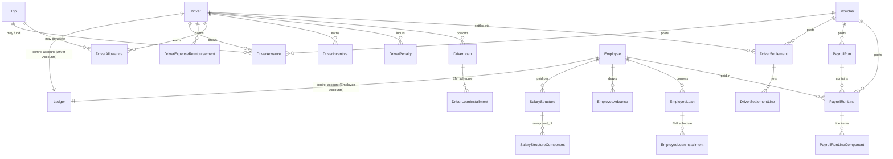

# Phase 5 — Driver Accounts, Employee Payroll & Settlements
### Functional & Technical Design Document — MJ Transport ERP

Status: Design (no code written yet) · Scope: Driver ledger, advances, expense reimbursements, allowances, incentives, penalties/recoveries, loans, and settlements; Employee ledger, salary structures, payroll processing, salary advances, employee loans, payroll adjustments, settlement, and approval — all posting through the existing Voucher Engine. **No** Vehicle Assets, Vehicle Loans, Expense Management (general), Inventory Accounting, GST, Financial Reports, or future modules.

---

## 1. Business Overview

Phase 4 connected the money at both ends of a trip — what a customer owes, what a market-vehicle supplier is owed — to the ledger. Phase 5 connects the money in the middle: what the person actually running the trip, or keeping the company running, is owed and has already drawn against.

**A grounding fact, not an assumption**: unlike Phase 4, there is no disconnected legacy module to rescue here. `Driver` exists today (Phase 4 of the schema's own internal numbering — Fleet Management) as a pure master record: name, license, phone, expiry — nothing financial. `Employee` does not exist at all; the schema's `LedgerPartyType` enum reserves an `EMPLOYEE` value with a comment stating plainly *"no Employee model exists in this codebase yet (see Phase 5 dependency note)"* — this phase was anticipated, not discovered. Phase 5 is greenfield on both sides, which changes the shape of the work relative to Phase 4: instead of retrofitting five tables onto a legacy Accounts module, this phase builds two new but structurally parallel subsystems from first principles, using exactly the primitives Phases 1–4 already proved out.

What already exists and is reused, not reinvented:

- `LedgerPartyType.DRIVER` and `.EMPLOYEE` — reserved since Phase 1, unused until now. A Driver Ledger and an Employee Ledger are both just `Ledger` rows with `partyType` set accordingly, auto-provisioned exactly the way Phase 4 auto-provisioned a Customer/Supplier control ledger on first use.
- `CostCenterRefType.DRIVER` — reserved since Phase 7, ready for trip-wise/vehicle-wise driver cost attribution (§19).
- `VoucherSourceModule.PAYROLL` and `.LOAN` — reserved since Phase 8, seeded with **inactive placeholder** `AccountingEventMapping` rows that were clearly written in anticipation of this exact phase: `SALARY_PROCESSED → JOURNAL`, `LOAN_EMI_DUE → PAYMENT`, and (filed under `BANKING` as a guess, mirroring the `SUPPLIER_PAYMENT_MADE` placeholder Phase 4 found and corrected) `DRIVER_ADVANCE_GIVEN → PAYMENT`. Phase 5 activates and, in one case, corrects these (§10).
- `FundAccountType`/`BankAccount`/`CashAccount`/`Cheque` (Phase 3) — every driver advance, employee advance, loan disbursement, and settlement payment moves through these unchanged. A driver's cheque is a Phase 3 `Cheque` row with `partyType = DRIVER`, already representable today with no schema change.
- `PaymentMode`/`PaymentModeType` (incl. `UPI`) — the brief's "Cash Advance / Bank Advance / UPI Advance" language is not three separate concepts; it is `fundAccountType` (BANK/CASH, which physical account moved) plus `paymentModeId` (CASH/CHEQUE/UPI/RTGS/NEFT/IMPS, the same label already used on `Receipt`/`SupplierPayment`).
- `Voucher`/`VoucherLine`/`ApprovalRule`/`VoucherApproval` (Phase 2) — unchanged. Every Driver and Employee transaction in this phase ends at `voucherService.create()` + `.submit()`.

What is genuinely missing and must be built new: every Driver-financial table (`DriverAdvance`, `DriverExpenseReimbursement`, `DriverAllowance`, `DriverIncentive`, `DriverPenalty`, `DriverLoan`, `DriverSettlement`), the `Employee` master itself, and every Employee-financial table (`SalaryStructure`, `EmployeeAdvance`, `EmployeeLoan`, `PayrollRun`). Nineteen new tables against roughly twenty requested modules — a much higher new-table ratio than Phase 4's five-against-twenty-three, because there is no legacy module here to extend. Everything is net new; the only reuse is at the Ledger/Voucher/fund-account foundation, not at the document layer.

**Two disclosed gaps this design does not solve**, in the same spirit Phase 4 disclosed the Branch-attribution gap rather than quietly working around it:

- **No attendance or working-days mechanism exists anywhere in the codebase.** There is no `Attendance` model, no `daysWorked` field, no calendar/shift concept. Any "days-present" salary proration or per-trip bata count must derive from `Trip` rows (`driverId = X`, `status = COMPLETED`, date within the payroll period) — real, existing data — rather than from attendance the system doesn't track. This is sufficient for *drivers* (bata is inherently trip-driven) but leaves Employee payroll's day-based proration (for staff who don't drive trips) with no source of truth beyond a manual override on the payslip. Building a full Attendance module is out of scope here per the brief; this design flags the gap rather than papering over it with an assumption.
- **No MJ-Transport-owned branch/depot master exists** (the same gap Phase 4 disclosed for customer-branch aging). Branch-wise driver/employee cost attribution is requested in §19 of the brief but cannot be built today — it is designed for and deferred, exactly as Phase 4 deferred it.

---

## 2. Driver Accounting Architecture

```
Driver (existing master, untouched)
        │  auto-provision on first transaction
        ▼
Ledger  (partyType = DRIVER, new account group DRIVER_ACCOUNTS under ASSETS —
         siblings with SUNDRY_DEBTORS/ADVANCES, since a driver's balance swings
         both ways: debit while advances exceed what's earned, credit once bata/
         incentives/salary exceed what's been drawn)
        │
        ├── DriverAdvance ─────────────► AccountingEventMapping(DRIVER/DRIVER_ADVANCE_GIVEN → PAYMENT)
        │                                 Dr Driver Ledger · Cr Bank/Cash
        │
        ├── DriverExpenseReimbursement ► AccountingEventMapping(DRIVER/DRIVER_REIMBURSEMENT_APPROVED → JOURNAL)
        │                                 Dr Expense Ledger (Fuel/Repair/Toll/…) · Cr Driver Ledger
        │
        ├── DriverAllowance ───────────► AccountingEventMapping(DRIVER/DRIVER_ALLOWANCE_ACCRUED → JOURNAL)
        │                                 Dr Driver Bata Expense · Cr Driver Ledger
        │
        ├── DriverIncentive ───────────► AccountingEventMapping(DRIVER/DRIVER_INCENTIVE_AWARDED → JOURNAL)
        │                                 Dr Driver Incentive Expense · Cr Driver Ledger
        │
        ├── DriverPenalty ─────────────► AccountingEventMapping(DRIVER/DRIVER_PENALTY_RECORDED → JOURNAL)
        │                                 Dr Driver Ledger · Cr the contra expense it recovers
        │                                 (Fuel Recovery credits Fuel Expense; non-expense
        │                                 recoveries credit Other Income)
        │
        ├── DriverLoan ────────────────► AccountingEventMapping(LOAN/DRIVER_LOAN_DISBURSED → PAYMENT)
        │       │                         Dr Driver Ledger · Cr Bank/Cash
        │       └── DriverLoanInstallment (EMI schedule; recovery is a DriverSettlementLine,
        │                                  not a separate cash transaction, unless recovered
        │                                  early/out-of-cycle)
        │
        └── DriverSettlement ──────────► AccountingEventMapping(DRIVER/DRIVER_SETTLEMENT_RECOGNIZED → JOURNAL)
                                          + AccountingEventMapping(DRIVER/DRIVER_SETTLEMENT_PAID → PAYMENT or RECEIPT)
                                          Nets everything above into one Net Payable (§12)

Driver Statement: computed, no table — running balance over VoucherLines
against this Ledger, the same discipline as every balance since Phase 1.
```

Every arrow above ends at `voucherService.create()`. No table in this block ever gets a `balance` column — a driver's current position is always `SUM(debit) − SUM(credit)` on their Ledger, computed on demand, exactly as Phase 4 held the line on `Invoice`/`SupplierBill` outstanding caches and the Banking phase held it on `BankAccount` balances.

---

## 3. Employee Payroll Architecture

```
Employee (NEW master — does not exist today)
        │  auto-provision on first transaction
        ▼
Ledger  (partyType = EMPLOYEE, new account group EMPLOYEE_ACCOUNTS under ASSETS,
         same swing-balance reasoning as Driver)
        │
        ├── SalaryStructure ──────────► configuration only, no Voucher
        │       └── SalaryStructureComponent (Basic/HRA/DA/Special/Travel/Medical
        │                                     Allowance, PF/ESI/PT/TDS/Other Deduction,
        │                                     Custom — each tagged isEarning + a target Ledger)
        │
        ├── EmployeeAdvance ──────────► AccountingEventMapping(PAYROLL/EMPLOYEE_ADVANCE_GIVEN → PAYMENT)
        │                                Dr Employee Ledger · Cr Bank/Cash
        │
        ├── EmployeeLoan ─────────────► AccountingEventMapping(LOAN/EMPLOYEE_LOAN_DISBURSED → PAYMENT)
        │       └── EmployeeLoanInstallment (EMI schedule, recovered via PayrollRunLine)
        │
        └── PayrollRun ───────────────► AccountingEventMapping(PAYROLL/SALARY_PROCESSED → JOURNAL)
                │                        Dr Salary Expense (+ each earning component's ledger)
                │                        Cr PF/ESI/PT/TDS Payable, Cr Employee Ledger (net)
                └── PayrollRunLine (one per employee)
                        │                AccountingEventMapping(PAYROLL/SALARY_PAID → PAYMENT)
                        │                Dr Employee Ledger · Cr Bank/Cash (the net-pay disbursement)
                        └── PayrollRunLineComponent (snapshot of every earning/
                                                       deduction at run time — payslip line items,
                                                       adjustments, bonuses, arrears all live here)
```

The key structural asymmetry between the two sides: Driver transactions are continuous and unstructured (any number of advances/allowances on any day), so Driver Accounting needs a separate `DriverSettlement` aggregator to periodically net the running ledger. Employee Payroll is inherently already period-based — one `PayrollRun` per cycle *is* the settlement — so "Payroll Settlement" (module 17) is not a new table, it is `PayrollRun` reaching `PAID` status (§13). Exit/Final settlement reuses the same `PayrollRun`/`PayrollRunLine` machinery with `runType = EXIT` or `FINAL_SETTLEMENT` rather than forking a parallel document.

---

## 4. Module Breakdown

| # | Module (from brief) | New table? | Reuses |
|---|---|---|---|
| 1 | Driver Ledger | — | `Ledger` (partyType=DRIVER, new group) |
| 2 | Driver Advance Management | `DriverAdvance` | PAYMENT VoucherType, Phase 3 fund accounts |
| 3 | Driver Expense Reimbursement | `DriverExpenseReimbursement` | JOURNAL type; optional link to existing `TripExpense` for reporting |
| 4 | Driver Allowance Management | `DriverAllowance`, `DriverAllowanceRule` | JOURNAL type |
| 5 | Driver Incentive Management | `DriverIncentive` | JOURNAL type |
| 6 | Driver Penalty & Recovery | `DriverPenalty` | JOURNAL type |
| 7 | Driver Loan Management | `DriverLoan`, `DriverLoanInstallment` | LOAN sourceModule, PAYMENT type |
| 8 | Driver Settlement | `DriverSettlement`, `DriverSettlementLine` | JOURNAL + PAYMENT/RECEIPT types |
| 9 | Driver Statement | — | Computed from Ledger + VoucherLines |
| 10 | Employee Ledger | — | `Ledger` (partyType=EMPLOYEE, new group) |
| 11 | Salary Structure | `SalaryStructure`, `SalaryStructureComponent` | — |
| 12 | Payroll Processing | `PayrollRun`, `PayrollRunLine` | JOURNAL + PAYMENT types |
| 13 | Salary Components | — | `SalaryStructureComponent.componentType` enum |
| 14 | Salary Advance | `EmployeeAdvance` | PAYMENT type |
| 15 | Employee Loan Management | `EmployeeLoan`, `EmployeeLoanInstallment` | LOAN sourceModule |
| 16 | Payroll Adjustments | `PayrollRunLineComponent` | — (rows on the existing line, not a new document) |
| 17 | Payroll Settlement | — | `PayrollRun.status = PAID` / `runType = EXIT` |
| 18 | Payroll Approval Workflow | — | 100% reuse of Phase 2 `ApprovalRule`/`VoucherApproval` |
| 19 | Payroll Dashboard | — | Read-only aggregation endpoint |
| 20 | Payroll Voucher Integration | — | `AccountingEventMapping`, activated (§10) |

**19 new tables.** Also new: the `Employee` master itself (module 10 depends on it) and `EmployeeAdvance`/`EmployeeLoan`/`EmployeeLoanInstallment`. Modules 13, 16, 17, 18, 19, 20 need no new table — behavior and computation layered on the tables above, the same ratio-of-nouns-to-modules Phases 2–4 each found.

---

## 5. Complete Business Workflows

### 5.1 Driver draws a Trip Advance before a run

`DriverAdvance` created with `advanceType = TRIP_ADVANCE`, `tripId` set, `requestedById` = the ops user who filed it. Enters `approvalStatus = PENDING`. On approval (`approvedById` set), `driverAdvanceService.approve()` resolves the fund account and posts a Payment Voucher — Dr Driver Ledger, Cr Bank/Cash. The advance is now visible on the driver's running balance immediately; it is not "settled" until a `DriverSettlement` later nets it off.

### 5.2 Driver completes the trip; bata and fuel recovery are recognized

At the next `DriverSettlement` run (not necessarily trip-by-trip — see §12), the settlement service scans `Trip` rows for that driver completed since the last settlement, applies the matching `DriverAllowanceRule` (e.g., ₹800 flat trip bata, or a per-km outstation rate) to generate `DriverAllowance` rows, and — if the trip's fuel consumption exceeded the norm — a `DriverPenalty` row with `penaltyType = FUEL_RECOVERY`. Both post their own Journal Voucher at recognition time (Dr/Cr against the Driver Ledger), then feed into the settlement's net calculation as already-posted lines.

### 5.3 Driver submits a fuel bill for reimbursement

`DriverExpenseReimbursement` created with `category = FUEL`, `tripId`, `receiptDocument` attached, `approvalStatus = PENDING`. On approval, posts a Journal Voucher: Dr Fuel Expense Ledger, Cr Driver Ledger (this converts a prior cash advance into a recognized company expense, or — if no advance was drawn — creates a fresh amount owed to the driver, paid out at next settlement or immediately via the same Payment Voucher path as an Advance).

### 5.4 Driver Loan disbursed and recovered via EMI

`DriverLoan` created (`loanType = MEDICAL`, principal, tenure, computed EMI), approved, disbursed via a Payment Voucher (Dr Driver Ledger, Cr Bank/Cash) and its `DriverLoanInstallment` schedule generated. Each `DriverSettlement` thereafter pulls the next due, unrecovered installment into its net calculation as a deduction line (`sourceType = LOAN_INSTALLMENT`) and marks it `RECOVERED` — no separate cash movement, since it nets against what's owed to the driver in that cycle.

### 5.5 Driver Settlement — Partial, mid-cycle

Ops runs a `DriverSettlement` for a driver mid-month (`settlementType = PARTIAL`) covering trips/advances since the last settlement. The service sums unsettled `DriverAdvance` (debit), `DriverAllowance` + `DriverIncentive` + `DriverExpenseReimbursement` (credit), `DriverPenalty` + due `DriverLoanInstallment`s (debit), computes Net Payable, posts one Journal Voucher recognizing any period-end bata/incentive not yet individually posted, then one Payment Voucher (or Receipt Voucher if the driver has drawn more than earned) for the net cash movement. Every contributing document is stamped `settlementId` and `isSettled = true`.

### 5.6 Employee Payroll — Monthly cycle

HR creates a `PayrollRun` (`periodType = MONTHLY`, period dates). `payrollService.calculate()` builds one `PayrollRunLine` per active employee from their current `SalaryStructure`, snapshots each component into `PayrollRunLineComponent`, nets EMI recovery for any active `EmployeeLoan`, and any unsettled `EmployeeAdvance`. Status moves `DRAFT → CALCULATED`. HR Manager reviews (`VERIFIED`), Accounts Manager approves (`APPROVED` — this is also the point the Journal Voucher recognizing the period's salary expense/payable is posted). Payroll Executive triggers disbursal (`PROCESSED → PAID` — one Payment Voucher per `PayrollRunLine`, Dr Employee Ledger, Cr Bank/Cash).

### 5.7 Employee exits mid-month — Final Settlement

A `PayrollRun` with `runType = EXIT` is created for the single employee, covering the part-month worked plus any outstanding advance/loan recovery in full (not spread over future EMIs) and any pending reimbursement. Same state machine, same voucher pair, one line.

---

## 6. Database Design

Same conventions as Phases 1–4: UUID PKs, soft delete via `deletedAt`, plain `createdById`/`updatedById`, `@@map` to snake_case, `organizationId`/`financialYearId`/`accountingPeriodId` anchoring on every financial document.

### 6.1 `Driver` (existing — untouched) / `Employee` (new)

`Driver` needs no schema change at all — every Phase 5 table hangs off it by `driverId` FK. `Employee` is genuinely new:

| Column | Type | Notes |
|---|---|---|
| employeeCode | varchar, unique | |
| name | varchar | |
| designationId | uuid FK → Designation, nullable | reuses the existing plain lookup master |
| userId | uuid FK → User, unique, nullable | links to a login account where one exists; not every employee logs in |
| employmentType | enum `EmploymentType`: PERMANENT / CONTRACT / TEMPORARY / DAILY_WAGE | drives which `PayrollRun.periodType` applies |
| dateOfJoining / dateOfExit | date, nullable | |
| panNumber, bankAccountNumber, bankIfsc, phone | varchar, nullable | |
| isActive / deletedAt / audit | — | |

### 6.2 `DriverAdvance` (new)

| Column | Type | Notes |
|---|---|---|
| advanceNumber | varchar, unique | own `NumberSeries` document type |
| driverId | uuid FK → Driver | |
| tripId / vehicleId | uuid FK, nullable | trip/vehicle mapping per brief |
| advanceType | enum `DriverAdvanceType`: SALARY_ADVANCE / TRIP_ADVANCE / EMERGENCY_ADVANCE / FUEL_ADVANCE / TOLL_ADVANCE / REPAIR_ADVANCE / MEDICAL_ADVANCE / ADVANCE_AGAINST_SALARY / ADVANCE_AGAINST_TRIP / OTHER | |
| purpose | varchar | |
| amount | decimal(12,2) | |
| requestedById / approvedById | uuid FK → User, nullable | |
| approvalStatus | enum `ApprovalStatus`: PENDING / APPROVED / REJECTED | gate on Voucher creation, distinct from the Voucher's own approval (§11) |
| paymentModeId | uuid FK → PaymentMode, nullable | |
| fundAccountType / fundAccountId | enum + uuid | Phase 3 reuse |
| driverLedgerId / voucherId | uuid FK, voucherId unique | |
| isSettled / settlementId | boolean / uuid FK, nullable | stamped by `DriverSettlement` |
| organizationId, financialYearId, accountingPeriodId, isActive, deletedAt, audit | — | |

### 6.3 `DriverExpenseReimbursement` (new)

| Column | Type | Notes |
|---|---|---|
| reimbursementNumber | varchar, unique | |
| driverId, tripId (nullable), vehicleId (nullable) | uuid FK | |
| category | enum `DriverExpenseCategory`: FUEL / REPAIR / TYRE / BATTERY / PARKING / TOLL / FOOD / ACCOMMODATION / MEDICAL / PHONE / MISCELLANEOUS | |
| amount, expenseDate, description, receiptDocument | — | |
| expenseLedgerId | uuid FK → Ledger | which expense account this debits — resolved from category |
| approvalStatus, approvedById, driverLedgerId, voucherId, isSettled, settlementId | — | same shape as DriverAdvance |

A `DriverExpenseReimbursement` is deliberately **not** a fork of the existing `TripExpense` table. `TripExpense` (Phase 5 of the schema's own numbering, "Fleet Management") is a trip-cost bucket with no payee concept at all — it doesn't know whether a driver, a supplier, or petty cash paid for the fuel — and it already feeds `trip-financial.service.ts`'s profitability reports today. Reimbursement is fundamentally a payment-to-driver transaction needing approval and a fund account, which `TripExpense` was never built to carry. Rather than bolt driver-payment fields onto a table that report code already depends on, `DriverExpenseReimbursement` stands alone; §20 flags extending trip profitability reporting to also read it as future work, not solved here.

### 6.4 `DriverAllowance` (new) / `DriverAllowanceRule` (new)

| Column | Type | Notes |
|---|---|---|
| driverId, tripId (nullable) | uuid FK | |
| allowanceType | enum `DriverAllowanceType`: TRIP_BATA / DAILY_BATA / NIGHT_BATA / LOADING_ALLOWANCE / UNLOADING_ALLOWANCE / WAITING_CHARGES / OUTSTATION_ALLOWANCE / FOOD_ALLOWANCE / SPECIAL_ALLOWANCE / CUSTOM | |
| name | varchar, nullable | label for CUSTOM |
| amount | decimal(12,2) | |
| ruleId | uuid FK → DriverAllowanceRule, nullable | set when auto-calculated; null for a manual one-off |
| driverLedgerId, voucherId, isSettled, settlementId, approvedById | — | |

`DriverAllowanceRule`: `allowanceType`, `calculationType` (FIXED_PER_TRIP / PER_KM / PER_DAY / PERCENT_OF_FREIGHT), `value`, optional `vehicleTypeId`/`routeId` scoping, `isActive`. A rate card, not a rules engine — deliberately thin.

### 6.5 `DriverIncentive` (new)

Identical shape to `DriverAllowance`, `incentiveType` enum: TRIP_INCENTIVE / MONTHLY_INCENTIVE / FUEL_SAVING_INCENTIVE / ON_TIME_DELIVERY_INCENTIVE / PERFORMANCE_BONUS / TARGET_INCENTIVE / FESTIVAL_BONUS / REFERRAL_BONUS / CUSTOM.

### 6.6 `DriverPenalty` (new)

| Column | Type | Notes |
|---|---|---|
| driverId, tripId (nullable) | uuid FK | |
| penaltyType | enum `DriverPenaltyType`: FUEL_RECOVERY / DAMAGE_RECOVERY / ACCIDENT_RECOVERY / LATE_DELIVERY_PENALTY / TRAFFIC_FINE / ADVANCE_RECOVERY / LOAN_RECOVERY / UNIFORM_RECOVERY / OTHER | |
| amount, reason | — | reason is required, not optional (§9) |
| contraLedgerId | uuid FK → Ledger | the Cr side — the same expense ledger the cost originally hit (Fuel Recovery → Fuel Expense) for expense-linked types, `OTHER_INCOME` otherwise |
| approvedById, driverLedgerId, voucherId, isSettled, settlementId | — | |

`ADVANCE_RECOVERY`/`LOAN_RECOVERY` here are for an **explicit, out-of-cycle** recovery decision (recover a specific old advance/EMI immediately, outside normal settlement netting) — distinct from the automatic netting every `DriverSettlement` performs regardless (§8).

### 6.7 `DriverLoan` (new) / `DriverLoanInstallment` (new)

| Column | Type | Notes |
|---|---|---|
| loanNumber | varchar, unique | |
| driverId | uuid FK | |
| loanType | enum `DriverLoanType`: PERSONAL / EMERGENCY / VEHICLE / FESTIVAL / MEDICAL | |
| principalAmount, tenureMonths, emiAmount | decimal / int / decimal | |
| interestRate | decimal, default 0 | future — computed as 0 today, column present so it isn't a breaking add later |
| approvedById, disbursementVoucherId, driverLedgerId | — | |
| status | enum `LoanStatus`: PENDING_APPROVAL / ACTIVE / CLOSED / WRITTEN_OFF | |

`DriverLoanInstallment`: `loanId`, `installmentNo`, `dueDate`, `emiAmount`, `status` (PENDING / RECOVERED / WAIVED), `recoveredSettlementId` (nullable FK → DriverSettlement). Outstanding principal is **never** a stored column — it is `principalAmount − SUM(emiAmount WHERE status = RECOVERED)`, computed live, the same discipline Phase 3 held for `BankAccount` balances.

### 6.8 `DriverSettlement` (new) / `DriverSettlementLine` (new)

| Column | Type | Notes |
|---|---|---|
| settlementNumber | varchar, unique | |
| driverId | uuid FK | |
| settlementType | enum `DriverSettlementType`: PARTIAL / FINAL / EXIT / YEAR_END | |
| periodStart / periodEnd | date | window of unsettled documents swept in |
| status | enum `DriverSettlementStatus`: DRAFT / CALCULATED / APPROVED / PAID | |
| grossEarnings, totalDeductions, netPayable | decimal(12,2) | computed at CALCULATED, frozen thereafter |
| journalVoucherId, paymentVoucherId | uuid FK, nullable, unique | paymentVoucherId is actually a Payment **or** Receipt voucher depending on the sign of `netPayable` |
| approvedById | — | |

`DriverSettlementLine`: `settlementId`, `sourceType` (ADVANCE / ALLOWANCE / INCENTIVE / REIMBURSEMENT / PENALTY / LOAN_INSTALLMENT / SALARY), `sourceId`, `description`, `amount`, `direction` (DEBIT / CREDIT) — a polymorphic breakdown, the same `sourceType`/`sourceId` pattern `Voucher.sourceModule/sourceDocumentType/sourceDocumentId` already established.

### 6.9 `SalaryStructure` (new) / `SalaryStructureComponent` (new)

| Column | Type | Notes |
|---|---|---|
| employeeId | uuid FK | |
| effectiveFrom / effectiveTo | date, effectiveTo nullable | versioned — a raise doesn't overwrite history |
| isActive | boolean | exactly one active structure per employee at a time |

`SalaryStructureComponent`: `salaryStructureId`, `componentType` (enum `SalaryComponentType`: BASIC / HRA / DA / SPECIAL_ALLOWANCE / TRAVEL_ALLOWANCE / MEDICAL_ALLOWANCE / PF / ESI / PROFESSIONAL_TAX / TDS / OTHER_DEDUCTION / CUSTOM), `name` (label for CUSTOM), `calculationType` (FIXED_AMOUNT / PERCENT_OF_BASIC / PERCENT_OF_GROSS), `value`, `isEarning` (true = credit to employee, false = deduction), `targetLedgerId`.

### 6.10 `EmployeeAdvance` (new) / `EmployeeLoan` (new) / `EmployeeLoanInstallment` (new)

Same shape as `DriverAdvance`/`DriverLoan`/`DriverLoanInstallment` minus trip/vehicle mapping (employees aren't trip-linked); `advanceType` enum drops the trip-specific values (SALARY_ADVANCE / EMERGENCY_ADVANCE / MEDICAL_ADVANCE / ADVANCE_AGAINST_SALARY / OTHER); `loanType` enum: PERSONAL / EMERGENCY / FESTIVAL / MEDICAL.

### 6.11 `PayrollRun` (new) / `PayrollRunLine` (new) / `PayrollRunLineComponent` (new)

| Column | Type | Notes |
|---|---|---|
| runNumber | varchar, unique | |
| periodType | enum `PayrollPeriodType`: MONTHLY / WEEKLY / DAILY_WAGE / CONTRACT | |
| periodStart / periodEnd | date | |
| runType | enum `PayrollRunType`: REGULAR / FINAL_SETTLEMENT / EXIT | |
| status | enum `PayrollRunStatus`: DRAFT / CALCULATED / VERIFIED / APPROVED / PROCESSED / PAID / CANCELLED | |
| journalVoucherId | uuid FK, unique, nullable | recognized at APPROVED |
| approvedById, processedById, organizationId, financialYearId, accountingPeriodId | — | |

`PayrollRunLine`: `payrollRunId`, `employeeId`, `employeeLedgerId`, `grossEarnings`, `totalDeductions`, `netPay`, `paymentVoucherId` (unique, nullable — set at PAID), `fundAccountType`/`fundAccountId`.

`PayrollRunLineComponent`: `payrollRunLineId`, `componentType` (mirrors `SalaryComponentType` plus adjustment-only values: BONUS / ARREARS / LEAVE_DEDUCTION / ATTENDANCE_DEDUCTION / OVERTIME / RECOVERY / MANUAL_ADJUSTMENT), `name`, `amount`, `isEarning` — a frozen snapshot per run, so editing `SalaryStructure` later never rewrites a past payslip.

### 6.12 New Account Groups and System Ledgers (additive)

| Code | Parent | Purpose |
|---|---|---|
| `DRIVER_ACCOUNTS` | ASSETS | per-driver control ledgers (sibling to `SUNDRY_DEBTORS`/`ADVANCES`) |
| `EMPLOYEE_ACCOUNTS` | ASSETS | per-employee control ledgers |
| `DRIVER_BATA_EXPENSE`, `DRIVER_INCENTIVE_EXPENSE` | `DIRECT_EXPENSES` | driver cost is a direct operating cost, alongside the existing `FUEL_EXPENSE`/`REPAIR_EXPENSE`/`TYRE_EXPENSE` |
| `TOLL_EXPENSE`, `PARKING_EXPENSE` | `DIRECT_EXPENSES` | missing today — only Fuel/Tyre/Repair were seeded |
| `SALARY_EXPENSE`, `STAFF_BONUS_EXPENSE` | `INDIRECT_EXPENSES` | employee/admin cost, distinct from driver direct cost |
| `PF_PAYABLE`, `ESI_PAYABLE`, `PROFESSIONAL_TAX_PAYABLE` | `CURRENT_LIABILITIES` | statutory deduction liabilities — **booking** the liability is in scope; remitting/filing to the statutory authority is not (future compliance phase) |

**A correction, not a new mistake**: Phase 1 already seeded pooled `DRIVER_ADVANCE` (under `ADVANCES`) and `SALARY_PAYABLE` (under `CURRENT_LIABILITIES`) system ledgers, and grepping the codebase confirms — exactly like the `CUSTOMER_ADVANCE`/`SUPPLIER_ADVANCE` ledgers Phase 4 found unused — neither is referenced anywhere. Per-driver and per-employee control ledgers supersede them. Both pooled ledgers are left in place, inert; deleting a system ledger is a heavier, riskier change than simply not using it, the same call Phase 4 made.

**Important classification correction**: the existing `LOANS` account group sits under `LIABILITIES` (it was seeded for *Vehicle Loan* — money the company borrowed, which it owes). `DriverLoan`/`EmployeeLoan` are the opposite direction — money the company lends to its own people, which is owed *to* the company. These do not get a new account group at all: the loan amount posts straight to the driver's/employee's own `DRIVER_ACCOUNTS`/`EMPLOYEE_ACCOUNTS` control ledger, exactly as the brief's own "Driver Ledger" section lists Advances, Salary, Bata, Incentives, Penalties, Loan, and Loan Recovery all as line items of the *same* ledger — one control account per person, not one per transaction type.

### 6.13 Enum additions (all additive, nothing removed)

- `VoucherSourceModule` += `DRIVER` (`PAYROLL` and `LOAN` already existed, unused, and are now activated)
- `LedgerPartyType.DRIVER`/`.EMPLOYEE` — already existed; now exercised
- `CostCenterRefType.DRIVER` — already existed; now exercised
- `NumberSeriesDocumentType` += `DRIVER_ADVANCE`, `DRIVER_EXPENSE_REIMBURSEMENT`, `DRIVER_LOAN`, `DRIVER_SETTLEMENT`, `EMPLOYEE_ADVANCE`, `EMPLOYEE_LOAN`, `PAYROLL_RUN`

---

## 7. Entity Relationships



---

## 8. Business Rules

- **Driver Ledger Rules**: one control Ledger per driver, auto-provisioned on first transaction, never manually created or balance-edited. A driver's balance may be debit (owes advances) or credit (owed earnings) at any time — neither side is an error state.
- **Payroll Rules**: exactly one `SalaryStructure` may be `isActive = true` per employee at a time; activating a new one deactivates the prior (versioned, not deleted). A `PayrollRun` cannot include an employee whose `dateOfExit` predates the run's `periodStart` unless `runType = EXIT`.
- **Advance Rules**: an advance requires `approvalStatus = APPROVED` before any Voucher is created — the business decision to hand over cash is separate from, and gates, the accounting posting (§11). An organization may configure a maximum outstanding-advance ceiling per driver/employee (checked at request time, not enforced by the schema).
- **Settlement Rules**: a document (`DriverAdvance`, `DriverAllowance`, etc.) can belong to at most one settlement (`isSettled`/`settlementId` set exactly once) — a settled document is immutable. `DriverSettlement.netPayable` is frozen once `status` passes `CALCULATED`; recalculating requires reverting to `DRAFT` first, the same reversibility discipline Phase 2 applied to Vouchers.
- **Loan Rules**: total EMI recovery across all of a person's active loans in a single settlement/payroll run cannot exceed their gross earnings for that cycle (protects against a negative net pay) — any shortfall carries the unrecovered installment forward rather than forcing a negative disbursement.
- **Recovery Rules**: a `DriverPenalty`/deduction always names a `contraLedgerId` — recoveries are booked against the expense they offset, not dumped into undifferentiated "other income."
- **Incentive/Allowance Rules**: rule-based amounts (`DriverAllowanceRule`) are a rate card resolved at the moment the allowance is generated; changing a rule later never rewrites an already-posted `DriverAllowance`.
- **Approval Rules**: every business document above carries its own lightweight `approvalStatus`, layered in front of — not instead of — the Voucher's own approval once posted (§11).

---

## 9. Validation Rules

| Rule | Enforced where |
|---|---|
| Duplicate Payroll — a `PayrollRun` cannot be created for a period that overlaps an existing non-cancelled run of the same `periodType` | Service layer, unique-ish check on `(periodType, periodStart, periodEnd)` |
| Advance Exceeds Limit — request rejected if organization's configured ceiling would be breached | Service layer at `DriverAdvance`/`EmployeeAdvance` create |
| Negative Settlement — a `DriverSettlement`/`PayrollRun` cannot be marked `PAID` with `netPayable < 0` without an explicit "recover from person" flag acknowledged by the approver | Service layer |
| Duplicate Loan — a person cannot have two `ACTIVE` loans of the same `loanType` simultaneously (configurable, not hard-blocked for all types — e.g. multiple `PERSONAL` loans may be legitimate) | Service layer, warn not block by default |
| Employee/Driver Inactive — no new Advance/Allowance/Incentive/Loan/Payroll line may be created against an `isActive = false` record | Service layer |
| Closed Payroll Period — a `PayrollRun`/`DriverSettlement` cannot post into a `financialYearId`/`accountingPeriodId` that is `CLOSED`, the same rule Phase 2 enforces on every Voucher | Voucher creation (inherited, not reimplemented) |
| Duplicate Settlement — a document already stamped `isSettled = true` cannot be pulled into a second settlement | Service layer, `settlementId` uniqueness per source document |
| Recovery Greater Than Outstanding — a `DriverPenalty`/loan-EMI recovery amount cannot exceed the actual outstanding it targets | Service layer |

---

## 10. Voucher Integration

| Event (`sourceEventCode`) | `sourceModule` | Voucher Type | Posting |
|---|---|---|---|
| `DRIVER_ADVANCE_GIVEN` | `DRIVER` *(corrected — was `BANKING`, inactive)* | PAYMENT | Dr Driver Ledger · Cr Bank/Cash |
| `DRIVER_REIMBURSEMENT_APPROVED` | `DRIVER` | JOURNAL | Dr Expense Ledger · Cr Driver Ledger |
| `DRIVER_ALLOWANCE_ACCRUED` | `DRIVER` | JOURNAL | Dr Bata/Allowance Expense · Cr Driver Ledger |
| `DRIVER_INCENTIVE_AWARDED` | `DRIVER` | JOURNAL | Dr Incentive Expense · Cr Driver Ledger |
| `DRIVER_PENALTY_RECORDED` | `DRIVER` | JOURNAL | Dr Driver Ledger · Cr contra Ledger |
| `DRIVER_LOAN_DISBURSED` | `LOAN` | PAYMENT | Dr Driver Ledger · Cr Bank/Cash |
| `DRIVER_SETTLEMENT_RECOGNIZED` | `DRIVER` | JOURNAL | Recognizes period earnings not yet individually posted |
| `DRIVER_SETTLEMENT_PAID` | `DRIVER` | PAYMENT or RECEIPT | Dr/Cr Driver Ledger · Cr/Dr Bank-Cash, by sign of net |
| `SALARY_PROCESSED` | `PAYROLL` *(already seeded correctly, inactive)* | JOURNAL | Dr Salary Expense (+components) · Cr PF/ESI/PT/TDS Payable, Cr Employee Ledger |
| `SALARY_PAID` | `PAYROLL` | PAYMENT | Dr Employee Ledger · Cr Bank/Cash |
| `EMPLOYEE_ADVANCE_GIVEN` | `PAYROLL` | PAYMENT | Dr Employee Ledger · Cr Bank/Cash |
| `EMPLOYEE_LOAN_DISBURSED` | `LOAN` | PAYMENT | Dr Employee Ledger · Cr Bank/Cash |
| `EMPLOYEE_LOAN_EMI_RECOVERED` | `LOAN` | JOURNAL | Dr Employee Ledger · Cr Loan (clears against next payroll's net) |
| `PAYROLL_ADJUSTMENT_RECORDED` | `PAYROLL` | JOURNAL | Bonus/arrears/overtime components folded into `SALARY_PROCESSED`'s Journal, not separately posted |
| `PAYROLL_SETTLEMENT_PAID` | `PAYROLL` | PAYMENT | Exit/final run's disbursement — same posting as `SALARY_PAID` |

**Correcting a second Phase 2 placeholder.** The pre-seeded `LOAN_EMI_DUE → PAYMENT` mapping conflates two different events: a loan **disbursement** (money out, rightly `PAYMENT`) and an EMI **recovery** (value coming back to the company, which should be `JOURNAL` since it nets against pay rather than moving fresh cash). Phase 5 splits this into `DRIVER_LOAN_DISBURSED`/`EMPLOYEE_LOAN_DISBURSED` (`PAYMENT`) and `..._LOAN_EMI_RECOVERED` (`JOURNAL`), deactivating the original ambiguous row rather than trying to make one event code serve both meanings — the same kind of correction Phase 4 made to `SUPPLIER_PAYMENT_MADE`.

No Driver or Employee table ever writes to a `Ledger` row directly; every one of the fifteen events above ends at `voucherService.create()` + `.submit()`.

---

## 11. Approval Workflow

Two distinct, both-necessary layers, not one:

1. **Business approval** — the yes/no decision on whether an advance should be handed over, a loan approved, or a settlement/payroll run released — lives as `approvalStatus`/`approvedById` fields directly on `DriverAdvance`, `DriverLoan`, `EmployeeAdvance`, `EmployeeLoan`, `DriverSettlement`, and `PayrollRun`. This gates whether a Voucher is even created; it is new to this phase because these are new documents, not a reinvention of anything.
2. **Accounting approval** — once a Voucher exists, it flows through Phase 2's unchanged `ApprovalRule`/`VoucherApproval` engine exactly like every Voucher since Phase 2, with the amount-based, role-based, and multi-level chaining the brief asks for already built and configurable per `VoucherType` (PAYMENT/JOURNAL/RECEIPT) — zero new schema needed here.

The two layers are intentionally not merged: a small routine advance might skip a lengthy business-approval chain but its Payment Voucher still runs through whatever `ApprovalRule` the organization has configured for PAYMENT vouchers above a threshold, and vice versa.

---

## 12. Driver Settlement Design

A `DriverSettlement` is a period (or explicit trip-batch) sweep, not an allocation against a single bill the way a Supplier Payment allocates against a `SupplierBill` in Phase 4 — there is no discrete "driver bill," only a continuous stream of ledger-affecting documents. Generation:

1. Collect every `DriverAdvance`, `DriverAllowance`, `DriverIncentive`, `DriverExpenseReimbursement`, `DriverPenalty` for the driver with `isSettled = false`, dated within `[periodStart, periodEnd]` (or matching an explicit trip-ID list, for a trip-batch settlement).
2. Pull the next-due, unrecovered `DriverLoanInstallment`(s) for any of the driver's active loans.
3. Compute: `Salary + Bata/Allowances + Incentives + Reimbursements − Advances − Loan Installments − Penalties/Recoveries = Net Payable`, exactly the formula in the brief.
4. Write one `DriverSettlementLine` per contributing document (full traceability — the Driver Statement, §9 of the module list, is this same line set rendered chronologically).
5. Post a Journal Voucher for any earnings not already individually posted (e.g., bata computed only at settlement time rather than per-trip), then a Payment Voucher (net payable ≥ 0) or Receipt Voucher (net payable < 0, driver owes back) for the actual cash movement.
6. Stamp every contributing document `isSettled = true`, `settlementId = <this settlement>`.

`settlementType` distinguishes **Partial** (mid-cycle, driver keeps working, more will accrue), **Final** (last settlement before a long break/reassignment, nothing left outstanding), **Exit** (driver leaving — forces recovery of full outstanding loan/advance balance rather than the next scheduled installment only), and **Year-End** (a scheduled full reconciliation, functionally identical to Final but timed to the financial year close for audit purposes).

---

## 13. Payroll Processing Design

`PayrollRun` is the anchor; its state machine matches the brief exactly: `DRAFT → CALCULATED → VERIFIED → APPROVED → PROCESSED → PAID`, with `CANCELLED` reachable from any pre-`PAID` state. Only `APPROVED` posts the recognition Journal Voucher (payable is now real, even before cash moves); only `PAID` posts each line's Payment Voucher. This split matters for month-end close: salary expense for the period is recognized on the books at approval even if actual bank disbursement happens a day or two later.

`periodType` drives which employees a run considers: `MONTHLY`/`WEEKLY` pull all active employees with a matching `employmentType`; `DAILY_WAGE`/`CONTRACT` runs are scoped to an explicit employee list passed at creation rather than an automatic org-wide sweep, since daily-wage staff don't necessarily work every cycle. Recalculating a `CALCULATED` (not yet `VERIFIED`) run is allowed and simply regenerates `PayrollRunLine`/`PayrollRunLineComponent` rows; once `VERIFIED`, a change requires reverting the whole run to `DRAFT` first — the same reversibility discipline as Vouchers and Driver Settlements.

---

## 14. Loan & Advance Management

Driver and Employee advances/loans are deliberately **separate tables with an identical shape**, not a unified polymorphic table — consistent with how Phase 4 kept `Invoice`/`SupplierBill` and `Receipt`/`SupplierPayment` as distinct parallel tracks rather than merging Customer and Supplier into one party-typed document, because the two sides carry genuinely different fields (trip/vehicle mapping vs. designation/statutory) even though the money-flow shape matches. The **service-layer logic** for EMI schedule generation and recovery-per-cycle, however, is written once as a shared utility consumed by both `driverLoanService` and `employeeLoanService` — duplication at the schema/document layer, none at the calculation layer. §22 elaborates why this split, rather than a single `Loan(partyType)` table, was chosen despite the schema's own precedent of polymorphic `partyType`/`partyId` pairs elsewhere (`Ledger`, `VoucherLine`, `Cheque`, `CostCenter`): those existing polymorphic fields tag a *reference*, not an entire document with its own distinct field set — a loan for a driver and a loan for an employee are different documents that happen to rhyme, not the same document wearing two hats.

Every advance/loan requires business approval (§11) before disbursement; every disbursement moves through a Phase 3 fund account; every recovery is either an explicit out-of-cycle `DriverPenalty`/deduction or a routine settlement/payroll-cycle netting — never a manual ledger adjustment.

---

## 15. API Design

Grouped under `/api/accounts/driver/*` and `/api/accounts/payroll/*`, following the existing `masterCrudFactory`/service/controller/router layering unchanged from every prior phase:

| Endpoint | Method | Notes |
|---|---|---|
| `/accounts/driver/advances` | GET/POST | list, create (approvalStatus=PENDING) |
| `/accounts/driver/advances/:id/approve` | POST | business approval → posts Voucher |
| `/accounts/driver/reimbursements` | GET/POST | + `/:id/approve` |
| `/accounts/driver/allowances`, `/incentives`, `/penalties` | GET/POST | + rule-based `/allowances/calculate` for a trip batch |
| `/accounts/driver/loans` | GET/POST | + `/:id/disburse`, `/:id/schedule` |
| `/accounts/driver/settlements` | GET/POST | `/preview` (compute without posting), `/:id/calculate`, `/:id/approve`, `/:id/pay` |
| `/accounts/driver/:driverId/statement` | GET | running-balance statement, date-ranged |
| `/accounts/payroll/employees` | GET/POST/PUT | Employee master CRUD |
| `/accounts/payroll/salary-structures` | GET/POST | versioned, `/:employeeId/active` |
| `/accounts/payroll/advances`, `/loans` | GET/POST | mirrors driver endpoints, no trip/vehicle fields |
| `/accounts/payroll/runs` | GET/POST | `/:id/calculate`, `/:id/verify`, `/:id/approve`, `/:id/process`, `/:id/pay`, `/:id/cancel` |
| `/accounts/payroll/runs/:id/lines` | GET | per-employee payslip detail |
| `/accounts/payroll/dashboard` | GET | §19 aggregation |

All mutating endpoints: `authenticate` + `authorize(<permission>)` + `validate(<zod schema>)`, unchanged pattern.

---

## 16. UI/UX Design

- **Driver Ledger / Statement**: a single driver-detail page — running balance header, filterable transaction timeline (advance/allowance/incentive/penalty/loan/settlement, each with a status chip and Voucher-reference link), date-range and trip filters, export/print.
- **Driver Advance**: request form (type, purpose, amount, trip/vehicle picker, fund-account picker) with a pending-approval queue view for approvers; bulk approval for routine small advances.
- **Driver Settlement**: a "Generate Settlement" wizard — pick driver + period (or explicit trips) → preview computed breakdown (grouped by earning/deduction, mirroring the brief's formula) before committing → approve → pay. Net Payable is the single largest, most prominent number on the screen.
- **Salary Structure**: a component-builder table (add row, pick type, fixed/percent, earning/deduction toggle) with a live gross/net preview as components are added.
- **Payroll Processing**: a run list with status pills matching the state machine; a run-detail grid (one row per employee, gross/deductions/net columns, drill into payslip); bulk approval and bulk "mark paid" actions; a payslip print/export view per line.
- **Payroll Dashboard**: pending payroll/advances/settlements/loans as actionable counts (click through to the filtered queue, not just a number), outstanding advance/loan totals by driver and by employee, today's payments, all with search/filter/sort consistent with every other list page since Phase 1.
- Status and approval indicators reuse the same chip component already standardized across the AR/AP pages (Phase 4) — no new visual language introduced.

---

## 17. Security & Permissions

Following the seed file's established convention: camelCase multi-word `.verb` permissions for the Accounts track, grouped in a new `DRIVER_PAYROLL_PERMISSIONS` array.

| Role | Access |
|---|---|
| Super Admin / Admin | Full access, all permissions implicitly |
| **HR Manager** *(new role)* | `employee.*`, `salaryStructure.*`, `payrollRun.view/create/verify`, `employeeAdvance.*`, `employeeLoan.*` — not `payrollRun.approve`/`.process` |
| Accounts Manager | `payrollRun.approve`, `driverSettlement.approve`, all `.view` across both tracks — mirrors `ACCOUNTING_MANAGER`'s oversight role from Phase 2 |
| **Payroll Executive** *(new role)* | `payrollRun.process`, `payrollRun.pay`, `driverAdvance.create`, `driverSettlement.create/calculate` — the day-to-day operator, no approval rights |
| Operations Manager | `driverAdvance.create` (trip-context advances), `driverAllowance.view` — no financial approval |
| Approver | Not a distinct role — approval rights are granted per-permission (`.approve` suffix) to whichever role an `ApprovalRule` names, consistent with Phase 2 |
| Auditor | `.view` only, across every permission in this phase, plus audit-log read (§18) |
| Viewer | `.view` only, scoped to their own department's data where role hierarchy applies |

`HR_MANAGER` and `PAYROLL_EXECUTIVE` are additive rows in the `ROLES` seed array; no existing role is renamed or removed.

---

## 18. Audit Strategy

Every table in this phase carries `createdById`/`updatedById`/`createdAt`/`updatedAt`/`deletedAt`, the standing convention since Phase 1 — no exception. Every approval action (`approvedById` on Advance/Loan/Settlement/PayrollRun) is a permanent, non-overwritable field — approving twice is not possible since `approvalStatus` only transitions forward. Every Voucher this phase produces inherits Phase 2's existing `VoucherAuditEntry` trail unchanged. The one addition specific to this phase: because `PayrollRunLineComponent` snapshots each component amount at run time, a payslip is reproducible exactly as issued even after `SalaryStructure` changes later — the audit trail for "what did we actually pay this person in March" never depends on the current state of unrelated configuration.

---

## 19. Transportation-Specific Business Rules

- **Trip-wise Driver Cost / Profitability**: `DriverAllowance`/`DriverIncentive`/`DriverPenalty` rows carry `tripId` where applicable; summed against a trip alongside its existing `TripExpense`/`supplierCommission` figures, this is a direct input to `trip-financial.service.ts`'s existing profitability calculation (extended, not rebuilt) once §20's integration is done.
- **Vehicle-wise Driver Cost**: derivable via `Trip.vehicleId` joined through the same `tripId`-tagged rows — no new field needed.
- **Route-wise Driver Cost**: derivable via `Trip.routeId`, same join.
- **Branch-wise Driver Cost**: **not achievable today** — disclosed in §1 as an unresolved gap inherited from Phase 4; no MJ-Transport-owned branch master and no `branchId` on `Trip`/`Vehicle`/`Intent` exist to attribute against.
- **Multiple Advances Before Settlement**: the core design — `DriverAdvance` has no cardinality limit per driver before a `DriverSettlement` sweeps them.
- **Multiple Trips in One Payroll/Settlement Cycle**: `DriverSettlement.periodStart/periodEnd` naturally spans any number of completed trips; each contributes its own `DriverAllowance`/`DriverIncentive` rows.
- **Cross-Branch Driver Operations**: unaffected by the branch gap above since Driver itself carries no branch field to conflict — a driver's ledger is a single account regardless of where they operated.
- **Emergency Cash / Fuel Cash Handling**: modeled as ordinary `DriverAdvanceType.EMERGENCY_ADVANCE`/`FUEL_ADVANCE` — no separate "cash handling" concept needed; the fund-account/approval machinery is identical.
- **Trip-wise Bata/Incentive/Recovery/Expense Allocation**: all five (`DriverAllowance`, `DriverIncentive`, `DriverPenalty`, `DriverExpenseReimbursement`, and existing `TripExpense`) carry an optional `tripId`, giving a complete per-trip driver cost picture once assembled by a reporting query — no new table required for the allocation itself.
- **Driver History / Financial Statement**: the Driver Statement (§6.8/§12) already is this — a full chronological ledger with running balance, trip references, and Voucher references, satisfying "Driver History" and "Driver Financial Statement" as the same deliverable.

---

## 20. Future Integration Points

- **Attendance Module** (does not exist): once built, would feed `PayrollRunLine` day-based proration directly instead of the Trip-derived approximation this phase uses for drivers and the manual-override fallback it leaves for non-driving staff.
- **Vehicle Loans / Assets**: explicitly out of scope; the `LOANS` (liability-side) account group this phase deliberately does *not* touch remains reserved for that future phase.
- **GST / Statutory Compliance**: `PF_PAYABLE`/`ESI_PAYABLE`/`PROFESSIONAL_TAX_PAYABLE` book the liability; actual government filing/remittance workflows are a future phase.
- **Trip Financial / Profitability Reports**: `trip-financial.service.ts` and `management-report.repository.ts` currently aggregate only `TripExpense`; extending them to also pull `DriverAllowance`/`DriverIncentive`/`DriverPenalty`/`DriverExpenseReimbursement` by `tripId` is the natural next step for true trip-level driver-cost profitability, deliberately not done in this phase to avoid touching existing, working report code as a side effect.
- **Branch Master**: if MJ Transport ever models its own operating branches/depots (distinct from a customer's `Branch`), `Driver`/`Employee`/`Trip`/`Vehicle` would each want a nullable `branchId` — the same recommendation Phase 4 made, still open.
- **Financial Reports**: Driver/Employee cost lines feed a future P&L the same way Freight Income and Supplier Freight Charges do today — no new hook needed beyond the Ledger/VoucherLine data already being correct.

---

## 21. Risks & Recommendations

- **Risk — settlement double-counting**: if a `DriverAllowance` is generated both by an automated per-trip rule *and* manually re-entered by an operator for the same trip before settlement, the driver is overpaid. Recommendation: the settlement preview (§15, `/settlements/preview`) must surface a same-trip/same-type duplicate warning before `calculate()` commits, not just at final approval.
- **Risk — negative net pay**: an employee/driver with advances or loan EMIs exceeding a single cycle's earnings could compute a negative Net Payable. §8's rule (carry the shortfall forward rather than force a negative disbursement) avoids a nonsensical "negative payment" Voucher, but the UI must make the carried-forward amount visible on the *next* cycle's opening figures, not silently absorb it.
- **Risk — two parallel loan/advance tracks drifting apart**: keeping Driver and Employee advance/loan logic in separate tables (§14) is the right call for schema clarity today, but if their business rules diverge over time without a shared service layer, bugs fixed in one track can be silently missed in the other. Recommendation: enforce the shared-utility discipline in code review, not just in this document.
- **Risk — no attendance source of truth for non-driving staff**: flagged in §1/§20; recommend a manual per-run day-count override field on `PayrollRunLine` as the pragmatic interim, not a full Attendance model.
- **Recommendation**: build the Driver Statement's running-balance query as a *generic* ledger-statement capability (any `Ledger`, not hardcoded to `partyType = DRIVER`) — no such generic statement exists anywhere in the system yet, and Customer/Supplier statements in Phase 4 would benefit from the same reusable query rather than each phase writing its own.

---

## 22. Best Practices

- No stored balance, anywhere in this phase — driver, employee, loan-outstanding, and settlement figures are always computed from `VoucherLine`/schedule rows on demand, the discipline every phase since Phase 1 has held.
- Snapshot, don't reference, at the moment money is calculated: `PayrollRunLineComponent` and `DriverSettlementLine` freeze amounts so later configuration changes never rewrite history — the same reasoning behind `Invoice.creditPeriodDays` snapshotting `Company.creditDays` in Phase 4.
- Business approval and accounting approval are two different questions (§11) — keep them as two different fields/flows rather than conflating "should we give this advance" with "is this Voucher approved."
- Reuse the rate-card pattern (`DriverAllowanceRule`) instead of a rules engine — a transportation company's bata/incentive schedule changes a few times a year, not per transaction; a simple lookup table configured by Accounts is enough.
- Keep Driver and Employee as separate, parallel tracks rather than a forced-generic party abstraction (§14) — clarity for the much larger group of future maintainers who will read "DriverLoan" and immediately understand its scope beats a marginally shorter schema.

---

## 23. Implementation Sequence within Phase 5

1. `Employee` master + `Designation` linkage (nothing else can be built until this exists).
2. New account groups (`DRIVER_ACCOUNTS`, `EMPLOYEE_ACCOUNTS`) and system ledgers (§6.12), plus enum additions (§6.13).
3. Driver Ledger auto-provisioning utility + Employee Ledger auto-provisioning utility (mirrors Phase 4's `ensureCustomerLedger`/`ensureSupplierLedger`).
4. `DriverAdvance` end-to-end (request → approve → Payment Voucher) — proves the fund-account + business-approval + Voucher pattern once, reused by everything after it.
5. `DriverAllowance` + `DriverAllowanceRule`, `DriverIncentive`, `DriverExpenseReimbursement`, `DriverPenalty` — same pattern, different Journal legs.
6. `DriverLoan` + `DriverLoanInstallment`.
7. `DriverSettlement` + `DriverSettlementLine` — the netting engine, the most complex single piece, deliberately built after every contributing document type already exists and is individually tested.
8. `SalaryStructure` + `SalaryStructureComponent`.
9. `EmployeeAdvance`, `EmployeeLoan` + `EmployeeLoanInstallment` — thin re-application of steps 4/6's pattern.
10. `PayrollRun` + `PayrollRunLine` + `PayrollRunLineComponent` — the payroll engine, built last for the same reason as step 7.
11. `AccountingEventMapping` activation/correction (§10), permission seeding (`DRIVER_PAYROLL_PERMISSIONS`, new `HR_MANAGER`/`PAYROLL_EXECUTIVE` roles).
12. Driver Statement + Payroll Dashboard read endpoints.
13. Frontend: Driver Ledger/Advance/Settlement pages, Payroll Processing/Salary Structure/Loan pages, dashboard, role-aware navigation.
14. End-to-end verification: driver advance → allowance → loan → settlement producing a correct net payable and balanced Vouchers; a full monthly payroll run from DRAFT to PAID with correct statutory-liability postings.
