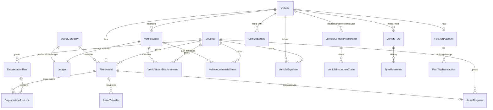

# Phase 6 — Vehicle Assets, Vehicle Loans & Expense Management
### Functional & Technical Design Document — MJ Transport ERP

Status: Design (no code written yet) · Scope: Fixed asset accounting for vehicles and other company assets, vehicle loan/EMI management, vehicle expense accounting (fuel, repair, tyre, battery, insurance, permit, fitness, road tax, FastTag), asset transfer/disposal, and depreciation — all posting through the existing Voucher Engine. **No** GST filing, Financial Reports, Financial Closing, or future modules.

---

## 1. Business Overview

Phases 1–5 built the ledger vocabulary, the Voucher Engine, banking, receivables/payables, and driver/payroll accounting. None of them touched the asset the entire business is built on: the vehicles themselves — what they cost, what's owed on them, what it costs to keep them running, and what they're actually worth today. Phase 6 is that place.

**A grounding fact, not an assumption**: `Vehicle` (built in Fleet Management, the schema's own "Phase 4") is a pure operational/compliance record — registration number, RC/insurance/permit/fitness/PUC documents with expiry dates, FASTag number, GPS device, status. It has **zero financial fields** — no purchase cost, no purchase date, no depreciation, no loan reference. `VehicleExpense`, `FuelEntry`, and `MaintenanceRecord` all exist too, and all three share the exact disconnected-from-accounting shape Phase 4 found in `Invoice`/`Receipt` and Phase 5 found in `TripExpense`: money fields with no `voucherId`, no ledger reference, no approval workflow. Generating a fuel entry or a maintenance record today has zero effect on any Ledger.

**Unlike Phase 4/5, this is not a case of discovering an accidental gap — it's a case of finding the plumbing already laid.** Grounding this design against the actual schema turned up five things Phase 1–2 seeded specifically for this moment and left untouched ever since:

- A `VEHICLE_LOAN` system ledger (under the `LOANS` liability group) and an `INTEREST_EXPENSE` ledger (under `FINANCIAL_EXPENSES`) — both seeded in Phase 1, both unreferenced by any code until now.
- A `FIXED_ASSETS` account group under `ASSETS` — seeded, empty, waiting for asset ledgers.
- Five `NumberSeriesDocumentType` values — `LOAN_VOUCHER`, `INTEREST_VOUCHER`, `DEPRECIATION_VOUCHER`, `ASSET_PURCHASE_VOUCHER`, `ASSET_SALE_VOUCHER` — added in Phase 2 alongside the original nine, with a seed-file comment stating plainly they were *"left for an admin to configure a NumberSeries + VoucherType for when actually needed, rather than seeding numbering config nobody has asked for yet."* None of the five has a `VoucherType` row. Phase 6 is that "when."
- `VoucherSourceModule.VEHICLE` and `.LOAN` — reserved since Phase 2, never populated by an active event mapping.
- A design comment on `DriverLoan` (Phase 5) stating outright: *"the opposite direction of the existing liability-side LOANS account group seeded for Vehicle Loan"* — Phase 5 was written already knowing this phase was coming.

Concretely, this changes the shape of the work relative to every prior phase:

- **Vehicle Purchase, Loan Disbursement, Depreciation, and Asset Sale get their own dedicated Voucher Types** (`ASSET_PURCHASE`, `LOAN`, `DEPRECIATION`, `ASSET_SALE`), each with its own numbering prefix, backed by numbering slots that have sat empty since Phase 2 — not shoved into generic `JOURNAL`/`PURCHASE`/`SALES` types built for trade transactions.
- **`VehicleExpense` is extended additively** (the Phase 4/10 pattern — extend the pre-existing disconnected table rather than fork it), because, unlike `TripExpense`, nothing in the report layer depends on its current shape (confirmed: `trip-financial.service.ts` and `management-report.repository.ts` read `TripExpense` exclusively, never `VehicleExpense`) — extending it carries no risk of breaking existing trip-profitability numbers, and `FuelEntry`/`MaintenanceRecord` already auto-mirror into it, so wiring `VehicleExpense` into the Voucher Engine automatically brings fuel and maintenance cost with it.
- **Vehicle loans get per-loan control ledgers**, auto-provisioned under `LOANS` the same way Phase 4/5 auto-provisioned per-party ledgers — which supersedes the single pooled `VEHICLE_LOAN` ledger exactly as `CUSTOMER_ADVANCE`/`DRIVER_ADVANCE`/`SALARY_PAYABLE` were superseded before it. That pooled ledger is left in place, inert, per the now-established precedent.
- **`Tyre` and battery tracking are genuinely new** — `Tyre` today is a brand/spec catalog with no relation to `Vehicle` at all; there is no installed-tyre, rotation, or lifecycle concept anywhere in the schema. Same for insurance/permit/fitness/road tax beyond the simple expiry-date fields already on `Vehicle`, and for FastTag beyond the plain `fastagNumber` string.

---

## 2. Fixed Asset Accounting Architecture

```
AssetCategory (new — Vehicle / Land / Building / Furniture / Computer /
        Machinery / Office Equipment / Warehouse Equipment / Other;
        defines useful life, depreciation method, residual %, numbering)
        │  one pooled Ledger per category under FIXED_ASSETS
        │  ("VEHICLE_ASSETS", "FURNITURE_ASSETS", ...) — NOT one ledger
        │  per physical asset. A Fixed Asset Register (below) is the
        │  subsidiary detail; the Ledger is the GL control account,
        │  same relationship Phase 4 uses between one SUNDRY_DEBTORS
        │  group and many per-customer ledgers, inverted: here it's
        │  many assets under one category ledger, because an asset's
        │  own "statement" is its depreciation/movement history, not
        │  a running party balance.
        ▼
FixedAsset (new — the Asset Register; vehicleId links a vehicle-type
        asset back to the existing Vehicle master, null for non-vehicle
        assets)
        │
        ├── Purchase ──► AccountingEventMapping(VEHICLE/ASSET_PURCHASED → ASSET_PURCHASE)
        │                 Dr Category Asset Ledger (full value)
        │                 Cr Bank/Cash and/or Cr Vehicle Loan Ledger and/or Cr Supplier Ledger
        │
        ├── Depreciation (via DepreciationRun, §13) ──► DEPRECIATION voucher
        │                 Dr Depreciation Expense (per category) · Cr Accumulated
        │                 Depreciation (contra-asset ledger, per category, under
        │                 the same FIXED_ASSETS group with normalBalance=CREDIT —
        │                 an explicitly-supported "unusual direction" case per
        │                 the Ledger model's own Phase 7 design comment)
        │
        ├── AssetTransfer (new) ── no Voucher (custody/department move only,
        │                 no value change — matches the "Asset Transfer" brief
        │                 item, distinct from the existing driver↔vehicle
        │                 VehicleAssignment feature, which this does not touch)
        │
        └── AssetDisposal (new) ──► SALE: ASSET_SALE voucher
                                     Dr Bank/Buyer · Dr Accumulated Depreciation
                                     Cr Fixed Asset Ledger (original cost)
                                     Cr/Dr Gain or Loss on Disposal
                                     Non-sale (scrap/write-off/theft/total-loss/
                                     donation): JOURNAL voucher, same lines minus
                                     the buyer-proceeds credit

Net Book Value = Category Asset Ledger balance for this asset's cost
        − this asset's share of Accumulated Depreciation — computed live
        from VoucherLines, cached on FixedAsset.currentValue the same
        way Invoice.outstandingAmount is cached: recomputed
        transactionally, never a second source of truth.
```

---

## 3. Vehicle Loan Management Architecture

```
VehicleLoan (new — loanNumber, vehicleId, lenderType BANK/NBFC/
        PRIVATE_FINANCE/INTERNAL, principal, interest rate, tenure)
        │  auto-provision on creation, one control Ledger per loan under
        │  LOANS — supersedes the pooled VEHICLE_LOAN ledger, same story
        │  as every per-party ledger since Phase 4
        ▼
Ledger (LOANS group, classification LIABILITY, normalBalance CREDIT)
        │
        ├── VehicleLoanDisbursement (new — supports "Multiple Loan
        │       Disbursements" as tranches against one loan) ──►
        │       AccountingEventMapping(LOAN/VEHICLE_LOAN_DISBURSED → LOAN)
        │       Dr Fixed Asset Ledger (at Asset Purchase, if disbursed
        │       direct to dealer — the realistic case for vehicle finance)
        │       or Dr Bank (if disbursed to company's own account first)
        │       Cr Vehicle Loan Ledger
        │
        └── VehicleLoanInstallment (new — real amortization schedule,
                principal/interest split via reducing-balance EMI math,
                unlike Driver/Employee loans which are flat-principal
                with interestRate always 0 today)
                │  EMI Payment ──► AccountingEventMapping(LOAN/
                │       VEHICLE_LOAN_EMI_PAID → PAYMENT)
                │       Dr Vehicle Loan Ledger (principal component)
                │       Dr Interest Expense (interest component)
                │       Dr Penalty Expense (late fee, if any)
                │       Cr Bank/Cash (total EMI + late fee)
                │
                ├── Prepayment/Part Payment/Foreclosure — same Payment
                │       Voucher shape, extra principal reduction,
                │       remaining schedule regenerated
                │
                └── Reschedule — regenerates remaining installments
                        from the current outstanding principal, no Voucher
                        (a schedule edit, not a financial transaction)

Outstanding Principal = principal − SUM(installment.principalComponent
        WHERE status=PAID) — never a stored running balance, same
        discipline as DriverLoan/EmployeeLoan in Phase 5.
```

---

## 4. Vehicle Expense Management Architecture

```
VehicleExpense (existing Fleet-phase table — extended additively, not
        forked, unlike TripExpense in Phase 5)
        │  additive: supplierId (vendor), tripId, gstMasterId/taxAmount,
        │  approvalStatus/approvedById (reuses Phase 5's shared
        │  ApprovalStatus enum), expenseLedgerId, voucherId,
        │  organizationId/financialYearId/accountingPeriodId
        │  category enum expanded: + REPAIR, SERVICE, TYRE, BATTERY,
        │  FITNESS, ROAD_TAX, FASTTAG, ACCESSORIES, GREASE_LUBRICANTS,
        │  BREAKDOWN (existing FUEL/MAINTENANCE/INSURANCE/PERMIT/
        │  MISCELLANEOUS untouched)
        ▼
AccountingEventMapping(VEHICLE/VEHICLE_EXPENSE_APPROVED → EXPENSE)
        Dr category-specific Expense Ledger (FUEL_EXPENSE/REPAIR_EXPENSE/
        TYRE_EXPENSE already exist from Phase 1/5; new: SERVICE_EXPENSE,
        BATTERY_EXPENSE, INSURANCE_EXPENSE, COMPLIANCE_EXPENSE for
        permit/fitness/road tax, FASTTAG_EXPENSE or the existing
        TOLL_EXPENSE for FastTag usage)
        Cr Bank/Cash (paid immediately) or Cr Supplier Ledger (on account
        — reuses Phase 4's ensureSupplierLedger, same vendor-bill pattern
        as SupplierBill)

FuelEntry / MaintenanceRecord (existing, unchanged) already auto-create
        a mirrored VehicleExpense row (category FUEL / MAINTENANCE) —
        this pre-existing mirroring means wiring VehicleExpense into the
        Voucher Engine automatically brings fuel and maintenance
        accounting online with it; no separate voucher logic needed in
        FuelEntry/MaintenanceRecord services themselves.

VehicleTyre / VehicleBattery / VehicleComplianceRecord (new — see §5)
        each generate their own VehicleExpense row at purchase/premium/
        fee time, keeping "one place to query vehicle cost" true for the
        new categories exactly as it already is for fuel and maintenance.
```

---

## 5. Module Breakdown

| # | Module (from brief) | New table? | Reuses |
|---|---|---|---|
| 1 | Fixed Asset Master | `FixedAsset` | New `FIXED_ASSETS`-group ledgers |
| 2 | Asset Categories | `AssetCategory` | — |
| 3 | Asset Registration | — | `FixedAsset` create flow |
| 4 | Vehicle Asset Register | — | `FixedAsset` filtered by `vehicleId != null`, joined to existing `Vehicle` |
| 5 | Asset Purchase | — | `FixedAsset` + new `ASSET_PURCHASE` VoucherType |
| 6 | Asset Capitalization | — | `FixedAsset.capitalizationDate` (may differ from purchase date) |
| 7 | Vehicle Loan Management | `VehicleLoan` | `LOANS` group, `VEHICLE_LOAN` ledger superseded |
| 8 | EMI Schedule | `VehicleLoanInstallment` | Reducing-balance EMI math |
| 9 | EMI Payment | — | PAYMENT VoucherType |
| 10 | Loan Outstanding | — | Computed from installments, no stored balance |
| 11 | Interest Accounting | — | Interest component of EMI; new `INTEREST` VoucherType for out-of-cycle accrual |
| 12 | Depreciation Configuration | — | `AssetCategory.depreciationMethod/usefulLifeMonths/residualValuePercent` |
| 13 | Depreciation Processing | `DepreciationRun`, `DepreciationRunLine` | New `DEPRECIATION` VoucherType |
| 14 | Vehicle Expense Management | — | `VehicleExpense` (extended) |
| 15 | Fuel Expense | — | Existing `FuelEntry` → mirrored `VehicleExpense` |
| 16 | Repair & Maintenance | — | Existing `MaintenanceRecord` → mirrored `VehicleExpense` |
| 17 | Tyre Management | `VehicleTyre`, `TyreMovement` | Existing `Tyre` catalog, `VehicleExpense` |
| 18 | Battery Management | `VehicleBattery` | `VehicleExpense` |
| 19 | Insurance Management | `VehicleComplianceRecord`, `VehicleInsuranceClaim` | `VehicleExpense` |
| 20 | Permit & Fitness Management | — | `VehicleComplianceRecord` (category PERMIT/FITNESS/POLLUTION) |
| 21 | Road Tax Management | — | `VehicleComplianceRecord` (category ROAD_TAX) |
| 22 | FastTag Management | `FastTagAccount`, `FastTagTransaction` | `TOLL_EXPENSE` ledger (Phase 5) |
| 23 | Asset Transfer | `AssetTransfer` | Existing `Department`; disclosed branch gap (§20) |
| 24 | Asset Disposal | `AssetDisposal` | JOURNAL VoucherType |
| 25 | Asset Sale | — | `AssetDisposal` (disposalType=SALE) + new `ASSET_SALE` VoucherType |
| 26 | Asset Revaluation Foundation | — | `FixedAsset.currentValue` cache; no revaluation workflow built (§21) |
| 27 | Vehicle Cost Summary | — | New read-only aggregation service |
| 28 | Vehicle Profitability Foundation | — | Data shape only, no report (§15) |
| 29 | Asset Dashboard | — | Read-only aggregation endpoint |
| 30 | Approval Workflow | — | 100% reuse of Phase 2 engine + per-document `approvalStatus` (Phase 5 pattern) |

**16 new tables** plus one heavily extended (`VehicleExpense`) and five new `VoucherType` rows activating numbering slots reserved since Phase 2. Six of thirty modules need no new table at all — the same "most of a brief this size is workflow on a handful of nouns" ratio every phase has found.

---

## 6. Complete Business Workflows

### 6.1 Cash Purchase of a new truck

`FixedAsset` created (`categoryId` = Vehicles, `vehicleId` links the just-created `Vehicle` master record), posts one `ASSET_PURCHASE` Voucher: Dr `VEHICLE_ASSETS` ledger (full value), Cr Bank/Cash. `capitalizationDate` defaults to purchase date but can be set later (asset bought but not yet put into service — depreciation only starts from capitalization).

### 6.2 Loan Purchase (bank pays the dealer directly)

Same `FixedAsset` creation, but the `ASSET_PURCHASE` Voucher's credit side splits: Cr Vehicle Loan Ledger (financed amount, auto-provisioned for the new `VehicleLoan`) + Cr Bank/Cash (down payment/margin money, if any) + Cr Supplier Ledger (if any portion is on credit terms from the dealer). One voucher, multiple credit lines — the Voucher Engine already supports this natively. `VehicleLoanInstallment` schedule is generated immediately using the reducing-balance EMI formula.

### 6.3 Exchange (trade-in) Purchase

Two linked transactions in one business action: an `AssetDisposal` (disposalType=SALE) on the old vehicle at the agreed trade-in value, and a `FixedAsset` purchase of the new one, with the trade-in value applied as a credit line on the new purchase's `ASSET_PURCHASE` Voucher instead of Bank/Cash. The old vehicle's `AssetDisposal` still posts its own `ASSET_SALE` Voucher independently — two vouchers, cross-referenced by a shared `exchangeGroupId` tag on both disposal and purchase for traceability, not merged into one.

### 6.4 EMI Payment (regular cycle)

`VehicleLoanInstallment` due today is marked for payment; the service resolves principal/interest split from the pre-computed schedule, posts one `PAYMENT` Voucher (Dr Loan Ledger + Dr Interest Expense, Cr Bank/Cash), marks the installment `PAID`.

### 6.5 Foreclosure

Outstanding principal (computed live) is paid in full via one `PAYMENT` Voucher (Dr Loan Ledger for the full remaining principal, Dr Interest Expense for any accrued-but-unbilled interest, Cr Bank/Cash); all remaining `PENDING` installments are marked `WAIVED`; `VehicleLoan.status` → `CLOSED`.

### 6.6 Fuel entry → automatic expense recognition

Operator logs a `FuelEntry` (unchanged Fleet flow) → the existing mirroring creates a `VehicleExpense(category=FUEL)` row → Phase 6's new approval/posting step picks it up: on approval, posts an `EXPENSE` Voucher (Dr `FUEL_EXPENSE`, Cr Bank/Cash or Cr fuel-card-vendor Supplier Ledger), same two-layer approval as Phase 5 (business approval gates the Voucher, not the other way around).

### 6.7 Tyre replacement

`VehicleTyre` for the old tyre marked `REMOVED` (odometer logged), a `TyreMovement(REMOVE)` row recorded; new `VehicleTyre` created and marked `INSTALLED`; the purchase cost posts a `VehicleExpense(category=TYRE)` → `EXPENSE` Voucher (Dr `TYRE_EXPENSE`, Cr Bank/Cash or Supplier). Tyre life (`removedOdometer − installedOdometer`) is available for future cost-per-km analysis without building it now.

### 6.8 Insurance renewal

New `VehicleComplianceRecord(type=INSURANCE)` created, linked to the prior record via `renewedFromId` (history chain); premium posts a `PAYMENT` Voucher (Dr `INSURANCE_EXPENSE`, Cr Bank/Cash); `Vehicle.insuranceExpiryDate` (existing field) is updated to match, so the Fleet module's existing expiry-alert UI keeps working unmodified — Phase 6 writes to that field, it does not replace it.

### 6.9 Monthly Depreciation Run

`DepreciationRun` created for the period; `calculate()` walks every `ACTIVE` `FixedAsset` past its `capitalizationDate`, computes each one's depreciation for the period per its category's method (Straight Line or Written Down Value), writes one `DepreciationRunLine` per asset. `approve()` posts **one consolidated `DEPRECIATION` Voucher** for the whole run — Dr each category's Depreciation Expense ledger (summed), Cr each category's Accumulated Depreciation ledger (summed) — the same "one Journal Voucher for the whole batch" pattern Phase 5's `PayrollRun.approve()` established for salary recognition.

### 6.10 Accident — total loss, insurance claim

`VehicleInsuranceClaim` filed against the vehicle's active `VehicleComplianceRecord(type=INSURANCE)`; once settled, an `AssetDisposal(disposalType=ACCIDENT_TOTAL_LOSS)` is raised with `saleValue` = the claim settlement amount (money received, even though it's insurance proceeds rather than a buyer) and `insuranceClaimId` cross-referenced; posts a `JOURNAL` Voucher (Dr Bank for settlement received, Dr Accumulated Depreciation, Dr/Cr Loss or Gain, Cr Fixed Asset Ledger).

---

## 7. Database Design

Same conventions as every prior phase: UUID PKs, soft delete via `deletedAt`, plain `createdById`/`updatedById`, `@@map` to snake_case. `organizationId`/`financialYearId`/`accountingPeriodId` on primary documents only (not on child/detail tables), as plain denormalized anchors — not physical FK relations — consistent with the pragmatic simplification Phase 5 introduced and this phase continues.

### 7.1 `AssetCategory` (new)

| Column | Type | Notes |
|---|---|---|
| code, name | varchar | e.g. `VEHICLES`, `FURNITURE` |
| assetType | enum `AssetType`: VEHICLE / LAND / BUILDING / FURNITURE / COMPUTER / MACHINERY / OFFICE_EQUIPMENT / WAREHOUSE_EQUIPMENT / OTHER | |
| usefulLifeMonths | int | default useful life for assets in this category |
| depreciationMethod | enum `DepreciationMethod`: STRAIGHT_LINE / WRITTEN_DOWN_VALUE / CUSTOM | |
| depreciationRatePercent | decimal, nullable | annual %, used for WDV; derived from useful life for SLM if null |
| residualValuePercent | decimal, default 5 | % of purchase value never depreciated below |
| assetLedgerId | uuid FK → Ledger, nullable | the pooled category ledger under `FIXED_ASSETS`, auto-provisioned on first use |
| depreciationExpenseLedgerId, accumulatedDepreciationLedgerId | uuid FK → Ledger, nullable | auto-provisioned pair |
| isSystemCategory, isActive, deletedAt, audit | — | Vehicles/Land/Building/Furniture/Computer seeded as system categories |

### 7.2 `FixedAsset` (new — the Asset Register)

| Column | Type | Notes |
|---|---|---|
| assetCode | varchar, unique | own numbering per category |
| assetName | varchar | |
| categoryId | uuid FK → AssetCategory | |
| vehicleId | uuid FK → Vehicle, nullable, unique | set only for vehicle-type assets; unique so one Vehicle has at most one FixedAsset record |
| supplierId | uuid FK → Supplier, nullable | purchase vendor |
| purchaseDate, capitalizationDate | date | capitalization may trail purchase (asset not yet in service) |
| purchaseValue | decimal(14,2) | original cost |
| residualValue | decimal(14,2) | snapshot from category %, can override per asset |
| usefulLifeMonths | int | snapshot from category, can override |
| depreciationMethod | enum (as above) | snapshot from category, can override |
| currentValue | decimal(14,2) | **cache**, recomputed transactionally after every depreciation run / disposal, same discipline as `Invoice.outstandingAmount` |
| departmentId | uuid FK → Department, nullable | reuses the existing Phase 2 Administration `Department` model |
| locationText | varchar, nullable | free text — no MJ-Transport-internal branch master exists (§20 disclosed gap) |
| responsiblePersonId | uuid FK → User, nullable | |
| status | enum `FixedAssetStatus`: ACTIVE / UNDER_TRANSFER / DISPOSED / WRITTEN_OFF | |
| purchaseVoucherId | uuid FK → Voucher, unique | |
| isActive, deletedAt, audit | — | |

### 7.3 `VehicleLoan` (new)

| Column | Type | Notes |
|---|---|---|
| loanNumber | varchar, unique | |
| vehicleId | uuid FK → Vehicle | |
| fixedAssetId | uuid FK → FixedAsset, nullable | links to the financed asset once purchase is recorded |
| lenderType | enum `LenderType`: BANK / NBFC / PRIVATE_FINANCE / INTERNAL | |
| lenderName, loanAccountNumber | varchar | |
| principalAmount, processingFee | decimal(14,2) | |
| interestRatePercent | decimal(5,2) | annual, reducing balance |
| disbursementDate, emiStartDate | date | |
| emiAmount | decimal(12,2) | computed via reducing-balance formula, editable before first disbursement |
| tenureMonths | int | |
| status | enum `VehicleLoanStatus`: PENDING_APPROVAL / ACTIVE / CLOSED / FORECLOSED | |
| loanLedgerId | uuid FK → Ledger | auto-provisioned control ledger, `LOANS` group |
| approvedById | — | |

### 7.4 `VehicleLoanDisbursement` (new) / `VehicleLoanInstallment` (new)

`VehicleLoanDisbursement`: `loanId`, `disbursementDate`, `amount`, `voucherId` (unique) — supports multi-tranche disbursement against one loan.

`VehicleLoanInstallment`: `loanId`, `installmentNo`, `dueDate`, `emiAmount`, `principalComponent`, `interestComponent`, `status` (`PENDING`/`PAID`/`OVERDUE`/`WAIVED`), `lateFeeAmount` default 0, `paidVoucherId` nullable unique, `paidDate` nullable.

### 7.5 `DepreciationRun` (new) / `DepreciationRunLine` (new)

`DepreciationRun`: `runNumber`, `periodType` (`MONTHLY`/`QUARTERLY`/`YEARLY`), `periodStart`, `periodEnd`, `status` (`DRAFT`/`CALCULATED`/`APPROVED`), `journalVoucherId` unique nullable, `approvedById`.

`DepreciationRunLine`: `runId`, `assetId`, `openingValue`, `depreciationAmount`, `closingValue`, `method` (snapshot). One row per asset per run — the audit trail for "what was this asset worth on this date" survives even if the category's method changes later, the same snapshot discipline `PayrollRunLineComponent` uses.

### 7.6 `VehicleExpense` (existing — extended additively)

| Column | Type | Notes |
|---|---|---|
| *(existing)* | | `vehicleId`, `category`, `amount`, `expenseDate`, `description`, `paymentModeId`, `billDocument`, `referenceType`, `referenceId` |
| category | enum, **extended** | + `REPAIR`, `SERVICE`, `TYRE`, `BATTERY`, `FITNESS`, `ROAD_TAX`, `FASTTAG`, `ACCESSORIES`, `GREASE_LUBRICANTS`, `BREAKDOWN` (existing `FUEL`/`MAINTENANCE`/`INSURANCE`/`PERMIT`/`MISCELLANEOUS` untouched) |
| tripId | uuid FK → Trip, nullable | **new** — optional trip linkage per the brief |
| supplierId | uuid FK → Supplier, nullable | **new** — vendor |
| gstMasterId, taxAmount, totalAmount | uuid FK / decimal | **new** — `totalAmount = amount + taxAmount`, `amount` stays pre-tax |
| approvalStatus | enum, reuses Phase 5's `ApprovalStatus` | **new** |
| approvedById | — | **new** |
| expenseLedgerId, voucherId | uuid FK, voucherId unique | **new** |
| organizationId, financialYearId, accountingPeriodId | plain | **new** |

### 7.7 `VehicleComplianceRecord` (new) / `VehicleInsuranceClaim` (new)

| Column | Type | Notes |
|---|---|---|
| vehicleId | uuid FK → Vehicle | |
| complianceType | enum `ComplianceType`: INSURANCE / PERMIT / FITNESS / ROAD_TAX / POLLUTION | one table, five near-identical shapes — same consolidation reasoning as Phase 5's `DriverEarning` merging Allowance+Incentive |
| documentNumber | varchar | policy/permit/certificate number |
| issuerName | varchar, nullable | insurer / RTO / testing center |
| issueDate, expiryDate | date | |
| premiumOrFeeAmount | decimal(12,2), nullable | |
| documentUrl | varchar, nullable | |
| renewedFromId | uuid FK → VehicleComplianceRecord, nullable, self-relation | history chain |
| voucherId | uuid FK → Voucher, unique, nullable | |
| status | enum: `ACTIVE`/`EXPIRED`/`RENEWED` | |

`VehicleInsuranceClaim`: `complianceRecordId` FK, `claimNumber`, `claimDate`, `claimAmount`, `settledAmount` nullable, `settlementDate` nullable, `status` (`FILED`/`APPROVED`/`SETTLED`/`REJECTED`).

### 7.8 `FastTagAccount` (new) / `FastTagTransaction` (new)

`FastTagAccount`: `vehicleId` unique FK, `fastagNumber` (snapshot of `Vehicle.fastagNumber`), `currentBalance` decimal — **cache**, recomputed from transactions, ledgerId (a pooled `FASTTAG_PREPAID` current-asset ledger).

`FastTagTransaction`: `accountId` FK, `type` (`RECHARGE`/`USAGE`), `amount`, `tripId` nullable, `transactionDate`, `voucherId` nullable unique (set for `RECHARGE` only — usage is typically reconciled in bulk from an NHAI statement, not vouchered per toll-booth swipe).

### 7.9 `VehicleTyre` (new) / `TyreMovement` (new)

`VehicleTyre`: `tyreId` FK → existing `Tyre` catalog, `vehicleId` nullable FK (null once removed/scrapped and not yet reinstalled), `serialNumber`, `position` (free text, e.g. "Front-Left"), `installedDate`, `installedOdometer`, `removedDate` nullable, `removedOdometer` nullable, `status` (`INSTALLED`/`REMOVED`/`SCRAPPED`), `purchaseVoucherId` nullable unique, `cost`.

`TyreMovement`: `vehicleTyreId` FK, `movementType` (`INSTALL`/`ROTATE`/`REMOVE`/`SCRAP`), `fromVehicleId`/`toVehicleId` nullable, `fromPosition`/`toPosition` nullable, `odometerReading`, `movementDate`, `notes`.

### 7.10 `VehicleBattery` (new)

`vehicleId` FK, `brand`, `serialNumber`, `installedDate`, `installedOdometer`, `warrantyMonths`, `warrantyExpiryDate`, `replacedDate` nullable, `status` (`INSTALLED`/`REPLACED`/`DISPOSED`), `purchaseVoucherId` nullable unique, `cost`.

### 7.11 `AssetTransfer` (new) / `AssetDisposal` (new)

`AssetTransfer`: `assetId` FK → FixedAsset, `transferType` (`DEPARTMENT`/`CUSTODY`/`LOCATION`), `fromDepartmentId`/`toDepartmentId` nullable FK → Department, `fromResponsiblePersonId`/`toResponsiblePersonId` nullable FK → User, `transferDate`, `reason`, `approvedById`, `status` (`PENDING`/`APPROVED`/`REJECTED`). No Voucher — a custody record, not a value change.

`AssetDisposal`: `assetId` FK, `disposalType` (`SALE`/`SCRAP`/`WRITE_OFF`/`THEFT`/`ACCIDENT_TOTAL_LOSS`/`DONATION`), `disposalDate`, `saleValue` nullable, `netBookValueAtDisposal` (snapshot at disposal time), `gainLossAmount` (computed, signed), `buyerDetails` nullable, `insuranceClaimId` nullable FK → VehicleInsuranceClaim, `voucherId` unique, `exchangeGroupId` nullable (cross-references a simultaneous trade-in purchase, §6.3), `approvedById`, `status`.

### 7.12 New Account Groups, Ledgers, Enum additions

No new **account groups** — `FIXED_ASSETS` (ASSETS) and `LOANS` (LIABILITIES) already exist. New **system ledgers**: `SERVICE_EXPENSE`, `BATTERY_EXPENSE`, `INSURANCE_EXPENSE`, `COMPLIANCE_EXPENSE` (permit/fitness/road tax), `FASTTAG_PREPAID` (CURRENT_ASSETS) — plus one `_ASSET`/`_DEPRECIATION`/`_ACCUM_DEPN` triple per `AssetCategory` seeded at category-creation time, not hardcoded. `VoucherSourceModule` — no new value needed; `VEHICLE` and `LOAN` (both reserved since Phase 2) are activated by this phase. Five new `VoucherType` rows: `ASSET_PURCHASE`, `ASSET_SALE`, `LOAN`, `INTEREST`, `DEPRECIATION`, backed by the five `NumberSeriesDocumentType` values reserved since Phase 2.

---

## 8. Entity Relationships



---

## 9. Business Rules

- **Asset Rules**: an asset cannot depreciate before `capitalizationDate`. `currentValue` never goes below `residualValue`. A vehicle-type `FixedAsset` requires a `vehicleId`; that `vehicleId` is unique across `FixedAsset` — one vehicle, one asset record, ever (disposal ends it, it is not deleted and re-created for a re-purchase).
- **Loan Rules**: `interestRatePercent` is fixed for the life of the loan (no mid-tenure rate-change support in this phase — a disclosed limitation, §21). A loan cannot be created with `emiStartDate` before `disbursementDate`.
- **EMI Rules**: an installment can only be paid once (`status` transitions `PENDING → PAID`, never back). Foreclosure requires all prior installments `PAID` or the foreclosure amount includes their catch-up. Reschedule regenerates only `PENDING` installments — `PAID` ones are immutable history.
- **Expense Rules**: `approvalStatus` gates Voucher creation, same two-layer pattern as Phase 5 (§12). An expense dated in a `CLOSED` accounting period cannot be created — inherited from Voucher creation, not reimplemented.
- **Depreciation Rules**: a `DepreciationRun` cannot be created for a period that overlaps an existing non-cancelled run at the same `periodType`. Recalculating a `CALCULATED` (not yet `APPROVED`) run regenerates every line from scratch. An asset already fully depreciated to its residual value is skipped in subsequent runs, not zeroed out further.
- **Insurance Rules**: a claim cannot exceed the compliance record's coverage in any enforced sense (this phase does not model sum-insured — a disclosed limitation); a claim can only be filed against an `ACTIVE` insurance record.
- **Transfer Rules**: a `FixedAsset` under an unapproved `AssetTransfer` is flagged `UNDER_TRANSFER` and blocked from a second concurrent transfer request.
- **Disposal Rules**: a disposed (`DISPOSED`/`WRITTEN_OFF`) asset cannot receive further depreciation, expenses, or transfers. `netBookValueAtDisposal` is snapshotted at the moment of disposal approval, immune to later depreciation-run changes.
- **Approval Rules**: business approval (this phase's own `approvalStatus` fields) gates Voucher creation; the resulting Voucher separately runs through Phase 2's unchanged `ApprovalRule` engine — identical two-layer split to Phase 5 §11.

---

## 10. Validation Rules

| Rule | Enforced where |
|---|---|
| Duplicate Asset Code | Service layer, unique per organization |
| Duplicate Chassis/Engine/Registration Number | Already enforced on `Vehicle` (Fleet phase, `registrationNumber` unique) — Phase 6 does not duplicate this; chassis/engine number fields do not exist on `Vehicle` today and are out of scope to add here (disclosed, §21) |
| Duplicate Loan Number | Service layer, unique constraint |
| EMI Already Paid | Service layer — installment `status != PENDING` rejected |
| Negative Asset Value | Service layer — `currentValue` floor at `residualValue` |
| Invalid Depreciation Method | Zod enum validation |
| Insurance Expired | Warned (not blocked) when creating an expense/trip against a vehicle with `Vehicle.insuranceExpiryDate < today` — matches the "compliance, not a hard stop" tone of the rest of the system |
| Permit Expired | Same — warn, don't block, since blocking vehicle operations is an Operations-module decision, not this phase's to make |
| Inactive Vehicle | No new expense/loan/compliance record against a `Vehicle.isActive = false` |
| Closed Accounting Period | Inherited from Voucher creation |

---

## 11. Voucher Integration

| Event (`sourceEventCode`) | `sourceModule` | Voucher Type | Posting |
|---|---|---|---|
| `ASSET_PURCHASED` | `VEHICLE` | `ASSET_PURCHASE` *(new type, new numbering)* | Dr Category Asset Ledger · Cr Bank/Cash + Cr Loan Ledger + Cr Supplier Ledger (any mix) |
| `VEHICLE_LOAN_DISBURSED` | `LOAN` | `LOAN` *(new type, new numbering)* | Dr Asset/Bank · Cr Vehicle Loan Ledger |
| `VEHICLE_LOAN_EMI_PAID` | `LOAN` | `PAYMENT` | Dr Loan Ledger + Dr Interest Expense (+ Dr Penalty) · Cr Bank/Cash |
| `VEHICLE_LOAN_INTEREST_ACCRUED` | `LOAN` | `INTEREST` *(new type, new numbering — out-of-cycle only, §21)* | Dr Interest Expense · Cr Loan Ledger |
| `VEHICLE_EXPENSE_APPROVED` | `VEHICLE` | `EXPENSE` *(new type, new numbering)* | Dr category Expense Ledger · Cr Bank/Cash or Supplier Ledger |
| `DEPRECIATION_RUN_POSTED` | `VEHICLE` | `DEPRECIATION` *(new type, new numbering)* | Dr Depreciation Expense (per category) · Cr Accumulated Depreciation (per category) |
| `ASSET_SOLD` | `VEHICLE` | `ASSET_SALE` *(new type, new numbering)* | Dr Bank/Buyer + Dr Accumulated Depreciation · Cr Fixed Asset Ledger + Cr/Dr Gain-Loss |
| `ASSET_DISPOSED` (non-sale) | `VEHICLE` | `JOURNAL` | Dr Accumulated Depreciation + Dr Loss on Disposal · Cr Fixed Asset Ledger |

**A deliberate refinement of the brief's own examples, not a deviation.** The brief lists "Vehicle Purchase → Purchase Voucher" and "Asset Sale → Sales Voucher," but the schema already distinguishes trade `PURCHASE_VOUCHER`/`SALES_VOUCHER` (Phase 4, wired to Supplier Bills/Invoices) from capital `ASSET_PURCHASE_VOUCHER`/`ASSET_SALE_VOUCHER` (Phase 2, unused until now) as separate `NumberSeriesDocumentType` values. Reusing Phase 4's trade types would mix capital asset purchases into the same numbering series as freight-trade purchases — this design uses the dedicated asset types instead, the same kind of correction Phase 4 made to `SUPPLIER_PAYMENT_MADE` and Phase 5 made to `LOAN_EMI_DUE`.

No Vehicle Loan, Fixed Asset, Vehicle Expense, or Depreciation record ever writes to a `Ledger` row directly; every one of the eight events above ends at `voucherService.create()` + `.submit()`.

---

## 12. Approval Workflow

Same two-layer split as Phase 5:

1. **Business approval** — `approvalStatus`/`approvedById` fields live directly on `FixedAsset` (purchase), `VehicleLoan`, `VehicleExpense`, `AssetTransfer`, `AssetDisposal`, and `DepreciationRun` — the yes/no on whether to buy the asset, take the loan, approve the expense, move custody, dispose the asset, or post this period's depreciation. This gates whether a Voucher is even created.
2. **Accounting approval** — once a Voucher exists, it runs through Phase 2's unchanged `ApprovalRule`/`VoucherApproval` engine, with amount-based, role-based, and multi-level chaining already configurable per `VoucherType` — including the five new types this phase adds. Zero new schema.

Amount-based approval (the brief's "Amount Based Approval") is not a new concept — it is Phase 2's existing `ApprovalRule.minAmount`/`maxAmount` mechanism, now configured against `ASSET_PURCHASE`/`LOAN`/`ASSET_SALE` voucher types the same way it's already configured for `PAYMENT`/`JOURNAL`.

---

## 13. Depreciation Design

Two methods, both computed at `DepreciationRun.calculate()` time, never stored as a running daily accrual:

- **Straight Line Method (SLM)**: `(purchaseValue − residualValue) / usefulLifeMonths × monthsInPeriod`. Constant every period until fully depreciated.
- **Written Down Value (WDV)**: `currentBookValue × (annualRatePercent / 12) × monthsInPeriod`, where `currentBookValue = purchaseValue − SUM(prior DepreciationRunLine.depreciationAmount for this asset)`. Declines every period.
- **Custom**: a manual override amount entered per asset per run, for cases neither formula fits (bypasses the formula entirely, still produces a normal `DepreciationRunLine`).

`periodType` (`MONTHLY`/`QUARTERLY`/`YEARLY`) determines `monthsInPeriod` and which assets are due — an asset already processed for a given calendar month is skipped by a later `MONTHLY` run for the same month, preventing double-depreciation, checked against existing `DepreciationRunLine` rows for that asset within the period.

One `DepreciationRun` produces **one consolidated Voucher** regardless of how many assets it covers — lines are grouped and summed by category's Depreciation Expense / Accumulated Depreciation ledger pair, the same aggregation Phase 5's `PayrollRun.approve()` performs across employees. `FixedAsset.currentValue` is recomputed and cached for every asset touched, immediately after the Voucher posts.

---

## 14. Asset Lifecycle Management

```
Registration → Capitalization → (Depreciation, recurring) → [Transfer]* → Disposal
```

- **Registration**: `FixedAsset` created, `status = ACTIVE`, no Voucher yet if purchase isn't recorded simultaneously (rare — normally registration and purchase are the same action).
- **Capitalization**: the point depreciation eligibility begins; may lag registration (asset delivered but not yet commissioned).
- **Transfer** (zero or more times): custody/department changes, no value change, no Voucher — pure history via `AssetTransfer` rows, `status` briefly `UNDER_TRANSFER` during an unapproved request.
- **Disposal** (terminal, exactly once): `status → DISPOSED` or `WRITTEN_OFF`, permanently blocks further depreciation/expense/transfer against that asset. A vehicle sold and later somehow reacquired gets a **new** `FixedAsset` row (new `assetCode`), never a reopened old one — asset history is immutable once closed.

---

## 15. Vehicle Costing Strategy

A new read-only `vehicleCostSummaryService`, additive alongside (not replacing) the existing `trip-financial.service.ts`, since the latter is confirmed to read only `TripExpense` for trip-level P&L and has no awareness of a vehicle's own fixed/running costs. Per vehicle, sums:

| Cost component | Source |
|---|---|
| Purchase Cost | `FixedAsset.purchaseValue` |
| Loan Cost (principal repaid) / Interest | `SUM(VehicleLoanInstallment.principalComponent / .interestComponent WHERE status=PAID)` |
| Depreciation to date | `SUM(DepreciationRunLine.depreciationAmount)` for this asset |
| Fuel / Repair / Tyre / Battery / Insurance / Permit / Tax / FastTag | `SUM(VehicleExpense.totalAmount)` grouped by category |
| Driver Cost | `SUM(DriverEarning + DriverAdvance − recoveries)` for trips where `Trip.vehicleId` matches (join through `Trip`, the same attribution path Phase 5 designed for trip-wise driver cost) |
| Trip Revenue | `SUM(Trip.freightAmount)` for trips on this vehicle |
| **Total Cost** | sum of all of the above except revenue |

This is explicitly a **data-shape and aggregation-query design**, not a report UI — matching the brief's own "Vehicle Profitability Foundation... do not implement reports" instruction. Cost Per KM and full ROI are named as **future** by the brief and are not computed here even as a formula, since no odometer-distance-per-period source of truth exists yet (only per-`FuelEntry` `distanceCovered`, not a continuous vehicle-level trip log) — flagged in §21, not silently assumed.

---

## 16. API Design

Grouped under `/api/accounts/assets/*` and `/api/accounts/vehicle-loans/*`, following the unchanged `masterCrudFactory`/service/controller/router layering:

| Endpoint | Method | Notes |
|---|---|---|
| `/accounts/assets/categories` | GET/POST/PUT | `AssetCategory` CRUD |
| `/accounts/assets` | GET/POST | Fixed Asset Register; POST = register + purchase |
| `/accounts/assets/:id/approve` | PATCH | business approval → posts `ASSET_PURCHASE` Voucher |
| `/accounts/assets/:id/transfer` | POST | `AssetTransfer` request |
| `/accounts/assets/:id/dispose` | POST | `AssetDisposal`, `disposalType` in body |
| `/accounts/assets/:id/cost-summary` | GET | §15 aggregation for one vehicle/asset |
| `/accounts/depreciation/runs` | GET/POST | + `/:id/calculate`, `/:id/approve` |
| `/accounts/vehicle-loans` | GET/POST | + `/:id/approve` (disburses) |
| `/accounts/vehicle-loans/:id/installments` | GET | EMI schedule |
| `/accounts/vehicle-loans/:id/installments/:instId/pay` | PATCH | regular EMI |
| `/accounts/vehicle-loans/:id/foreclose` | PATCH | §6.5 |
| `/accounts/vehicle-expenses` | GET/POST | extends existing Fleet endpoint additively |
| `/accounts/vehicle-expenses/:id/approve` | PATCH | |
| `/accounts/vehicle-tyres`, `/vehicle-batteries`, `/vehicle-compliance`, `/fasttag-accounts` | GET/POST | own thin CRUD each |
| `/accounts/assets/dashboard` | GET | §Asset Dashboard aggregation |

All mutating endpoints: `authenticate` + `authorize(<permission>)` + `validate(<zod schema>)`, unchanged pattern.

---

## 17. UI/UX Design

- **Asset Master / Vehicle Asset Register**: a filterable register table (category, status, department), each row drilling into an asset detail page — purchase info, current book value with a live depreciation-to-date chart, transfer history, linked `Vehicle` compliance summary if applicable.
- **Loan Management**: loan list with outstanding-principal progress bars; loan detail shows the full EMI schedule (paid vs. pending, principal/interest breakdown per row) and a one-click "Pay Next EMI" / "Foreclose" action.
- **Depreciation Processing**: a run wizard mirroring Payroll's (§Phase 5) — pick period → calculate → review per-asset lines grouped by category → approve, with the consolidated Journal preview before posting.
- **Vehicle Expenses**: extends the existing Fleet expense list (not a new page) with category filter now covering all fifteen categories, an approval queue view, and a per-vehicle cost tab.
- **Tyre / Battery Management**: a vehicle-scoped "current fitment" view (which physical tyre/battery is on which position right now) plus a movement history timeline.
- **Insurance / Permit / Fitness / Road Tax**: one unified "Compliance" screen (tabbed by type) with a traffic-light expiry indicator (green/amber/red) reusing the same status-chip component standardized since Phase 4, and a renewal action that carries forward the prior record's data as a starting point.
- **FastTag**: account balance card per vehicle, recharge action, transaction history.
- **Asset Dashboard**: stat tiles (Total Assets, Total Vehicle Value, Active Vehicles, Loan Outstanding, Today's Expenses) plus compliance-due lists (Insurance/Permit/Fitness/Road Tax due within 30 days) and a Top Expense Vehicles ranking — all read-only, reusing the `ProfitCard`/hub-card components already standardized.
- Search, filters, sorting, status/approval chips: identical components to every prior phase — no new visual language.

---

## 18. Security & Permissions

Following `FLEET_MODULE_LABELS`' snake_case convention (this phase's permission prefixes don't collide with any existing `fuel_card`/`fuel_entry`/`maintenance`/`spare_part`/`vehicle_expense`/`fleet`/`vehicle.assign` keys):

| Role | Access |
|---|---|
| Super Admin / Admin | Full access |
| Accounts Manager | `asset.approve`, `vehicle_loan.approve`, `depreciation.approve`, `asset_disposal.approve` — the financial sign-off role, mirroring `ACCOUNTING_MANAGER`'s role in every prior phase |
| **Fleet Manager** *(existing role)* | `vehicle_tyre.*`, `vehicle_battery.*`, `vehicle_compliance.*`, `fasttag.*`, `vehicle_expense.create` — operational upkeep, no financial approval |
| **Maintenance Manager** *(new role)* | Repair/service-category `vehicle_expense.create`, `vehicle_tyre.*`, `vehicle_battery.*` — narrower than Fleet Manager, for a dedicated workshop lead |
| **Purchase Manager** *(new role)* | `asset.create`, `vehicle_loan.create` — files purchase/loan requests, does not approve them |
| Operations Manager | `.view` only across this phase — visibility without action rights, consistent with §17 of the Phase 4/5 role matrices |
| Approver | Not a distinct role — `.approve` granted per-permission via `ApprovalRule`, unchanged since Phase 2 |
| Auditor | `.view` only, plus audit-log read |
| Viewer | `.view` only |

`MAINTENANCE_MANAGER` and `PURCHASE_MANAGER` are additive rows in the `ROLES` seed array; no existing role is renamed or removed.

---

## 19. Audit Strategy

Every table in this phase carries `createdById`/`updatedById`/`createdAt`/`updatedAt`/`deletedAt` — no exception. Every approval action is a permanent, non-overwritable field. Every Voucher this phase produces inherits Phase 2's `VoucherAuditEntry` trail unchanged. `DepreciationRunLine` and `AssetDisposal.netBookValueAtDisposal` are frozen snapshots — later configuration changes (a category's depreciation rate, say) never rewrite what a past run actually posted, the same reproducibility guarantee `PayrollRunLineComponent` gives payslips in Phase 5.

---

## 20. Transportation-Specific Business Rules

- **Vehicle-wise / Trip-wise / Branch-wise Expense Analysis**: `VehicleExpense.tripId` (new) and `.vehicleId` give the first two directly; branch-wise remains blocked by the same unresolved gap Phase 4 and Phase 5 both disclosed — no MJ-Transport-owned branch master exists.
- **Customer-wise / Route-wise Cost Allocation**: derivable by joining `VehicleExpense`/loan-cost through `Trip.vehicleId` to `Trip.intentId`/`Trip.routeId` — no new field needed, same join pattern §15 already establishes for driver cost.
- **Vehicle ROI / Cost Per KM**: explicitly **not built** — flagged as future in §15, since no continuous odometer/distance ledger exists at the vehicle level (only per-fuel-entry snapshots).
- **Fuel / Repair / Tyre / Battery / Insurance Cost Analysis**: all directly queryable from `VehicleExpense` grouped by category — no new table needed beyond the category expansion already designed.
- **Permit / Fitness / Road Tax Compliance**: `VehicleComplianceRecord` grouped by `complianceType` and `expiryDate` gives compliance-due lists directly; no separate "compliance tracking" table needed.
- **FastTag Usage Analysis**: `FastTagTransaction` grouped by `type`/`tripId`.
- **EMI Tracking / Loan Outstanding Analysis**: `VehicleLoanInstallment` grouped by `status`/`dueDate`; outstanding is always computed live, never a stored figure that could drift.
- **Cost Per Trip / Cost Per Vehicle**: the §15 aggregation already produces per-vehicle totals; per-trip is the same query scoped to a single `Trip.id` instead of all trips for a vehicle.

---

## 21. Future Integration Points

- **GST Filing**: `VehicleExpense.gstMasterId`/`taxAmount` capture the rate and amount for correct books; actual filing/input-credit reconciliation is a future phase, same boundary the brief itself draws.
- **Financial Reports / Vehicle ROI report**: the §15 data shape is the foundation; the report UI itself is explicitly out of scope per the brief.
- **Mid-tenure Loan Interest Rate Changes**: not supported this phase (§9) — a rate revision would require a new `VehicleLoan` or a rate-change-effective-date mechanism neither exists nor is built here.
- **Insurance Sum-Insured Modeling**: claims are tracked, but no sum-insured ceiling is enforced — a future refinement, not a blocking gap for this phase's core purpose.
- **Chassis/Engine Number on `Vehicle`**: the brief asks for duplicate-chassis/engine validation, but `Vehicle` has no such fields today; adding them is a Fleet-module (not Accounting-module) change and is out of this phase's boundary — disclosed rather than silently worked around.
- **Cost Per KM**: needs a continuous vehicle-level distance ledger this phase does not build (§15/§20).
- **Branch Master**: the same open recommendation from Phase 4 and Phase 5 — still unresolved.
- **Asset Revaluation Workflow**: `FixedAsset.currentValue` exists and is correct, but no formal revaluation-approval workflow (upward restatement, revaluation reserve) is built — "foundation" per the brief, not the full feature.

---

## 22. Risks & Recommendations

- **Risk — depreciation run double-counting or gaps across period-type changes**: switching an `AssetCategory` from `MONTHLY` to `QUARTERLY` runs mid-year without careful `DepreciationRunLine` period-overlap checking could double-depreciate or skip months. Recommendation: `DepreciationRun.calculate()` must check the asset's depreciated-through-date (derived from its own line history, not the run's nominal period) before computing, not just "has this asset been touched by a run with an overlapping nominal period."
- **Risk — exchange/trade-in traceability**: two separate Vouchers (disposal + purchase) linked only by an informal `exchangeGroupId` tag could drift apart if one leg is edited or cancelled independently. Recommendation: UI should always present and act on both legs together, even though the data model allows them to be independent.
- **Risk — FastTag balance drift**: `FastTagAccount.currentBalance` is a cache; if usage reconciliation (bulk, from an NHAI statement) is delayed or partial, the cached balance will silently disagree with the real prepaid instrument. Recommendation: treat it as an estimate for dashboard purposes only, never as an authoritative balance for financial statements, until a proper reconciliation step is built.
- **Recommendation**: build the Depreciation Run engine's "one consolidated Voucher per batch" logic as a shared utility from day one — `PayrollRun` (Phase 5) and `DepreciationRun` (this phase) are now the second and third places this exact pattern (aggregate many lines into one Journal by ledger pair) is needed; a third future phase will likely need it again.

---

## 23. Best Practices

- No stored balance anywhere in this phase — asset book value, loan outstanding, and FastTag balance are always computed from `VoucherLine`/schedule/transaction rows on demand, or cached with transactional recompute exactly like `Invoice.outstandingAmount` — the discipline every phase since Phase 1 has held.
- Snapshot, don't reference, at the moment a value is fixed: `DepreciationRunLine`, `FixedAsset.usefulLifeMonths`/`.depreciationMethod` (copied from category at registration), and `AssetDisposal.netBookValueAtDisposal` all freeze history so later configuration changes never rewrite it.
- Extend the pre-existing disconnected table (`VehicleExpense`) rather than fork it, because nothing downstream depends on its exact current shape — verified, not assumed, before deciding (§1). Where something *does* depend on the existing shape (as `TripExpense` did in Phase 5), fork instead.
- Reuse pre-seeded numbering/ledger/enum slots before inventing new ones — this phase activates five `NumberSeriesDocumentType` values, a `FIXED_ASSETS` group, and a `VEHICLE_LOAN`/`INTEREST_EXPENSE` ledger pair that have sat waiting since Phase 1–2, rather than creating parallel structures.
- One control ledger per financially-independent party (each `VehicleLoan`), one pooled ledger per category of financially-similar things (`AssetCategory`) — the same distinction Phase 4/5 drew between per-customer ledgers and per-expense-category ledgers, applied consistently here.

---

## 24. Implementation Sequence within Phase 6

1. `AssetCategory` + auto-provisioning of its ledger triple (asset/depreciation-expense/accumulated-depreciation), seeded system categories (Vehicles, Land, Building, Furniture, Computer, Machinery, Office Equipment, Warehouse Equipment).
2. Five new `VoucherType` rows (`ASSET_PURCHASE`, `ASSET_SALE`, `LOAN`, `INTEREST`, `DEPRECIATION`) + their `NumberSeries` rows.
3. `FixedAsset` register + Asset Purchase flow (cash purchase first, proves the ledger/voucher pattern before loan complexity).
4. `VehicleLoan` + `VehicleLoanDisbursement` + reducing-balance EMI schedule generator (`VehicleLoanInstallment`) — then wire Loan Purchase into step 3's purchase flow.
5. EMI Payment, Prepayment, Foreclosure, Reschedule.
6. `VehicleExpense` extension (additive fields + category expansion) + approval/voucher wiring — this alone brings Fuel and Maintenance online via the existing mirroring.
7. `VehicleTyre` + `TyreMovement`, `VehicleBattery` — each generates its own `VehicleExpense` row, reusing step 6's posting logic.
8. `VehicleComplianceRecord` + `VehicleInsuranceClaim` — Insurance, Permit, Fitness, Road Tax as one consolidated module.
9. `FastTagAccount` + `FastTagTransaction`.
10. `DepreciationRun` + `DepreciationRunLine` — the most complex single piece, built after every asset already has real purchase data to depreciate against.
11. `AssetTransfer`, `AssetDisposal` (including Asset Sale and the exchange/trade-in flow).
12. Vehicle Cost Summary aggregation service (§15) + Asset Dashboard read endpoints.
13. Permission seeding (`MAINTENANCE_MANAGER`/`PURCHASE_MANAGER` roles, all new permission prefixes), `AccountingEventMapping` activation.
14. Frontend: Asset Register, Loan Management, Depreciation Processing, extended Vehicle Expenses, Tyre/Battery, Compliance, FastTag, Transfer/Disposal, Dashboard, role-aware navigation.
15. End-to-end verification: cash purchase → depreciation run → disposal producing a correct gain/loss; loan purchase → EMI schedule → payments → foreclosure with correct principal/interest split and balanced Vouchers throughout.
